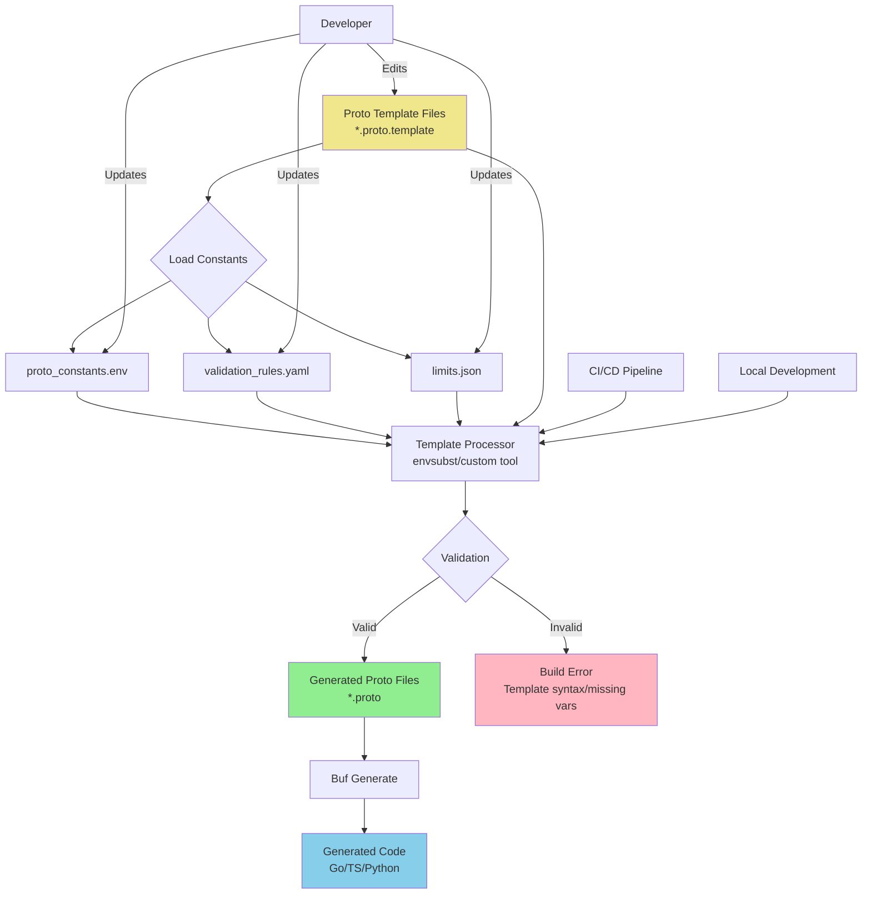

---
# Required
status: 'proposed'
date: '2025-09-24'
tags:
 - protobuf
 - code-generation
 - developer-experience
 - maintainability
# Optional
driver: '@alkalescent'
deciders: '@architecture'
informed: '@maintainers'
---
# Proto Template Generation for Reducing Value Duplication

## Context and Problem Statement

Our protobuf definitions contain numerous repeated values such as regex patterns, validation rules, field constraints, and common string literals that are copy-pasted across multiple messages and services. For example, FQN validation regex patterns like `^https:\/\/[a-zA-Z0-9]([a-zA-Z0-9\-]{0,61}[a-zA-Z0-9])?(\.[a-zA-Z0-9]([a-zA-Z0-9\-]{0,61}[a-zA-Z0-9])?)*\/[a-zA-Z][a-zA-Z0-9_-]*[a-zA-Z0-9]$` appear in multiple message definitions. This duplication leads to:

- **Maintenance drift**: When validation rules change, developers must remember to update all instances
- **Inconsistency**: Copy-paste errors result in slightly different validation rules across similar fields
- **Reduced readability**: Long repeated values clutter proto definitions
- **Error-prone updates**: Missing updates to duplicated values cause inconsistent behavior

How can we eliminate duplication in protobuf files while maintaining clarity and avoiding over-abstraction?

## Decision Drivers

* **Maintainability**: Need to update validation rules and constants in a single location
* **Consistency**: Ensure identical validation behavior across all related fields
* **Developer Experience**: Minimize cognitive load when reading and writing proto definitions
* **Build Complexity**: Balance solution complexity with maintenance benefits
* **Backward Compatibility**: Maintain existing API contracts and generated code interfaces
* **Toolchain Integration**: Solution must work with existing protobuf compilation pipeline

## Considered Options

* **Option 1**: Intermediate Message Abstraction
* **Option 2**: Proto Template Generation with Preprocessing

## Decision Outcome

Preferred option: "Proto Template Generation with Preprocessing", because it provides the best balance of maintainability, consistency, and developer experience. It eliminates duplication at the source level while generating standard protobuf files that integrate seamlessly with existing toolchains, and allows for centralized management of constants without adding runtime abstraction layers.

### Consequences

* 🟩 **Good**, because validation rules and constants are defined once and reused everywhere
* 🟩 **Good**, because generated proto files are standard protobuf with no runtime overhead
* 🟩 **Good**, because existing protobuf toolchain and generated code remain unchanged
* 🟩 **Good**, because template syntax provides clear variable substitution semantics
* 🟩 **Good**, because constants can be organized by domain/context in separate files
* 🟥 **Bad**, because adds a preprocessing step to the build pipeline
* 🟥 **Bad**, because developers must understand template syntax and variable resolution
* 🟨 **Neutral**, because requires tooling for template validation and IDE support

## Validation

Implementation compliance will be validated through:
- Build pipeline integration tests ensuring template processing works correctly
- Linting rules to prevent direct proto file editing (only .proto.template files)
- Code review checklist items for new proto definitions
- Documentation and examples for template usage patterns

## Pros and Cons of the Options

### Option 1: Intermediate Message Abstraction

Create shared message types containing common values that are referenced by other messages.

**Example Implementation:**
```protobuf
// shared_validation.proto
message NameValidation {
  string name = 1 [
    (buf.validate.field).required = true,
    (buf.validate.field).string.max_len = 253,
    (buf.validate.field).cel = {
      expression: "this.matches('^[a-zA-Z0-9](?:[a-zA-Z0-9_-]*[a-zA-Z0-9])?$')"
    }
  ];
}

// obligations.proto
message CreateObligationRequest {
  NameValidation name = 1;
}
```
```go
// obligations.go
req := &obligations.CreateObligationRequest{
  Name: &NameValidation{
    Name: "drm",
  },
}
```


* 🟩 **Good**, because centralizes validation rules in reusable components
* 🟩 **Good**, because works with existing protobuf toolchain without modification
* 🟨 **Neutral**, because provides type safety for shared validation rules
* 🟥 **Bad**, because adds unnecessary message nesting and complexity to APIs
* 🟥 **Bad**, because creates confusing abstractions that don't map to business concepts
* 🟥 **Bad**, because increases message size and serialization overhead
* 🟥 **Bad**, because makes proto definitions harder to read and understand

### Option 2: Proto Template Generation with Preprocessing

Use template files (.proto.template) with variable substitution to generate standard .proto files.

**Example Implementation:**

Template Variables (`proto_constants.env`):
```bash
# Name Validation Pattern
NAME_PATTERN="^[a-zA-Z0-9](?:[a-zA-Z0-9_-]*[a-zA-Z0-9])?$"

# Common Field Constraint
MAX_NAME_LENGTH=253
```

Template File (`obligations.proto.template`):
```protobuf
syntax = "proto3";

package policy.obligations;

import "validate/validate.proto";

// obligations.proto
message CreateObligationRequest {
  string name = 1 [
    (buf.validate.field).required = true,
    (buf.validate.field).string.max_len = ${MAX_NAME_LENGTH},
    (buf.validate.field).cel = {
      expression: "this.matches('${NAME_PATTERN}')"
    }
  ];
}
```
```go
// obligations.go
req := &obligations.CreateObligationRequest{Name: "drm"}
```

**Proto Generation Process Flow:**


Build Process Integration:
```makefile
# Generate proto files from templates
# Note: This assumes variables from a file like proto_constants.env are exported into the shell environment.
proto-gen:
	@echo "Generating proto files from templates..."
	@find . -name "*.proto.template" -exec sh -c 'envsubst < "$$1" > "$${1%.template}"' _ {} \;

# Standard proto compilation (depends on generation)
proto-compile: proto-gen
	buf generate
```

* 🟩 **Good**, because eliminates all duplication while maintaining readable templates
* 🟩 **Good**, because generates standard proto files compatible with all existing tools
* 🟩 **Good**, because allows organizing constants by logical groupings (validation, limits, etc.)
* 🟩 **Good**, because supports multiple variable sources (env files, YAML, JSON)
* 🟩 **Good**, because enables environment-specific constants (dev vs prod limits)
* 🟩 **Good**, because template syntax is intuitive and widely understood
* 🟨 **Neutral**, because requires build tooling changes and developer training
* 🟨 **Neutral**, because adds template validation as a new concern
* 🟥 **Bad**, because introduces preprocessing complexity to the build pipeline
* 🟥 **Bad**, because requires discipline to edit templates instead of generated files

## More Information

**Implementation Plan:**
1. **Phase 1**: Set up template preprocessing pipeline with simple variable substitution
2. **Phase 2**: Create comprehensive constants library organized by domain
3. **Phase 3**: Convert existing proto files to templates incrementally
4. **Phase 4**: Add IDE support and developer tooling for template editing

**Tooling Requirements:**
- Template processor (envsubst, custom Go tool, or build integration)
- Validation for template syntax and variable resolution
- IDE plugins for syntax highlighting and variable completion
- Documentation and examples for common patterns

**Risk Mitigation:**
- Gradual rollout starting with new proto definitions
- Comprehensive testing of generated output
- Fallback capability to manual proto editing if preprocessing fails
- Clear separation between generated files (git-ignored) and templates (version controlled)

The proposal supports our goal of maintaining high code quality while scaling proto definitions across a large platform with multiple teams and services.