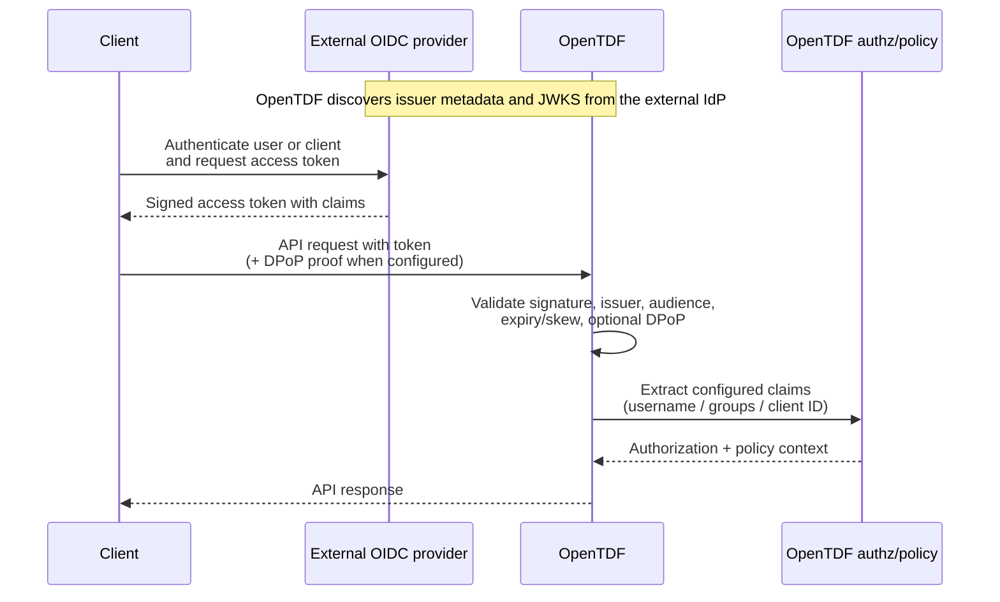

# OpenTDF and OpenID Connect (OIDC)

OpenTDF uses OpenID Connect (OIDC) as an external source of authentication and identity claims. It is **not** an identity provider (IdP).

In the current implementation, OpenTDF expects an external OIDC issuer to:

- authenticate users or clients
- issue signed access tokens
- publish discovery metadata at `/.well-known/openid-configuration`
- publish signing keys through the discovered `jwks_uri`

OpenTDF then validates those tokens and uses selected claims as trusted input for endpoint authorization and policy decisions.

For concrete setup details, see [Configuration](./Configuring.md#server-configuration), [Running the Platform Locally](./Consuming.md#running-the-platform-locally), the [Go SDK README](../sdk/README.md), and [`otdfctl auth`](../otdfctl/docs/man/auth/_index.md).

## Deployment boundary

| Responsibility | External OIDC provider | OpenTDF |
| --- | --- | --- |
| Authenticate end users or OAuth clients | Yes | No |
| Host `/.well-known/openid-configuration` | Yes | No |
| Publish JWKS signing keys | Yes | No |
| Issue signed access tokens with claims | Yes | No |
| Validate access tokens on OpenTDF API requests | No | Yes |
| Use validated claims for authorization and policy evaluation | No | Yes |
| Publish `/.well-known/opentdf-configuration` for OpenTDF clients | No | Yes |

In this repository's local quickstart, Keycloak fills the external IdP role. In other deployments, OpenTDF's OIDC authentication relies on the configured external issuer, expected audience, and that issuer's discovery/JWKS endpoints.

## Two different well-known endpoints

OpenTDF deployments commonly involve two different discovery documents:

| Endpoint | Hosted by | Purpose |
| --- | --- | --- |
| `<issuer>/.well-known/openid-configuration` | external OIDC provider | OIDC discovery for issuer metadata such as `issuer`, `token_endpoint`, and `jwks_uri` |
| `<platform>/.well-known/opentdf-configuration` | OpenTDF | OpenTDF-specific metadata, including the resolved issuer and selected discovered IdP metadata, that clients use to bootstrap authentication |

OpenTDF discovers the configured provider at startup and republishes selected metadata under `idp`, together with `platform_issuer`, in its own well-known configuration. OpenTDF Policy Enforcement Points (PEPs) should use the SDK to read this platform configuration and bootstrap IdP endpoint discovery from only the OpenTDF platform endpoint, rather than requiring separate IdP endpoint configuration. A PEP must still supply its client ID and any required credentials, and authentication still happens at the external IdP.

## Relevant OIDC concepts in OpenTDF

- **Issuer**
  - Configured as `server.auth.issuer`.
  - OpenTDF uses this URL to discover OIDC metadata at `/.well-known/openid-configuration`.
  - OpenTDF expects the configured issuer and the discovery document's `issuer` value to agree; if they differ, the discovery document's issuer value is used for token validation.

- **Audience**
  - Configured as `server.auth.audience`.
  - OpenTDF validates the incoming token's `aud` claim against this expected audience value.

- **JWKS / signing keys**
  - OpenTDF reads `jwks_uri` from the discovery document.
  - It caches the remote key set and uses `server.auth.cache_refresh_interval` as the minimum refresh interval for that JWKS cache.
  - Incoming access-token signatures are validated against that cached JWKS.

- **Claims**
  - After token validation, OpenTDF uses configured claims from the access token to build request identity context.
  - The current auth policy configuration supports:
    - `server.auth.policy.username_claim` (default `preferred_username`)
    - `server.auth.policy.groups_claim` (default `realm_access.roles`)
    - `server.auth.policy.client_id_claim` (default `azp`)

- **DPoP**
  - When enabled, OpenTDF also validates DPoP proof material associated with the access token.
  - This is additional request binding on top of normal OIDC token validation, not a replacement for issuer/audience/signature checks.

## End-to-end conceptual flow

1. An end user or a machine-to-machine OAuth client authenticates with the external OIDC provider.
2. The provider issues an access token for the audience OpenTDF expects.
3. OpenTDF uses the configured issuer to discover OIDC metadata and load the provider's JWKS.
4. The client calls an OpenTDF API with the access token (and optionally DPoP proof headers when that deployment uses DPoP).
5. OpenTDF validates the token signature, issuer, audience, and time-based constraints before trusting its claims.
6. OpenTDF extracts configured identity claims and uses them for endpoint authorization and downstream policy or decisioning context.

## Where OpenTDF currently uses that identity context

Today, the implementation uses validated token context in a few distinct places:

- **Request authentication middleware** validates the incoming access token against the configured issuer, audience, and JWKS.
- **Endpoint authorization** builds subjects from configured claims and evaluates them through the configured authorization policy.
- **Authorization service request context** propagates the resolved client ID into downstream policy request context.
- **Entity Resolution Service (ERS)** can be configured separately:
  - `keycloak` mode integrates with Keycloak using ERS-specific service credentials.
  - `claims` mode resolves entity information from claims already present in JWT input.

## See also

- [Configuration](./Configuring.md#server-configuration)
- [Entity Resolution configuration](./Configuring.md#entity-resolution)
- [Casbin endpoint authorization](./Configuring.md#casbin-endpoint-authorization)
- [Running the Platform Locally](./Consuming.md#running-the-platform-locally)
- [Go SDK README](../sdk/README.md)
- [`otdfctl auth login`](../otdfctl/docs/man/auth/login.md)
- [`otdfctl auth client-credentials`](../otdfctl/docs/man/auth/client-credentials.md)
