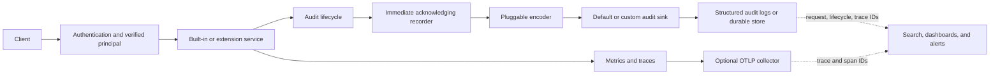

# Plan for coordinating audit, logging, and telemetry fixes

Status: Proposed  
Last updated: 2026-09-25

## Executive summary

OpenTDF should treat audit, structured logging, metrics, and distributed tracing as related but distinct operational capabilities:

- **Audit** is the durable security record of who attempted an operation, what they attempted, and how it ended.
- **Structured logs** report application behavior and carry the audit records emitted by the default platform deployment.
- **Metrics** show aggregate health, reliability, latency, and changes in operational patterns.
- **Traces** connect work across processes and services so developers can diagnose an individual request quickly.

The immediate security problem is that a client can disconnect, change networks, or exceed a deadline after an operation has started. The request context is then cancelled, and an audit event created or emitted only at the end of the handler can be lost or lack the actor, action, partial progress, and true terminal status. This is tracked by [DSPX-2007](https://virtru.atlassian.net/browse/DSPX-2007).

The proposed solution is an append-only audit lifecycle. Services record an acknowledged, intentionally partial `attempted` event before cancellable work or security-sensitive side effects. They later record one enriched terminal event with the same lifecycle ID. The terminal event distinguishes success, error, denial, client cancellation, and deadline expiration. It is written through a bounded context that retains request values but is no longer cancelled with the client.

As of 2026-09-25 the delivery half of this is in place: audit recording is immediate, runs on a cancellation-detached context with a per-event deadline, and reports its own failures. The registration half is not. Nothing is recorded before the cancellable work begins, so a handler that never reaches its recording statement still leaves no evidence. Workstream 2 covers the remainder.

OpenTelemetry should enrich this model, not underpin it. Audit records must remain complete when tracing is disabled, sampled out, delayed, misconfigured, or unavailable. When tracing is enabled, trace and span IDs should correlate audit records and logs with a request waterfall in Jaeger or another OTLP backend.

This program produces four operational outcomes:

1. Security teams can trust that disconnecting a client does not erase evidence of an attempted operation.
2. Administrators can monitor cancellations, incomplete work, access decisions, audit delivery, and service health through dashboards and alerts.
3. Developers can move from a failed pytest case or log record to the corresponding distributed trace quickly.
4. Platform extensions can emit compatible audit events through stable public recorder, encoder, and sink contracts.

## Goals

### Robustness and reliability

- Preserve evidence when a client disconnects or a Go context is cancelled.
- Record facts as they become known instead of depending on a final mutable event.
- Prevent a panic, transaction failure, or request interceptor from rewriting already successful operations.
- Ensure that database-backed operations are not audited as successful before their transaction commits.
- Preserve one lifecycle per batch item, including duplicate-looking key access objects.
- Bound audit delivery latency and make sink failures observable.

### Operations and administration

- Provide stable fields for dashboards, alerts, searches, and incident investigation.
- Distinguish denial from interruption and application error from audit-delivery error.
- Detect attempted operations that have not reached a terminal state after an appropriate grace period.
- Expose aggregate service and action trends without using high-cardinality or sensitive values as metric labels.
- Preserve backwards-compatible JSON audit output during migration.

### Developer experience

- Make request ID, audit lifecycle ID, trace ID, and span ID available for correlation.
- Print a useful trace link from failing xtest cases when local tracing is enabled.
- Support deterministic in-memory and end-to-end tests for cancellation and sink failure.
- Keep tracing strictly opt-in for normal local and CI runs that do not need it.

### Extensibility

- Give extensions the same public audit primitives used by built-in services.
- Allow deployments to provide an encoder and acknowledging sink without importing platform-internal logging types.
- Document the lifecycle rules extension authors must follow.
- Permit custom audit transport and storage without changing the semantic event contract.

## Non-goals

- OpenTelemetry traces are not a durable audit ledger.
- Trace IDs do not replace audit lifecycle IDs or request IDs.
- The first release does not require a new audit database or query service.
- This work does not require Java and JavaScript CLI trace propagation before the Go path can ship.
- This plan does not define organization-specific audit retention periods or SIEM products.

## Design principles

### Audit is the source of truth

An auditable operation must not depend on trace sampling, an OTLP collector, or a telemetry backend. The default structured-log sink and any custom audit sink must receive the same semantic event. Audit delivery failure is itself an operationally visible condition.

### Audit events are append-only

An emitted event is never mutated or globally rewritten later. A lifecycle normally contains:

1. An `attempted` record containing everything known before work starts.
2. One `completed` record containing the final result and any additional facts learned during processing.

This makes a partial event useful evidence rather than malformed output. If the process terminates before the terminal record can be written, the durable attempted record remains and can be reported as an orphan after a grace period.

### Record before side effects

For security-sensitive operations, the attempted record must be acknowledged before cryptographic work, authorization side effects, or persistent mutation begins. The failure policy must be explicit. Rewrap and administrative mutation should default to failing closed when their attempted audit record cannot be accepted.

### Cancellation is a result, not a denial

Client cancellation and deadline expiration indicate that processing was interrupted. They must not be represented as an authorization denial. A decision may be permit, deny, error, or cancel, with partial entitlements and decisions retained when available.

### Terminal delivery outlives the request, but not indefinitely

Terminal recording should retain values from the request context while removing its cancellation signal. The write must have a short, configurable upper bound. The implementation must not use an unbounded background context or hold the request open indefinitely.

### Compatibility is deliberate

The canonical event can grow while the default encoder preserves the existing JSON shape. New lifecycle fields must nevertheless be available to end-to-end tests and operators. They may initially be carried in a documented `eventMetaData.lifecycle` object or through an explicitly configured lifecycle-aware encoder. The location must be decided before the xtest contract is finalized.

### Correlation identifiers have different purposes

- `lifecycle_id` identifies one auditable operation or batch slot across attempted and terminal records.
- `request_id` identifies the inbound application request and may contain several audit lifecycles.
- `trace_id` identifies a sampled distributed trace and may contain several requests or audit records depending on instrumentation.
- `span_id` locates the active operation within a trace.

Dashboards and tests must pair audit records by lifecycle ID, not by trace ID.

## Target architecture



The audit path does not pass through the optional telemetry path. Correlation happens through identifiers attached to their respective records.

## Canonical audit lifecycle

The public canonical event should support at least the following information:

| Field | Purpose |
| --- | --- |
| Event or lifecycle ID | Pairs attempted and terminal records without relying on request or trace IDs. |
| Phase | Distinguishes `attempted` from `completed`. |
| Verb | Stable event family such as rewrap, decision, or policy CRUD. |
| Action and result | Describes the requested action and its current or terminal result. |
| Verified principal and provenance | Identifies the actor and how that identity was established. |
| Object | Identifies the affected policy, key object, resource, or administrative object. |
| Request ID | Correlates multiple events produced by one inbound request. |
| Timestamp | Records when each lifecycle phase was accepted. |
| Client information | Captures platform, user agent, and trusted request IP where applicable. |
| Original and updated state | Supports administrative change investigation. |
| Event metadata | Carries event-specific facts, cancellation reason, and compatibility fields. |
| Batch slot | Identifies the position of an item even when item IDs are duplicated or absent. |

Expected lifecycle examples:

```text
attempted  lifecycle=A  action=rewrap  actor=user-1  object=policy-1
completed  lifecycle=A  action=rewrap  result=success

attempted  lifecycle=B  action=rewrap  actor=user-1  object=policy-2
completed  lifecycle=B  action=rewrap  result=cancel  cancellation=client_disconnect
```

For batch rewrap, every expected key access object is registered by request position before processing. Each slot receives its own lifecycle ID. Successful slots remain successful if a later slot fails or the client disconnects. Slots that started but did not finish receive an error or cancellation terminal record. Map keys based only on KAO identifiers are not sufficient because identifiers may collide.

## Coordinated workstreams

### 1. Audit identity and public recording foundation

This workstream is complete. Relevant platform work:

- [#3900: establish verified audit principal](https://github.com/opentdf/platform/pull/3900) is merged.
- [#3901: add canonical audit recorder](https://github.com/opentdf/platform/pull/3901) is merged. It provides the public event, recorder, encoder, and acknowledging sink direction.
- [#3089: make audit logger types extensible](https://github.com/opentdf/platform/pull/3089) is merged and was reconciled with #3901 rather than landing a competing API.
- [#3920: resolve audit IP through trusted proxies](https://github.com/opentdf/platform/pull/3920) is merged. It makes recorded client IP provenance deployable behind proxies.
- [#4091: record audit outcomes after transaction completion](https://github.com/opentdf/platform/pull/4091) is merged. It moves policy success recording after the database commit.
- [#3902: process buffered audit through recorder](https://github.com/opentdf/platform/pull/3902) was **closed** and replaced by [#4092: replace buffered audit with immediate recording](https://github.com/opentdf/platform/pull/4092), which removes the audit buffer and the interceptor flush outright instead of routing the buffer through the recorder.

Required outcomes, and how they were met:

- One canonical public event model — `audit.Event` in `service/logger/audit/utils.go`.
- An immediate `Recorder.Record(ctx, event)` contract with an observable acknowledgement or error — `Recorder`, `Processor`, and `ProcessorFunc` in `service/logger/audit/recorder.go`. Every typed helper now returns an error.
- A public encoder and sink contract available to server embedders and extensions — configurable through `server.WithAuditProcessor`.
- A backwards-compatible default encoder and structured-log sink — the default processor preserves the existing JSON shape.
- Bounded recording after request cancellation — `Record` processes under `context.WithTimeout(context.WithoutCancel(ctx), RecordTimeout())`, configurable through `server.WithAuditTimeout`.
- Clear ownership of validation, encoding, retry, timeout, and failure policy — validation and timeout belong to `Record`; delivery policy belongs to the processor.

### 2. Lifecycle helper and service adoption

This is the active workstream. Foundation work closed the delivery half of DSPX-2007: a recorded event now survives client disconnection, a slow backend, and interceptor unwinding. It did not close the registration half. The following gaps remain after #4092 and define the scope of this workstream:

1. No event is registered before the cancellable work. Event parameters are built early but recording happens on the way out, so a panic or process termination mid-handler leaves no record at all.
2. There is no `attempted` phase and no correlation identifier. The recorder stamps a fresh event ID per call, so two records describing one operation are related only by request ID.
3. `ActionResultCancel` exists in the action-result enumeration but no service emits it. Client cancellation is therefore indistinguishable from an application error or a denial.
4. Several KAS rewrap rejection paths return before reaching any audit call, including subject-request-token extraction failure, missing entity information, and an invalid rewrap context. There is no separate NanoTDF rewrap path to audit: every policy request is routed through the TDF3 handler, so fixing the TDF3 path covers both formats.
5. Batch rewrap has no per-slot registration, so key access objects with duplicate or absent identifiers cannot be reported separately.
6. A recorded outcome can disagree with what the client received. A per-object rewrap success is recorded before later request handling can still fail the RPC, and a context cancellation arriving after a successful commit is recorded as a policy failure.

Add a small concurrency-safe lifecycle helper on top of the recorder. It should make the correct ordering natural without hiding recorder failures. It may own a private mutable builder before each immutable snapshot is recorded, but emitted events remain append-only.

Adopt it in this order:

1. **KAS rewrap and batch rewrap** because they directly represent the DSPX-2007 threat and exercise partial batch completion.
2. **Authorization v1 and v2** because cancellation must not be conflated with deny and partial decision context is valuable.
3. **Policy CRUD services** because terminal success must move after database commit and original/updated state must remain coherent.
4. **Other built-in and extension services** after the patterns and helper API stabilize.

Each migration should remove old deferred or request-transaction behavior for its scope rather than emitting both old and new events.

### 3. Direct audit test harness and end-to-end tests

The `opentdf/tests` repository already contains:

- A file-based collector, parser, clock-skew handling, and assertions in `xtest/audit_logs.py`.
- Rewrap assertions in standard TDF and ABAC tests.
- Broader policy, decision, error, and load scenarios in `xtest/test_audit_logs_integration.py`.
- JSON server-log wiring in the reusable xtest workflow.

[Tests PR #411](https://github.com/opentdf/tests/pull/411) explores disconnect testing but should be replaced from `tests/main`. Its staggered process termination is useful as a smoke test, but the current assertions do not prove that every request reaching KAS receives a cancellation event.

The replacement should:

- Rename the scenario around append-only audit lifecycle rather than deferred events.
- Parse lifecycle ID, phase, cancellation kind, and batch slot.
- Wait for events by predicate instead of sleeping for fixed intervals.
- Assert one terminal record for every attempted record.
- Assert that cancellation retains actor, action, object, and request information.
- Assert that cancellation is not denial and that no cancelled operation is rewritten as success.
- Run serialized against the platform-under-test SHA.
- Use structured audit files as its primary oracle, with no Jaeger requirement.

A deterministic xtest-only extension or probe service should complement the real KAS smoke test. Its handler records an attempt, signals readiness, waits for its context to be cancelled, and records the terminal cancellation through the public recorder. Pytest can then close the client or set a deadline only after the attempted record is observed. This validates the extension API and avoids relying entirely on process-start timing.

### 4. Structured logging and trace correlation

[Platform PR #3722](https://github.com/opentdf/platform/pull/3722) explores Go CLI trace propagation and adding active trace and span IDs to structured log records. This should be rebased after the audit context and lifecycle semantics stabilize. Splitting log correlation from CLI propagation would reduce review and dependency risk.

Logging requirements:

- All audit records use structured JSON in the default deployment.
- The log envelope contains service, level, timestamp, request ID, and optional trace and span IDs.
- The audit payload retains its semantic lifecycle ID independently of the log envelope.
- A detached terminal audit write preserves trace values when present.
- Logger failures and audit sink failures are distinguishable.
- Sensitive audit payloads are not copied into ordinary debug log messages.

### 5. Optional OpenTelemetry test support

[Tests PR #549](https://github.com/opentdf/tests/pull/549) adds an opt-in pytest tracing fixture and `otdf-local up --tracing` support. It starts Jaeger, creates one `pytest.test` span per test, propagates `TRACEPARENT` to SDK subprocesses, and prints a Jaeger URL on failure.

That work should be rebased after the direct audit test changes. Its green standard xtest matrix primarily demonstrates that the disabled path is a strict no-op; an explicit tracing job is still needed to prove export and propagation through Jaeger.

The tracing test should be separate from the audit lifecycle test. With tracing enabled, it should assert:

- Pytest, the Go CLI, platform, and KAS join the expected trace.
- Structured logs contain the active trace and span IDs.
- Attempted and terminal audit records can be correlated to the same trace when it was sampled.
- Server-side spans remain useful even if a forcibly terminated CLI cannot flush its final span.
- Jaeger or OTLP failure fails only the telemetry-specific test, not the audit correctness test.

Java and JavaScript propagation can follow the proven Go pattern without blocking the first audit release.

### 6. Metrics, dashboards, alerts, and runbooks

Metrics should describe system health and aggregate audit behavior. Identifiers such as actor ID, lifecycle ID, request ID, object ID, and trace ID must not be metric labels.

Candidate metrics include:

- Audit records attempted, accepted, and rejected by service, verb, phase, and result.
- Recorder and sink latency histograms.
- Terminal recording timeouts.
- Attempted lifecycles without a terminal record after a grace period.
- Cancellation counts by service, action, and cancellation kind.
- Batch size and partial batch completion counts.
- Authorization permit, deny, error, and cancellation counts.
- Policy commit failures and post-commit audit failures.
- OTLP export errors, dropped spans, and exporter queue pressure as telemetry health, not audit health.

Recommended administrator dashboards:

1. **Audit delivery health**: sink success rate, latency, timeouts, and orphan lifecycle count.
2. **Security operations**: action results, cancellations, denials, actor/action/object drill-down, and unusual cancellation changes.
3. **KAS and batch rewrap**: rewrap outcomes, per-KAS failures, partial batches, algorithms, and key identifiers where access control permits.
4. **Authorization decisions**: permit, deny, error, and cancel rates with service and action breakdowns.
5. **Platform reliability**: request latency, error rate, dependency health, and links from affected operations to logs and traces.

Recommended developer workflow:

1. Start from a failing test, request ID, lifecycle ID, or alert.
2. Inspect the attempted and terminal audit records to establish the security-relevant facts.
3. Follow the trace ID, when available, to inspect latency and cross-service control flow.
4. Use span IDs to narrow structured logs to the failing component.
5. Consult a runbook that distinguishes application failure, cancellation, sink failure, and telemetry-export failure.

Initial alerts should include:

- Any sustained audit sink rejection or terminal recording timeout.
- An unexpected rise in orphan attempts after the normal in-flight grace period.
- A material change in client-disconnect or deadline cancellation rate.
- A rise in partial batch failures or cancellations.
- Telemetry exporter degradation as a warning that debugging data may be incomplete.

Alert thresholds should be based on deployment volume and reviewed after a baseline period. An attempted event without a terminal event is not immediately an incident because the operation may still be running.

## Coordination model

The work crosses the platform, tests, CLI, and deployment repositories and should have explicit handoffs:

| Area | Primary responsibility | Handoff |
| --- | --- | --- |
| Platform audit foundation | Canonical event, recorder, encoder, sink, request provenance, and lifecycle helper. | Publishes a stable contract for built-in services, extensions, and xtest. |
| Service owners | Correct lifecycle placement and enrichment in KAS, authorization, and policy. | Provide unit and integration scenarios that xtest can reproduce. |
| Tests and CI | Parser, assertions, sample deployment, failure artifacts, and required compatibility jobs. | Makes the platform contract executable across repositories. |
| Logging and telemetry | Log correlation, CLI context propagation, OTLP configuration, and telemetry health. | Adds optional trace navigation without changing audit semantics. |
| Security and operations | Failure policy, retention expectations, dashboards, alerts, and runbooks. | Approves operational acceptance criteria and rollout thresholds. |

Cross-repository changes should follow these rules:

- Keep each platform PR independently reviewable and preserve the declared stack order.
- Merge test-harness parsing and assertion helpers before making new platform behavior a generally required test.
- While tests are unmerged, dispatch the tests branch manually against the exact platform commit under review.
- Once the platform behavior is available on `main`, enable the lifecycle test as a required check for head builds.
- Capability-gate older released platforms, but never silently skip the lifecycle test for a platform commit that claims the capability.
- Avoid permanent workflow references to feature branches; use commit SHAs for coordinated validation and return reusable workflows to stable refs before merge.
- Record the event-schema decision and sample JSON fixtures so dashboard and SIEM work can proceed without tracking Go implementation details.

## Delivery sequence and gates

| Phase | Work | Exit gate | Status |
| --- | --- | --- | --- |
| 0. Reconcile | Resolve overlap between platform #3089 and #3901; refresh branches on current `main`. | One agreed public audit API and PR stack. | Complete. |
| 1. Foundation | Land verified principal, immediate recorder, encoder/sink, transaction removal, and trusted proxy provenance. | Unit tests prove acknowledgement, cancellation-safe recording, compatibility encoding, and race safety. | Complete through #4092. |
| 2. Lifecycle | Add append-only lifecycle helper and stable correlation fields. | Attempted and terminal snapshots have a documented contract. | Active. |
| 3. Service migration | Migrate KAS, authorization, then policy CRUD. | Each service has success, error, cancellation, and partial-progress tests; policy success occurs after commit. | Policy commit ordering done in #4091; lifecycle migration not started. |
| 4. Direct end-to-end audit | Replace tests #411 and run the lifecycle tests against a sample deployment. | Required CI passes without OTEL and detects intentionally removed terminal events. | Not started. |
| 5. Logging and OTEL | Rebase/split platform #3722 and tests #549; add explicit Jaeger test. | Optional tracing produces correlated spans and logs while disabled mode remains a no-op. | Not started. |
| 6. Operations | Publish dashboards, alert rules, extension guidance, and incident runbooks. | Administrators can detect delivery and lifecycle problems; developers can navigate from audit to trace. | Not started. |
| 7. Broader propagation | Extend CLI trace propagation to Java and JavaScript where valuable. | Cross-SDK trace tests pass without changing audit semantics. | Not started. |

Do not stack the audit correctness implementation on the OpenTelemetry PRs. OTEL should be rebased on the stable audit and context model, not the reverse.

## Test strategy

### Go unit tests

- In-memory recorder captures immutable event snapshots.
- Attempt recording is acknowledged before work starts.
- Terminal recording uses the detached bounded context.
- Client cancellation and deadline expiration are classified separately.
- Recorder, encoder, and sink failures are returned and measured.
- Concurrent lifecycle enrichment is race-free.
- Duplicate batch identifiers cannot collide.
- Default encoding remains wire-compatible.

### Service integration tests

- Rewrap success, invalid binding, authorization failure, cancellation, and batch partial completion.
- Authorization permit, deny, error, and cancel with available decision context.
- Policy create, update, and delete with transaction rollback and commit boundaries.
- Panic and handler error behavior without rewriting previously terminal events.
- Extension service use of the public recorder and custom sink.

### Pytest/xtest

- Continue tailing `PLATFORM_LOG_FILE` and `KAS_*_LOG_FILE` from a sample deployment.
- Run `test_audit_logs_integration.py` explicitly; its presence in the repository alone is not CI coverage.
- Add a serialized `test_audit_lifecycle.py` job focused on the Go platform under test.
- Retain a real client-disconnect barrage as a smoke test, but use a deterministic cancellation probe for the required lifecycle assertion.
- Upload captured audit and server logs on failure.

### OTEL correlation tests

- Start the `tracing` compose profile and configure platform and KAS OTLP export.
- Propagate `TRACEPARENT` from pytest through the Go CLI.
- Query Jaeger with bounded retry to confirm expected server-side spans.
- Verify log-to-trace correlation.
- Keep this as a separate job so collector failure cannot masquerade as audit failure.

Recommended CI jobs:

| Job | Required | Backend |
| --- | --- | --- |
| `audit-unit-and-integration` | Yes | In-memory and default sinks |
| `audit-lifecycle-xtest` | Yes | Structured JSON audit logs |
| `audit-otel-correlation` | Initially nightly/non-blocking; required after stabilization | Jaeger/OTLP |

## Sample local workflow

With `opentdf/tests` and `opentdf/platform` checked out as peers:

```bash
export OTDF_LOCAL_PLATFORM_DIR=/absolute/path/to/platform

cd opentdf-tests/otdf-local
uv sync
uv run otdf-local up

cd ../xtest
uv sync --extra dev
eval "$(uv run --project ../otdf-local otdf-local env)"
uv run pytest -n 0 -ra -v --sdks go \
  test_audit_logs_integration.py \
  test_audit_lifecycle.py
```

For trace correlation:

```bash
cd opentdf-tests/otdf-local
uv run otdf-local down
uv run otdf-local up --tracing

cd ../xtest
eval "$(uv run --project ../otdf-local otdf-local env)"
uv run pytest -n 0 -ra -v --sdks go --tracing test_audit_otel.py
```

The first command is the audit correctness gate. The second is an additional observability test.

## Rollout and compatibility

1. Land the public primitives before migrating all services.
2. Preserve existing audit JSON fields and results during the transition.
3. Add lifecycle fields in a way old consumers can ignore safely.
4. Run old and new parsers against representative audit output before enabling dashboards.
5. Deploy KAS lifecycle recording first and monitor recorder latency and sink failures.
6. Enable orphan and cancellation dashboards with conservative thresholds.
7. Migrate authorization and policy services after KAS behavior is stable.
8. Enable OTEL correlation independently and verify that disabling it changes neither event content nor delivery.
9. Document backout procedures for custom sinks, OTLP exporters, and dashboard rules.

Custom sink retry policy requires particular care. Unbounded retries can exhaust resources, while silent drops defeat the security goal. The recorder should have a bounded timeout, return failures to the service according to its fail-open/fail-closed policy, and emit low-cardinality health metrics through an independent path.

## Security, privacy, and access control

- Treat audit payloads as sensitive operational data.
- Restrict dashboards containing actor, object, policy, or key information.
- Avoid credentials, tokens, plaintext content, and private key material in audit events, logs, spans, or span attributes.
- Do not use sensitive or high-cardinality audit values as metric labels.
- Apply retention and deletion policies independently to audit, logs, metrics, and traces.
- Sanitize error strings before making them searchable or attaching them to traces.
- Record principal and client IP provenance so operators can distinguish verified information from forwarded or untrusted claims.

## Open decisions

The following decisions should be resolved before the lifecycle xtest becomes the compatibility contract:

1. Whether lifecycle ID and phase are top-level encoded fields or documented compatibility metadata.
2. The exact result and cancellation taxonomy. `ActionResultCancel` already exists and is unused, so the remaining question is how to distinguish client disconnection from deadline expiration.
3. ~~The timeout and acknowledgement semantics of the public recorder and sink.~~ Resolved by #4092: `Record` applies a per-event deadline from `RecordTimeout()` over a cancellation-detached context and returns an acknowledgement error. Retry and durability remain the processor's responsibility.
4. Which operations fail closed when the attempted record is rejected.
5. The grace period used to classify orphan attempts.
6. Whether retry and deduplication belong in the recorder, sink, or external transport.
7. Which dashboard dimensions are safe and useful across deployments.
8. When the OTEL correlation job becomes a required check.

## Definition of done

This coordinated effort is complete when:

- A client disconnect or deadline cannot remove the attempted audit evidence for a request that reached auditable processing.
- Every attempted lifecycle normally has exactly one terminal record, and missing terminals are detectable.
- Cancellation, denial, application error, and audit-delivery failure are distinguishable.
- Batch rewrap reports each slot without collision or global outcome rewriting.
- Policy success is emitted only after commit.
- Built-in services and extensions use one public event, recorder, encoder, and sink model.
- Required Go and pytest tests prove audit behavior without requiring OTEL.
- Optional OTEL tests prove trace propagation and log correlation through a sample deployment.
- Administrators have dashboards and alerts for audit delivery, cancellations, incomplete lifecycles, authorization outcomes, and partial batches.
- Developers can navigate from a failed test or audit event to relevant structured logs and, when sampled, a distributed trace.
