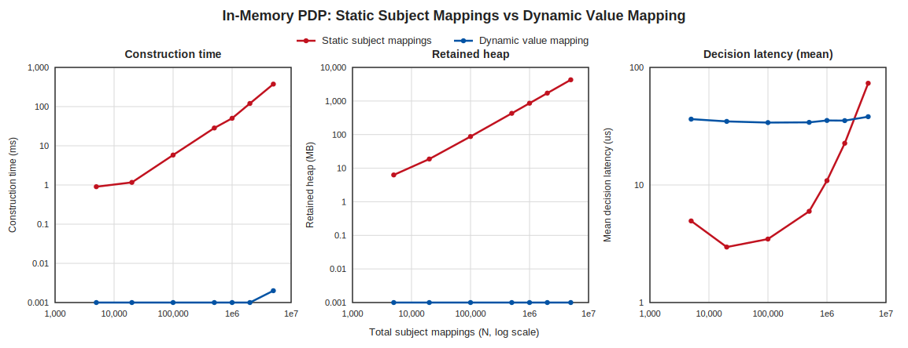
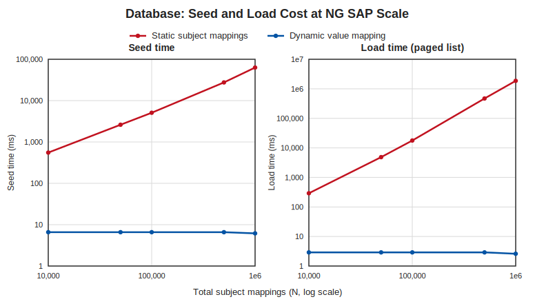

# Static Subject Mappings vs Dynamic Value Mappings at NG SAP Scale

A reproducible benchmark for [DSPX-3498](https://virtru.atlassian.net/browse/DSPX-3498),
comparing the cost of entitling high-cardinality attribute values two ways:

- **Static Subject Mappings** (before): one `SubjectMapping` per `(user, value)` pair, so the
  corpus grows to the cross-product of users and the values they are cleared for.
- **Dynamic Value Mappings** (after): one definition-level `DynamicValueMapping` resolves the
  same entitlements at decision time, so the corpus stays at a handful of mappings regardless of how
  many values or users exist.

Two benchmarks measure this, and together they cover the full request path:

1. **In-Memory PDP** (no Docker): the footprint and per-decision cost once policy is loaded.
2. **Database Seed and Load** (Docker): the cost of seeding the corpus and the bulk load that feeds
   the PDP cache on every construction and refresh.

## Motivation

The driver is the **NG SAP** reference scenario. Its known scale parameters:

- **~5,000 Compartment Values.** Need-to-know (NTK) compartments, a flattened tree.
- **Millions of Subject Mappings.** The cross-product of users with access to one or more of the
  5,000 compartments, "potentially in the millions".
- **Tooling Limits.** The ConfigMap for resource condition sets exceeds the
  1 MiB Kubernetes limit, and attribute-value insertion exceeds the DB transaction limit and needs
  workaround scripting.

The scenario poses three questions this benchmark speaks to directly:

1. **Seeding.** Can a corpus at this scale be loaded at all, in bounded time and memory?
2. **Decision Latency.** What is the decision latency once the corpus is loaded, against a
   subject-mapping set with millions of entries? Is it under a usable SLA (the scenario floats
   < 100 ms and < 500 ms)?
3. **Concurrency.** Does the design hold up under concurrent read load without a performance cliff as
   the corpus grows?

## Hypothesis

The two paths differ in their complexity in the number of subject mappings, **N**. Reading the
implemented decision path makes the asymmetry concrete:

- **Static: O(N).** `NewPolicyDecisionPoint` validates and retains every one of the N subject
  mappings when it builds the in-memory policy
  ([`service/internal/access/v2/pdp.go`](../../../service/internal/access/v2/pdp.go), the loop at
  lines 147-187). At decision time
  [`EvaluateSubjectMappingsWithActions`](../../../service/internal/subjectmappingbuiltin/subject_mapping_builtin_actions.go)
  evaluates every subject mapping attached to the requested value with no short-circuit, so a single
  decision does work proportional to the number of mappings on that value (~ N / 5,000). The corpus
  also has to be read from Postgres before any of this, on every load and refresh.
- **Dynamic: O(1) in N.** A dynamic definition carries no statically provisioned values, so
  construction retains only the few `DynamicValueMapping`s
  ([`pdp.go`](../../../service/internal/access/v2/pdp.go) lines 189-224). The value is synthesized
  from the resource FQN at decision time and
  [`EvaluateDynamicValueMappingsWithActions`](../../../service/internal/subjectmappingbuiltin/dynamic_value_mapping_builtin.go)
  tests membership of the resource segment in the entity's selector-resolved set, so decision cost
  depends on the entity's cleared-set size and stays constant as N grows. The database holds a
  handful of rows, so the load is a single page.

The expectation: static construction time, retained memory, database seed, and database load all grow
with N while dynamic stays flat, and static per-decision cost grows with N while dynamic stays flat.

## Methods

### In-Memory Measurements

A pure in-memory benchmark of the Policy Decision Point. For each scale point N (total subject
mappings) and each mode (static, dynamic) it builds the corpus and records:

- **Construction Time (ms).** Wall time of the `NewPolicyDecisionPoint[WithDynamicValueMappings]`
  call, i.e. building the in-memory policy index from already-materialized policy objects.
- **Retained Heap (MB).** `runtime.MemStats.HeapInuse` delta across building the corpus and the PDP,
  each side measured after `runtime.GC()`. This is the steady-state memory the PDP holds to answer
  decisions.
- **Decision Latency (µs).** Mean, p50, and p99 over 2,000 timed `GetDecision` calls (after 200
  warm-up calls) for a single document tagged with one compartment value, by an entity that is
  entitled. The harness asserts every measured decision permits, so no timing comes from a
  misconfigured deny path.

### Database Measurements

A benchmark against a real Postgres (testcontainers) at the `PolicyDBClient` layer. For each scale
point N and each mode it records:

- **Seed Time (ms).** Wall time to insert the corpus. Static seeding uses server-side
  `generate_series` to write N rows into each of `subject_condition_set`, `subject_mappings`, and
  `subject_mapping_actions` in three statements. This is the raw-insert floor; the production import
  path runs per row through the API and is slower. Dynamic seeding writes one definition plus one
  `dynamic_value_mapping` (and one action row).
- **Load Time (ms).** Wall time to page the corpus back to exhaustion through
  `ListSubjectMappings` (page size 5,000), mirroring the PDP cache load in
  [`EntitlementPolicyRetriever.ListAllSubjectMappings`](../../../service/internal/access/v2/policy_store.go)
  (lines 83-107). That list query is a multi-JOIN with `JSONB_AGG` + `GROUP BY` paginated by OFFSET,
  so deep pages at large N degrade worse than linearly. Dynamic loads via `ListDynamicValueMappings`
  in a single page.

Measuring at the `PolicyDBClient` layer keeps the benchmark to one Postgres container with no gRPC
server or ERS. gRPC and SDK marshaling sit on top of these numbers and are not measured. Retained
heap is covered by the in-memory benchmark and is not re-measured here.

### Corpus Shape

- One namespace, one `ANY_OF` attribute definition with 5,000 compartment values, matching the
  scenario.
- **Static:** N subject mappings spread across the 5,000 values, each pinned to one synthetic user
  via a `SubjectConditionSet` (`.properties.userId IN [user-i]`). This is the user-by-compartment
  cross-product the static design forces. A single value therefore carries ~ N / 5,000 mappings.
- **Dynamic:** the same definition with no provisioned values, plus one `DynamicValueMapping`
  (resolver selector `.properties.compartments[]`, operator `RESOURCE_VALUE_IN`). The analyst entity
  carries a fixed cleared-set of 50 compartments resolved from the IdP/ERS.
- Both modes decide the same request identically (permit), so the comparison is like for like.

### Scope and Caveats

- **Host-Dependent Absolutes.** Both the in-memory latencies and the database query times depend on
  the host, Postgres tuning, and the testcontainers image. The trend with N is the result; absolute
  values are indicative.
- **Architecture.** The production PDP (`JustInTimePDP`) bulk-loads all subject mappings once at
  construction and serves every decision from memory. There is no per-decision database query, so the
  database cost is paid at construction and on every cache refresh, which the Load measurement
  captures.

### Reproduction

Prerequisites: a Go toolchain matching `service/go.mod`, and `python3`. The in-memory benchmark needs
no database or network. The database benchmark also needs Docker (testcontainers Postgres).

```bash
git clone https://github.com/opentdf/platform.git
cd platform
git checkout <branch-with-DSPX-3498-and-this-directory>

# In-memory benchmark (no Docker): writes results.csv and renders charts/in_memory.svg.
bash docs/performance/DSPX-3498-dynamic-value-mappings/run.sh

# Database benchmark (requires Docker): writes db_results.csv and renders charts/db_load_seed.svg.
bash docs/performance/DSPX-3498-dynamic-value-mappings/run-db.sh
```

To run the pieces by hand:

```bash
# 1. In-memory harness (build tag dvmbench, never runs in normal `go test ./...` or CI).
cd service
DVM_BENCH_OUT=../docs/performance/DSPX-3498-dynamic-value-mappings/results.csv \
  go test -tags dvmbench -run TestDVMScaleBenchmark -timeout 60m -v ./internal/access/v2/

# 2. Database harness (build tag dvmdbbench, requires Docker).
DVM_DB_OUT=../docs/performance/DSPX-3498-dynamic-value-mappings/db_results.csv \
  go test -tags dvmdbbench -run TestDVMDBBenchmark -timeout 60m -v ./integration/

# 3. Charts (Python stdlib only; third arg is optional and adds the DB figure).
cd ..
python3 docs/performance/DSPX-3498-dynamic-value-mappings/plot.py \
  docs/performance/DSPX-3498-dynamic-value-mappings/results.csv \
  docs/performance/DSPX-3498-dynamic-value-mappings/charts \
  docs/performance/DSPX-3498-dynamic-value-mappings/db_results.csv
```

To fit a smaller host, cap the largest scale point: `DVM_BENCH_MAX_N=1000000` for the in-memory run,
`DVM_DB_MAX_N=100000` for the database run. `DVM_DB_MIN_N` sets a floor, so a single point can be run
in isolation, e.g. `DVM_DB_MIN_N=1000000 DVM_DB_MAX_N=1000000`.

The committed `db_results.csv` was produced in two processes: points up to 500,000 in one run, and
the 1,000,000 point on its own. Running every point through 1,000,000 in a single process drives the
1M deep-OFFSET load to spill enough temporary data to exhaust the test container, so the largest
point is measured separately.

The committed CSVs and charts were produced on this host:

| Item | Value |
| --- | --- |
| Machine | Apple Silicon, 14 cores, 36 GB RAM |
| OS | macOS 26.5 (arm64) |
| Go | go1.26.1 |
| Postgres | postgres:15-alpine (testcontainers, via Colima) |
| In-memory harness | `service/internal/access/v2/dynamic_value_mapping_bench_test.go` |
| Database harness | `service/integration/dynamic_value_mapping_db_bench_test.go` |

## Results: In-Memory PDP



| N | Static heap (MB) | Static construct (ms) | Static mean (µs) | Static p99 (µs) | Dynamic mean (µs) | Dynamic p99 (µs) |
| ---: | ---: | ---: | ---: | ---: | ---: | ---: |
| 5,000 | 6.3 | 0.9 | 4.9 | 21.0 | 36.3 | 162.6 |
| 20,000 | 18.7 | 1.2 | 3.0 | 6.1 | 34.7 | 154.5 |
| 100,000 | 87.6 | 5.8 | 3.5 | 6.9 | 33.9 | 148.3 |
| 500,000 | 428.4 | 28.4 | 6.0 | 11.2 | 34.1 | 169.0 |
| 1,000,000 | 856.7 | 50.4 | 10.9 | 16.7 | 35.4 | 160.5 |
| 2,000,000 | 1,714.2 | 120.0 | 22.6 | 31.0 | 35.3 | 168.5 |
| 5,000,000 | 4,271.4 | 374.1 | 73.4 | 92.4 | 38.1 | 192.3 |

Dynamic retained heap is below measurement resolution (one mapping) and dynamic construction is
< 0.01 ms at every scale, so both read as flat lines.

- **Heap.** Static footprint grows linearly at roughly 855 bytes per subject mapping, reaching
  **4.3 GB at 5 million mappings**. Dynamic stays negligible.
- **Construction.** Building the in-memory index is linear in N for static (374 ms at 5 million) and
  constant for dynamic. This is only the indexing step; the static path also pays the database load
  below on every PDP load and refresh.
- **Decision Latency.** Static latency grows with N because each decision evaluates every subject
  mapping on the requested value (~ N / 5,000). Dynamic latency stays near 35 µs across all N. The
  two means cross between 2 and 5 million mappings. Both paths stay in the tens of microseconds here
  because this is the in-memory evaluation only.

## Results: Database Seed and Load



| N | Static seed (ms) | Static load (ms) | Load pages | Dynamic seed (ms) | Dynamic load (ms) |
| ---: | ---: | ---: | ---: | ---: | ---: |
| 10,000 | 553.3 | 290.7 | 2 | 6.6 | 2.9 |
| 50,000 | 2,608.2 | 4,865.1 | 10 | 6.6 | 2.9 |
| 100,000 | 5,087.3 | 17,744.6 | 20 | 6.6 | 2.9 |
| 500,000 | 27,576.7 | 470,993.2 (~7.8 min) | 100 | 6.6 | 2.9 |
| 1,000,000 | 63,194.1 | 1,864,427.7 (~31 min) | 200 | 6.2 | 2.6 |

- **Seed.** Static seeding writes three rows per subject mapping across three tables; its time grows
  linearly with N. Dynamic seeding is two rows total, independent of N. This is the raw-insert floor;
  the scenario already reports hitting the DB transaction limit on the production import path, which
  is slower per row.
- **Load.** This is the cost paid on every PDP construction and cache refresh. Static load grows
  worse than linearly: from 291 ms at 10,000 mappings to 1,864 s (~31 min) at 1,000,000, so a 100x
  increase in N raises load time by roughly 6,400x. The `ListSubjectMappings` query joins and
  aggregates, and OFFSET pagination re-walks every skipped row, so each deeper page costs more than
  the last (200 pages at 1M). Dynamic load is a single 2.6 ms page at every scale. A reload this
  expensive is the practical ceiling for the static model well before memory becomes the limit.

## Conclusion

The hypothesis holds. The measured differences map onto the three NG SAP questions:

1. **Seeding.** The static corpus costs 4.3 GB of resident memory and 374 ms to index in memory at
   5 million mappings, and a database seed and reload that both grow with N, the reload reaching
   ~31 minutes at 1 million. The dynamic corpus is a handful of rows, so its seed, load, and footprint
   stay small. This is the same scaling wall the scenario reports hitting (1 MiB ConfigMap limit, DB
   transaction limit).
2. **Decision Latency.** In memory both paths are microsecond-scale across the measured range; the
   static mean grows with N and overtakes the dynamic mean between 2 and 5 million mappings, while
   the dynamic mean holds flat. The larger cost, the database load against millions of rows, is paid
   at construction and refresh rather than per decision, and the dynamic model stores few rows so
   there is no large table to scan.
3. **Concurrency.** We did not run a concurrency sweep. The measured inputs such a test would build
   on are the resident footprint (gigabytes for static, negligible for dynamic), the per-decision
   cost (growing with N for static, flat for dynamic), and the load cost on refresh (growing with N
   for static, flat for dynamic).

The dynamic value mapping keeps memory, database seed, and database load constant in N, and the
decision-latency mean flat across the measured range.

## Files

| File | Purpose |
| --- | --- |
| `../../../service/internal/access/v2/dynamic_value_mapping_bench_test.go` | In-memory harness (build tag `dvmbench`) |
| `../../../service/integration/dynamic_value_mapping_db_bench_test.go` | Database harness (build tag `dvmdbbench`, requires Docker) |
| `run.sh` | One-command in-memory reproduction (no Docker) |
| `run-db.sh` | One-command database reproduction (Docker) |
| `plot.py` | CSV to SVG charts (Python stdlib only) |
| `results.csv` | Committed in-memory measurements |
| `db_results.csv` | Committed database measurements |
| `charts/in_memory.svg` | In-memory figure (construction, heap, decision latency) |
| `charts/db_load_seed.svg` | Database figure (seed, load) |
