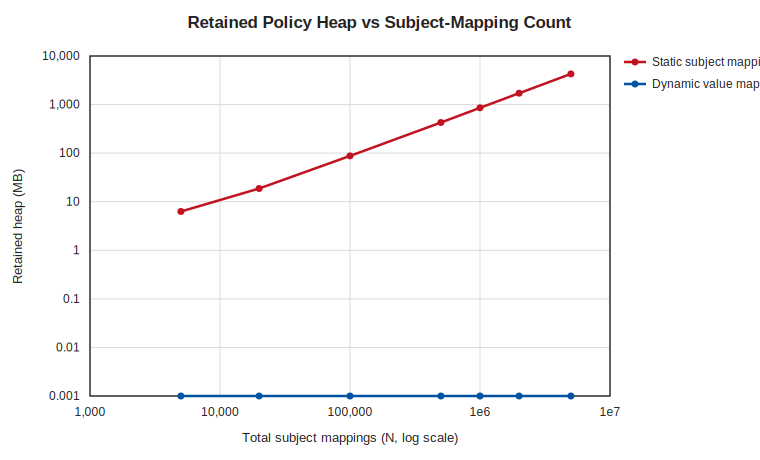
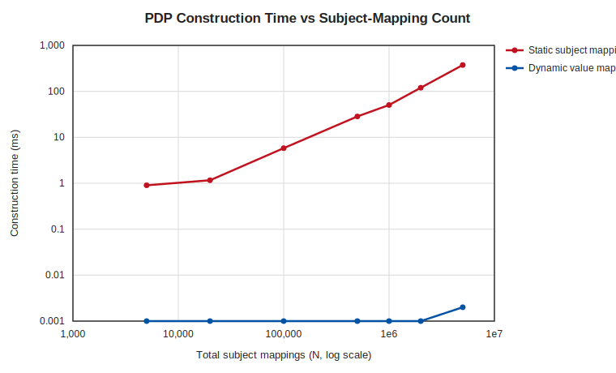
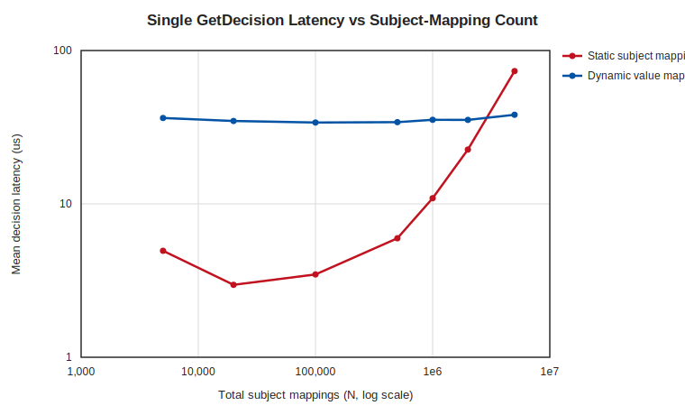

# Static Subject Mappings vs Dynamic Value Mappings at NG SAP Scale

A reproducible benchmark for [DSPX-3498](https://virtru.atlassian.net/browse/DSPX-3498),
comparing the cost of entitling high-cardinality attribute values two ways:

- **Static Subject Mappings** (before): one `SubjectMapping` per `(user, value)` pair, so the
  corpus grows to the cross-product of users and the values they are cleared for.
- **Dynamic Value Mappings** (after): one definition-level `DynamicValueMapping` resolves the
  same entitlements at decision time, so the corpus stays at a handful of mappings regardless of how
  many values or users exist.

## Motivation

The driver is the **NG SAP** reference scenario. Its known scale parameters:

- **~5,000 Compartment Values.** Need-to-know (NTK) compartments, a flattened tree.
- **Millions of Subject Mappings.** The cross-product of users with access to one or more of the
  5,000 compartments, "potentially in the millions".
- **Tooling Limits.** The ConfigMap for resource condition sets exceeds the
  1 MiB Kubernetes limit, and attribute-value insertion exceeds the DB transaction limit and needs
  workaround scripting.

The scenario poses three questions this benchmark speaks to directly:

1. **Seeding.** Can a corpus at this scale be loaded at all, in bounded time
   and memory?
2. **Decision Latency.** What is the decision latency once the corpus is
   loaded, against a subject-mapping set with millions of entries? Is it under a usable SLA
   (the scenario floats < 100 ms and < 500 ms)?
3. **Concurrency.** Does the design hold up under concurrent
   read load without a performance cliff as the corpus grows?

## Hypothesis

The two paths differ in their complexity in the number of subject mappings, **N**. Reading the
implemented decision path makes the asymmetry concrete:

- **Static: O(N).** `NewPolicyDecisionPoint` validates and retains every one of the N subject
  mappings when it builds the in-memory policy
  ([`service/internal/access/v2/pdp.go`](../../../service/internal/access/v2/pdp.go), the loop at
  lines 147-187). At decision time
  [`EvaluateSubjectMappingsWithActions`](../../../service/internal/subjectmappingbuiltin/subject_mapping_builtin_actions.go)
  evaluates every subject mapping attached to the requested value with no short-circuit, so a single
  decision does work proportional to the number of mappings on that value (~ N / 5,000).
- **Dynamic: O(1) in N.** A dynamic definition carries no statically provisioned values, so
  construction retains only the few `DynamicValueMapping`s
  ([`pdp.go`](../../../service/internal/access/v2/pdp.go) lines 189-224). The value is synthesized
  from the resource FQN at decision time and
  [`EvaluateDynamicValueMappingsWithActions`](../../../service/internal/subjectmappingbuiltin/dynamic_value_mapping_builtin.go)
  tests membership of the resource segment in the entity's selector-resolved set, so decision cost
  depends on the entity's cleared-set size and stays constant as N grows.

The expectation: static construction time and memory grow linearly with N while dynamic stays flat,
and static per-decision cost grows with N while dynamic stays flat.

## Methods

### Measurements

A pure in-memory benchmark of the Policy Decision Point. For each scale point N (total subject
mappings) and each mode (static, dynamic) it builds the corpus and records:

- **Construction Time (ms).** Wall time of the `NewPolicyDecisionPoint[WithDynamicValueMappings]`
  call, i.e. building the in-memory policy index from already-materialized policy objects.
- **Retained Heap (MB).** `runtime.MemStats.HeapInuse` delta across building the corpus and the PDP,
  each side measured after `runtime.GC()`. This is the steady-state memory the PDP holds to answer
  decisions.
- **Decision Latency (µs).** Mean, p50, and p99 over 2,000 timed `GetDecision` calls (after 200
  warm-up calls) for a single document tagged with one compartment value, by an entity that is
  entitled. The harness asserts every measured decision permits, so no timing comes from a
  misconfigured deny path.

### Corpus Shape

- One namespace, one `ANY_OF` attribute definition (`https://sap.gov/attr/ntk`) with 5,000
  compartment values, matching the scenario.
- **Static:** N subject mappings spread across the 5,000 values, each pinned to one synthetic user
  via a `SubjectConditionSet` (`.properties.userId IN [user-i]`). This is the user-by-compartment
  cross-product the static design forces. A single value therefore carries ~ N / 5,000 mappings.
- **Dynamic:** the same definition with no provisioned values, plus one `DynamicValueMapping`
  (resolver selector `.properties.compartments[]`, operator `RESOURCE_VALUE_IN`). The analyst entity
  carries a fixed cleared-set of 50 compartments resolved from the IdP/ERS.
- Both modes decide the same request identically (permit), so the comparison is like for like.

### Scope and Caveats

- **In-Memory Decision Path.** It measures the PDP's footprint and evaluation cost. It does not
  measure the Postgres fetch and deserialize of millions of rows that precede PDP construction or
  cache refresh. That fetch is additional work for the static path on every load and refresh, and is
  not measured here.
- **Microsecond-Scale Latencies.** Both paths sit far below the scenario's candidate SLAs in
  isolation. The latency curve shows the trend with N. Absolute values depend on the host.

### Reproduction

Prerequisites: a Go toolchain matching `service/go.mod`, and `python3`. No database, no network, no
extra packages.

```bash
git clone https://github.com/opentdf/platform.git
cd platform
git checkout <branch-with-DSPX-3498-and-this-directory>
bash docs/performance/DSPX-3498-dynamic-value-mappings/run.sh
```

`run.sh` runs the Go harness (writing `results.csv`) then renders the SVG charts. To run the pieces
by hand:

```bash
# 1. Benchmark (writes results.csv). The harness file is gated by //go:build dvmbench,
#    so it never runs in normal `go test ./...` or CI.
cd service
DVM_BENCH_OUT=../docs/performance/DSPX-3498-dynamic-value-mappings/results.csv \
  go test -tags dvmbench -run TestDVMScaleBenchmark -timeout 60m -v ./internal/access/v2/

# 2. Charts (pure stdlib, no matplotlib).
cd ..
python3 docs/performance/DSPX-3498-dynamic-value-mappings/plot.py \
  docs/performance/DSPX-3498-dynamic-value-mappings/results.csv \
  docs/performance/DSPX-3498-dynamic-value-mappings/charts
```

To fit a smaller host, cap the largest scale point: `DVM_BENCH_MAX_N=1000000 bash .../run.sh`.

The committed `results.csv` and `charts/*.svg` were produced on this host:

| Item | Value |
| --- | --- |
| Machine | Apple Silicon, 14 cores, 36 GB RAM |
| OS | macOS 26.5 (arm64) |
| Go | go1.26.1 |
| Harness | `service/internal/access/v2/dynamic_value_mapping_bench_test.go` |

## Results

### Retained Heap



| N | Static heap (MB) | Dynamic heap (MB) |
| ---: | ---: | ---: |
| 5,000 | 6.3 | ~0 |
| 20,000 | 18.7 | ~0 |
| 100,000 | 87.6 | ~0 |
| 500,000 | 428.4 | ~0 |
| 1,000,000 | 856.7 | ~0 |
| 2,000,000 | 1,714.2 | ~0 |
| 5,000,000 | 4,271.4 | ~0 |

The static footprint grows linearly at roughly 855 bytes per subject mapping, reaching **4.3 GB at
5 million mappings**. The dynamic footprint is below measurement resolution (one mapping) at every
scale. Holding NG SAP policy in memory costs several gigabytes for the static model and a negligible
amount for the dynamic model.

### Construction Time



| N | Static construct (ms) | Dynamic construct (ms) |
| ---: | ---: | ---: |
| 5,000 | 0.9 | <0.01 |
| 100,000 | 5.8 | <0.01 |
| 1,000,000 | 50.4 | <0.01 |
| 2,000,000 | 120.0 | <0.01 |
| 5,000,000 | 374.1 | <0.01 |

Building the in-memory index is linear in N for static (374 ms at 5 million) and constant for
dynamic. This is only the indexing step. In production the static path also pays an O(N) database
fetch and deserialize before this, on every PDP load and cache refresh, which the dynamic path
skips.

### Decision Latency



| N | Static mean (µs) | Dynamic mean (µs) | Static p99 (µs) | Dynamic p99 (µs) |
| ---: | ---: | ---: | ---: | ---: |
| 5,000 | 4.9 | 36.3 | 21.0 | 162.6 |
| 100,000 | 3.5 | 33.9 | 6.9 | 148.3 |
| 1,000,000 | 10.9 | 35.4 | 16.7 | 160.5 |
| 2,000,000 | 22.6 | 35.3 | 31.0 | 168.5 |
| 5,000,000 | 73.4 | 38.1 | 92.4 | 192.3 |

Static decision latency grows with N because each decision evaluates every subject mapping on the
requested value (~ N / 5,000). Dynamic latency stays near 35 µs across all N. The two means cross
between 2 and 5 million mappings: below that the static decision is faster because each value carries
few mappings, above it the static cost keeps climbing while the dynamic cost holds flat. Both paths
stay in the tens of microseconds here, well inside the scenario's candidate SLAs, because this is the
in-memory evaluation only.

## Conclusion

The hypothesis holds. The measured differences map onto the three NG SAP questions:

1. **Seeding.** The static corpus costs 4.3 GB of resident memory and hundreds of milliseconds to
  index in memory at 5 million mappings, on top of a database load this benchmark does not measure.
  The dynamic corpus is a handful of rows, so its seeding and load stay small. This is the same
  scaling wall the scenario already reports hitting (1 MiB ConfigMap limit, DB transaction limit).
2. **Decision Latency.** In memory both paths are microsecond-scale across the measured range. The
  static mean grows with N and overtakes the dynamic mean between 2 and 5 million mappings; the
  dynamic mean holds flat. The larger risk for decision latency, the database query against millions
  of rows, is outside this in-memory measurement. The dynamic model stores few rows, so there is no
  large table to scan.
3. **Concurrency.** We did not run a concurrency sweep. The measured inputs such a test would build
  on are the resident footprint (gigabytes for static, negligible for dynamic) and the per-decision
  cost (growing with N for static, flat for dynamic).

The dynamic value mapping keeps memory and load constant in N and the decision-latency mean flat
across the measured range.

## Files

| File | Purpose |
| --- | --- |
| `../../../service/internal/access/v2/dynamic_value_mapping_bench_test.go` | The harness (build tag `dvmbench`) |
| `run.sh` | One-command reproduction |
| `plot.py` | CSV to SVG charts (Python stdlib only) |
| `results.csv` | Committed measurements |
| `charts/*.svg` | Committed charts |
