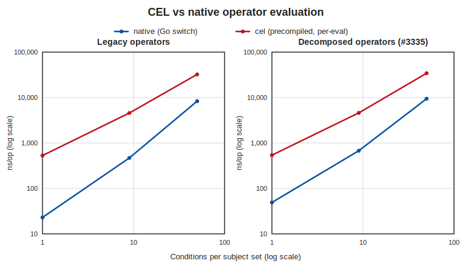
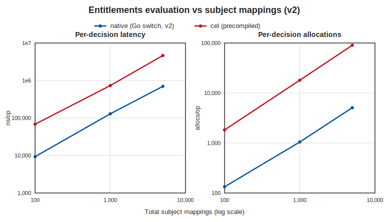

# CEL vs Native Condition Evaluation Benchmarks

Reproducible benchmarks for the CEL condition-evaluation spike, asking whether
[CEL](https://cel.dev) should replace the bespoke Subject Mapping condition operators (see
`service/policy/adr/0005-cel-condition-evaluation-spike.md`). Two layers, both in-memory below the
RPC server:

1. **Operator Engine** (no Docker): per-evaluation cost of the native operator switch vs a precompiled
   CEL program, plus the one-time CEL compile cost, swept over condition complexity, for the legacy
   operators and the decomposed axes.
2. **Entitlements Evaluation (v2)** (no Docker): native Go switch vs CEL on the step the v2 PDP
   performs, swept over subject-mapping count.

The v2 authorization path (`service/internal/access/v2`) evaluates subject mappings in pure Go via
`EvaluateSubjectMappingMultipleEntitiesWithActions` (`pdp.go:460`); there is no OPA/rego in v2 (that
lives only in the legacy v1 service). So the live question is native switch vs CEL. End-to-end v2
decision cost (policy fetch, PDP construction, attribute-rule layer) is covered by the separate v2
PDP performance work; here both layers isolate the operator engine.

## Layer 1: Operator Engine

`TestCELOperatorBenchmark` (`service/internal/subjectmappingbuiltin/cel_operator_bench_test.go`, build
tag `celbench`) builds a `SubjectSet` of `groups × conds` conditions crafted so every condition is
true and the whole set is traversed, and times three arms for two operator sets:

- **native** — a hand-written Go switch (`EvaluateSubjectSet` for legacy; a representative decomposed
  evaluator standing in for what "keep bespoke" must implement for the merged axes).
- **cel** — a `cel.Program` compiled once from the SubjectSet (`celeval`), evaluated per call by
  binding the entity's selector values.
- **cel_compile** — the one-time cost of compiling that program (amortized under compile-once / cache).

Run (no Docker):
```bash
bash docs/performance/cel-condition-evaluation/run.sh   # runs both layers
```
Outputs `results.csv` and `charts/operator.svg`.

### Results



Legacy operators (IN / NOT_IN / IN_CONTAINS):

| arm | 1×1 | 3×3 (9 conds) | 10×5 (50 conds) |
|-----|-----|---------------|-----------------|
| native | 24 ns | 462 ns | 8.2 µs |
| cel (per-eval) | 561 ns | 4.6 µs | 32.1 µs |
| cel_compile (one-time) | 80.7 µs | 353 µs | 2.3 ms |
| cel / native | 23× | 9.9× | 3.9× |

Decomposed axes (comparison + quantifier + case_insensitive):

| arm | 1×1 | 3×3 (9 conds) | 10×5 (50 conds) |
|-----|-----|---------------|-----------------|
| native | 48 ns | 665 ns | 9.1 µs |
| cel (per-eval) | 532 ns | 4.6 µs | 33.4 µs |
| cel_compile (one-time) | 80.9 µs | 335 µs | 1.9 ms |
| cel / native | 11× | 6.9× | 3.7× |

The native switch is faster per evaluation for both operator sets (3.7–23× ahead of CEL), all in the
sub-microsecond to tens-of-microseconds range. Compile is three to four orders of magnitude more than
a single eval, so any CEL path is only viable with compile-once / cache, never compile-per-request.

## Layer 2: Entitlements Evaluation (v2, no OPA)

`TestCELEntitlementsBenchmark` (`service/internal/subjectmappingbuiltin/cel_entitlements_bench_test.go`,
build tag `celbench`) builds N attribute mappings (each one subject mapping matching a single entity)
and times the entitlements computation the v2 PDP performs, two ways:

- **native** — `EvaluateSubjectMappingMultipleEntities`, the Go evaluator the v2 PDP calls (`pdp.go:460`).
- **cel** — the same orchestration with condition evaluation via precompiled CEL (`celeval`).

Run (no Docker):
```bash
bash docs/performance/cel-condition-evaluation/run.sh
CEL_BENCH_MAX_N=1000 bash docs/performance/cel-condition-evaluation/run.sh   # cap N for speed
```
Outputs `entitlements_results.csv` and `charts/entitlements.svg`.

### Results



| arm | N=100 | N=1,000 | N=5,000 |
|-----|-------|---------|---------|
| native | 9.3 µs | 130 µs | 698 µs |
| cel | 68 µs | 733 µs | 4.6 ms |
| cel / native | 7.3× | 5.7× | 6.6× |

Native is ~6–7× faster than CEL and allocates far less (5,077 vs 90,065 allocs/op at N=5,000), but
both scale linearly with the number of subject mappings and stay in the microsecond-to-low-millisecond
range across the swept sizes. In v2 this evaluation is a small slice of a decision: the dominant cost
is policy fetch/load and PDP construction, measured separately in the v2 PDP performance work.

## Takeaway

Performance is not the deciding factor. The native switch is faster per evaluation, but in v2 the
operator engine is microsecond-to-low-millisecond and a small fraction of a decision dominated by
policy fetch and PDP construction. The recommendation (store conditions as CEL) is argued in the ADR
on expressiveness: capabilities the decomposed axes cannot express (regex, numeric/ordinal,
cross-field, dynamic set-vs-set, cardinality).

## Environment

Measured on Apple M4 Max, `go version go1.26.1 darwin/arm64`. Numbers are machine-dependent; the ratios
are the portable result. `results.csv` and `entitlements_results.csv` are committed from a full run;
the race detector is off (it skews timing). Regenerate with `run.sh`.

## Scope

Both layers run in-memory below the RPC server, with no wired client / server / ERS / Keycloak / DB.
`celeval` is an experimental, unwired reference evaluator for the spike; it is not on any request path.
Both layers isolate the operator engine; end-to-end v2 decision cost (policy fetch, PDP construction,
attribute-rule layer) and multi-entity fan-out are out of scope and covered by the v2 PDP performance
work.

## Files

| File | Purpose |
| --- | --- |
| `../../../service/internal/subjectmappingbuiltin/cel_operator_bench_test.go` | Layer 1 harness (build tag `celbench`) |
| `../../../service/internal/subjectmappingbuiltin/cel_entitlements_bench_test.go` | Layer 2 harness (build tag `celbench`) |
| `../../../service/internal/subjectmappingbuiltin/celeval/` | Experimental CEL evaluator + equivalence test |
| `run.sh` | One-command reproduction (no Docker) |
| `plot.py` | CSV to consolidated SVG figures (Python stdlib only) |
| `results.csv` | Committed Layer 1 measurements |
| `entitlements_results.csv` | Committed Layer 2 measurements |
| `charts/operator.svg` | Layer 1 figure (legacy + decomposed, per-eval latency) |
| `charts/entitlements.svg` | Layer 2 figure (latency, allocations) |
