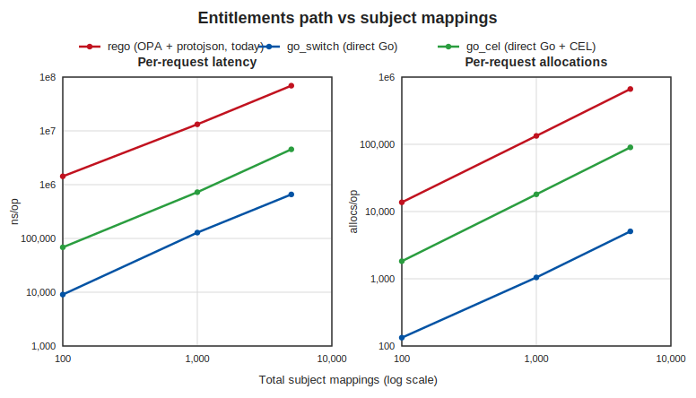

# CEL vs Native Condition Evaluation Benchmarks

Reproducible benchmarks for the CEL condition-evaluation spike, asking whether
[CEL](https://cel.dev) should replace the bespoke Subject Mapping condition operators (see
`service/policy/adr/0005-cel-condition-evaluation-spike.md`). Two layers, both in-memory below the
RPC server:

1. **Operator Engine** (no Docker): per-evaluation cost of the native operator switch vs a precompiled
   CEL program, plus the one-time CEL compile cost, swept over condition complexity, for the legacy
   operators and the decomposed axes.
2. **Full Entitlements Path** (no Docker): the cost of computing entitlements three ways, swept over
   subject-mapping count, to separate the OPA wrapper overhead from the operator engine.

A key structural finding sets up Layer 2: `entitlements.rego` only calls the `subjectmapping.resolve`
Go builtin (`service/internal/subjectmappingbuiltin`), so Rego does not evaluate operators. The choice
is CEL vs the Go switch; Rego is an orchestration wrapper measured separately.

## Layer 1: Operator Engine

`TestCELOperatorBenchmark` (`service/internal/subjectmappingbuiltin/cel_operator_bench_test.go`, build
tag `celbench`) builds a `SubjectSet` of `groups × conds` conditions crafted so every condition is
true and the whole set is traversed, and times three arms for two operator sets:

- **native** — a hand-written Go switch (`EvaluateSubjectSet` for legacy; a representative decomposed
  evaluator standing in for what "keep bespoke" must implement for the merged axes).
- **cel** — a `cel.Program` compiled once from the SubjectSet (`celeval`), evaluated per call by
  binding the entity's selector values.
- **cel_compile** — the one-time cost of compiling that program (amortized under compile-once / cache).

Run (no Docker):
```bash
bash docs/performance/cel-condition-evaluation/run.sh   # runs both layers
```
Outputs `results.csv` and `charts/operator.svg`.

### Results


Legacy operators (IN / NOT_IN / IN_CONTAINS):

| arm | 1×1 | 3×3 (9 conds) | 10×5 (50 conds) |
|-----|-----|---------------|-----------------|
| native | 24 ns | 462 ns | 8.2 µs |
| cel (per-eval) | 561 ns | 4.6 µs | 32.1 µs |
| cel_compile (one-time) | 80.7 µs | 353 µs | 2.3 ms |
| cel / native | 23× | 9.9× | 3.9× |

Decomposed axes (comparison + quantifier + case_insensitive):

| arm | 1×1 | 3×3 (9 conds) | 10×5 (50 conds) |
|-----|-----|---------------|-----------------|
| native | 48 ns | 665 ns | 9.1 µs |
| cel (per-eval) | 532 ns | 4.6 µs | 33.4 µs |
| cel_compile (one-time) | 80.9 µs | 335 µs | 1.9 ms |
| cel / native | 11× | 6.9× | 3.7× |

The native switch is faster per evaluation for both operator sets (3.7–23× ahead of CEL), all in the
sub-microsecond to tens-of-microseconds range. Compile is three to four orders of magnitude more than
a single eval, so any CEL path is only viable with compile-once / cache, never compile-per-request.

## Layer 2: Full Entitlements Path

`TestCELFullPathBenchmark` (`service/authorization/cel_fullpath_bench_test.go`, build tag `celbench`)
builds N attribute mappings (each one subject mapping matching a single entity) and times three ways
to produce entitlements over the same policy + entity:

- **rego** — the status quo: `entitlements.OpaInput` (protojson marshal) plus the prepared OPA query,
  which calls the builtin into `EvaluateSubjectMappingMultipleEntities`.
- **go_switch** — `EvaluateSubjectMappingMultipleEntities` directly, no OPA.
- **go_cel** — the same orchestration with condition evaluation via precompiled CEL (`celeval`).

Run (no Docker):
```bash
bash docs/performance/cel-condition-evaluation/run.sh
CEL_BENCH_MAX_N=1000 bash docs/performance/cel-condition-evaluation/run.sh   # cap N for speed
```
Outputs `fullpath_results.csv` and `charts/fullpath.svg`.

### Results



| arm | N=100 | N=1,000 | N=5,000 |
|-----|-------|---------|---------|
| rego | 1.43 ms | 13.2 ms | 69.2 ms |
| go_switch | 9.1 µs | 128 µs | 657 µs |
| go_cel | 68 µs | 725 µs | 4.5 ms |
| rego / go_switch | 158× | 103× | 105× |
| go_cel / go_switch | 7.5× | 5.7× | 6.9× |

The OPA wrapper dominates: Rego is ~100× slower than a direct Go call and allocates ~130× more
(665,686 vs 5,077 allocs/op at N=5,000). Against that, the operator engine difference is small: `go_cel`
is ~6–7× `go_switch`, but both are an order of magnitude under `rego`. The operator engine is not the
bottleneck in the entitlements path; the OPA layer is.

## Takeaway

Performance is not the deciding factor. The native switch is fastest per evaluation, but the operator
engine is a small slice of an OPA-dominated request (the OPA wrapper costs ~100× a direct Go call).
The recommendation (store conditions as CEL) is argued in the ADR on expressiveness: capabilities the
decomposed axes cannot express (regex, numeric/ordinal, cross-field, dynamic set-vs-set, cardinality).
A separate, larger performance lever surfaced here is the OPA wrapper itself, independent of the
operator engine.

## Environment

Measured on Apple M4 Max, `go version go1.26.1 darwin/arm64`. Numbers are machine-dependent; the ratios
are the portable result. `results.csv` and `fullpath_results.csv` are committed from a full run; the
race detector is off (it skews timing). Regenerate with `run.sh`.

## Scope

Both layers run in-memory below the RPC server, with no wired client / server / ERS / Keycloak / DB.
`celeval` is an experimental, unwired reference evaluator for the spike; it is not on any request path.
The benchmark quantifies the OPA overhead but does not remove it. Hierarchy and multi-entity fan-out
are out of scope.

## Files

| File | Purpose |
| --- | --- |
| `../../../service/internal/subjectmappingbuiltin/cel_operator_bench_test.go` | Layer 1 harness (build tag `celbench`) |
| `../../../service/authorization/cel_fullpath_bench_test.go` | Layer 2 harness (build tag `celbench`) |
| `../../../service/internal/subjectmappingbuiltin/celeval/` | Experimental CEL evaluator + equivalence test |
| `run.sh` | One-command reproduction (no Docker) |
| `plot.py` | CSV to consolidated SVG figures (Python stdlib only) |
| `results.csv` | Committed Layer 1 measurements |
| `fullpath_results.csv` | Committed Layer 2 measurements |
| `charts/operator.svg` | Layer 1 figure (legacy + decomposed, per-eval latency) |
| `charts/fullpath.svg` | Layer 2 figure (latency, allocations) |
