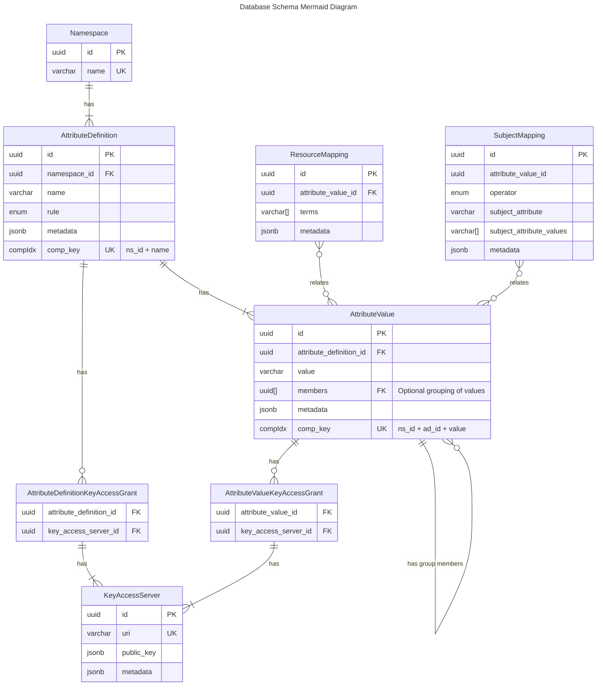

# Diagram for 20240118000000_create_new_tables.sql

```mermaid
---
title: Database Schema Mermaid Diagram
nodes: |
  Metadata is a jsonb type which will hold a common structure

  To note OCI data we can utilize labels (i.e. map[string]string)
    "labels": {
      "oci:version": "1.0.0"
      "oci:...": "..."
    }

---

erDiagram

    Namespace ||--|{ AttributeDefinition : has
    AttributeDefinition ||--|{ AttributeValue : has
    AttributeDefinition ||--o{ AttributeDefinitionKeyAccessGrant : has

    AttributeValue ||--o{ AttributeValueKeyAccessGrant: has
    AttributeValue ||--o{ AttributeValue: "has group members"

    AttributeDefinitionKeyAccessGrant ||--|{ KeyAccessServer: has
    AttributeValueKeyAccessGrant ||--|{ KeyAccessServer: has

    ResourceMapping }o--o{ AttributeValue: relates

    SubjectMapping }o--o{ AttributeValue: relates

    Namespace {
        uuid        id   PK
        varchar     name UK
    }

    AttributeDefinition {
        uuid         id           PK
        uuid         namespace_id FK
        varchar      name
        enum         rule
        jsonb        metadata
        compIdx      comp_key     UK "ns_id + name"
    }

    AttributeDefinitionKeyAccessGrant {
        uuid  attribute_definition_id FK
        uuid  key_access_server_id    FK
    }

    AttributeValue {
        uuid         id                      PK
        uuid         attribute_definition_id FK
        varchar      value
        uuid[]       members                 FK "Optional grouping of values"
        jsonb        metadata
        compIdx      comp_key                UK "ns_id + ad_id + value"
    }

    AttributeValueKeyAccessGrant {
        uuid  attribute_value_id FK
        uuid  key_access_server_id FK
    }

    ResourceMapping {
        uuid         id                 PK
        uuid         attribute_value_id FK
        varchar[]    terms
        jsonb        metadata
    }

    SubjectMapping {
        uuid           id                          PK
        uuid           attribute_value_id
        enum           operator
        varchar        subject_attribute
        varchar[]      subject_attribute_values
        jsonb          metadata
    }

    KeyAccessServer {
        uuid       id                PK
        varchar    uri               UK
        jsonb      public_key
        jsonb      metadata
    }
```
