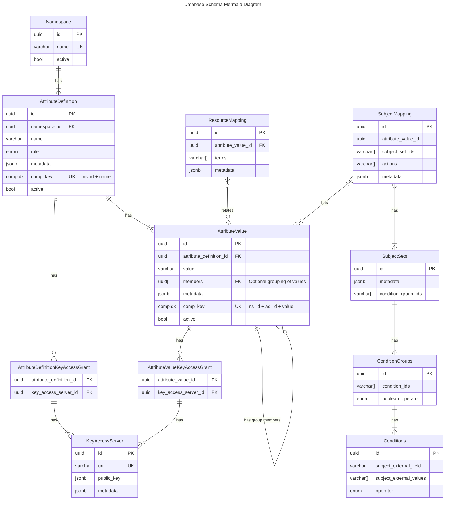

# Diagram for 20240118000000_create_new_tables.sql

```mermaid
---
title: Database Schema Mermaid Diagram
nodes: |
  This schema reflects the addition of tables forming a tree relationship under the SubjectMapping node.

  As a policy administrator, I will be able to define a subject mapping to a specific attribute Value
  corresponds to a SubjectMapping, permitting the actions TRANSMIT and DECRYPT to SubjectSets, where each
  SubjectSet comprises one or more ConditionGroups, and each ConditionGroup joins
  with a boolean operator AND or OR one or more Conditions. The Conditions are where
  Subject context fields and values (i.e. a `username` of `alice@example.org`) contained
  in an external source (most often an identity provider) actually drive a mapping
  all the way back up the tree to an internal Platform-known AttributeValue.

---

erDiagram

    Namespace ||--|{ AttributeDefinition : has
    AttributeDefinition ||--|{ AttributeValue : has
    AttributeDefinition ||--o{ AttributeDefinitionKeyAccessGrant : has

    AttributeValue ||--o{ AttributeValue: "has group members"
    AttributeValue ||--o{ AttributeValueKeyAccessGrant: has

    AttributeDefinitionKeyAccessGrant ||--|{ KeyAccessServer: has
    AttributeValueKeyAccessGrant ||--|{ KeyAccessServer: has

    ResourceMapping }o--o{ AttributeValue: relates

    SubjectMapping }|--|{ AttributeValue: has
    SubjectMapping }|--|{ SubjectSets: has
    SubjectSets ||--|{ ConditionGroups: has
    ConditionGroups ||--|{ Conditions: has

    Namespace {
        uuid        id   PK
        varchar     name UK
        bool        active
    }

    AttributeDefinition {
        uuid         id           PK
        uuid         namespace_id FK
        varchar      name
        enum         rule
        jsonb        metadata
        compIdx      comp_key     UK "ns_id + name"
        bool         active
    }

    AttributeDefinitionKeyAccessGrant {
        uuid  attribute_definition_id FK
        uuid  key_access_server_id    FK
    }

    AttributeValue {
        uuid         id                      PK
        uuid         attribute_definition_id FK
        varchar      value
        uuid[]       members                 FK "Optional grouping of values"
        jsonb        metadata
        compIdx      comp_key                UK "ns_id + ad_id + value"
        bool         active
    }

    AttributeValueKeyAccessGrant {
        uuid  attribute_value_id FK
        uuid  key_access_server_id FK
    }

    ResourceMapping {
        uuid         id                 PK
        uuid         attribute_value_id FK
        varchar[]    terms
        jsonb        metadata
    }

    SubjectMapping {
        uuid           id                          PK
        uuid           attribute_value_id
        varchar[]      subject_set_ids
        varchar[]      actions
        jsonb          metadata
    }

    Conditions {
        uuid            id                              PK
        varchar         subject_external_field
        varchar[]       subject_external_values
        enum            operator
    }

    ConditionGroups {
        uuid            id                              PK
        varchar[]       condition_ids
        enum            boolean_operator
    }

    SubjectSets {
        uuid            id                              PK
        jsonb           metadata
        varchar[]       condition_group_ids
    }

    KeyAccessServer {
        uuid       id                PK
        varchar    uri               UK
        jsonb      public_key
        jsonb      metadata
    }
```
