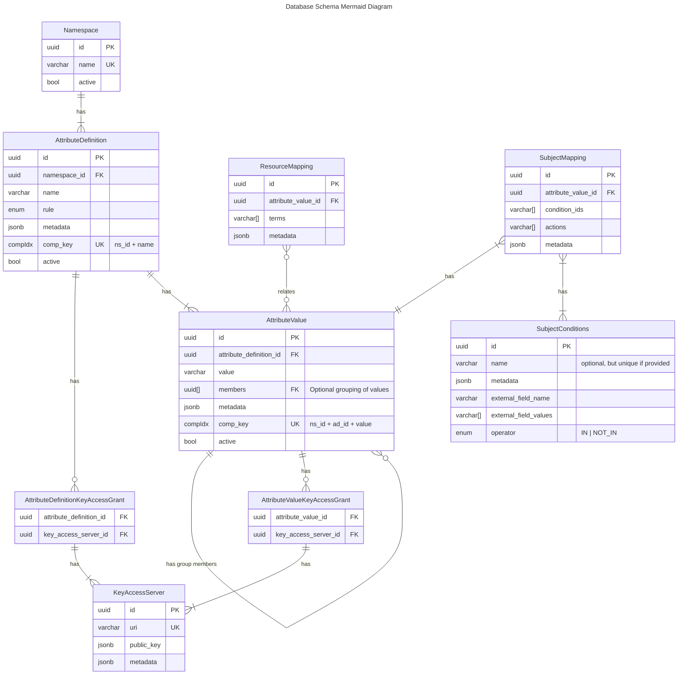

# Diagram for 20240118000000_create_new_tables.sql

```mermaid
---
title: Database Schema Mermaid Diagram
nodes: |
  This schema reflects the addition of SubjectConditions, which map external fields and values, like those
  provided in the context received about a subject/user from an Identity Provider (idP) to an Attribute Value
  by way of a SubjectMapping. An Attribute Value will relate to one or more SubjectMappings with an
  'AND' relationship, and a SubjectMapping will have one or more SubjectConditions with an 'AND' relationship. If an 'OR' boolean relationship is needed, the policy administrator is recommended to utilize
  the 'ANY_OF' Attribute Definition rule and multiple Attribute Values with their own individual
  SubjectMappings.

  Following this schema, a SubjectCondition for a company "division" of "engineering" or "product" could
  be reused across multiple SubjectMappings. On its own, that SubjectCondition would contextualize an
  Attribute Value for something like "R & D". However, in a SubjectMapping including it with a second
  SubjectCondition containing the external_field_name "title" and the external_field_values "executive",
  they would contextualize the mapped Attribute Value as essentially "R & D Executives".

  If the intended ABAC behavior was instead "R&D" _OR_ "Executives", the implementation would be an Attribute
  Definition with the rule 'ANY_OF' containing two separate Attribute Values, where each had a distinct
  SubjectMapping to one or the other of the independent SubjectConditions.

  Note: a name is optionally provided as a column on SubjectConditions (and constrained to be unique
  when provided) so that SubjectConditions can be more easily reused across varying SubjectMappings
  while allowing a policy administrator to query them by a slug instead of only a uuid.


  Questions:
    1. do we need AND/OR *outside of attribute definition ANY_OF/ALL_OF enum* for certain?
    2. if we really need nested subject conditions, can we use recursive SQL and an implicit AND?
    3. we have `active` status on attribute values, if an attribute value is deactivated, its subject mappings can live on. Do we also need `active` status on subject conditions, or is deletion just fine? 
    4. does it have to be many to many from SubjectSets to ConditionGroups and ConditionGroups to Conditions?
    5. where to ACTIONS really live? Tagging PDP is asking?

---

erDiagram

    Namespace ||--|{ AttributeDefinition : has
    AttributeDefinition ||--o{ AttributeDefinitionKeyAccessGrant : has
    AttributeDefinition ||--|{ AttributeValue : has

    AttributeValue ||--o{ AttributeValue: "has group members"
    AttributeValue ||--o{ AttributeValueKeyAccessGrant: has

    AttributeDefinitionKeyAccessGrant ||--|{ KeyAccessServer: has
    AttributeValueKeyAccessGrant ||--|{ KeyAccessServer: has

    ResourceMapping }o--o{ AttributeValue: relates

    SubjectMapping }|--|| AttributeValue: has
    SubjectMapping }|--|{ SubjectConditions: has

    Namespace {
        uuid        id   PK
        varchar     name UK
        bool        active
    }

    AttributeDefinition {
        uuid         id           PK
        uuid         namespace_id FK
        varchar      name
        enum         rule
        jsonb        metadata
        compIdx      comp_key     UK "ns_id + name"
        bool         active
    }

    AttributeDefinitionKeyAccessGrant {
        uuid  attribute_definition_id FK
        uuid  key_access_server_id    FK
    }

    AttributeValue {
        uuid         id                      PK
        uuid         attribute_definition_id FK
        varchar      value
        uuid[]       members                 FK "Optional grouping of values"
        jsonb        metadata
        compIdx      comp_key                UK "ns_id + ad_id + value"
        bool         active
    }

    AttributeValueKeyAccessGrant {
        uuid  attribute_value_id FK
        uuid  key_access_server_id FK
    }

    ResourceMapping {
        uuid         id                 PK
        uuid         attribute_value_id FK
        varchar[]    terms
        jsonb        metadata
    }

    SubjectMapping {
        uuid           id                          PK
        uuid           attribute_value_id          FK
        varchar[]      condition_ids
        varchar[]      actions
        jsonb          metadata
    }

    SubjectConditions {
        uuid            id                              PK
        varchar         name                    "optional, but unique if provided"
        jsonb           metadata
        varchar         external_field_name
        varchar[]       external_field_values
        enum            operator                "IN | NOT_IN"
    }

    KeyAccessServer {
        uuid       id                PK
        varchar    uri               UK
        jsonb      public_key
        jsonb      metadata
    }
```
