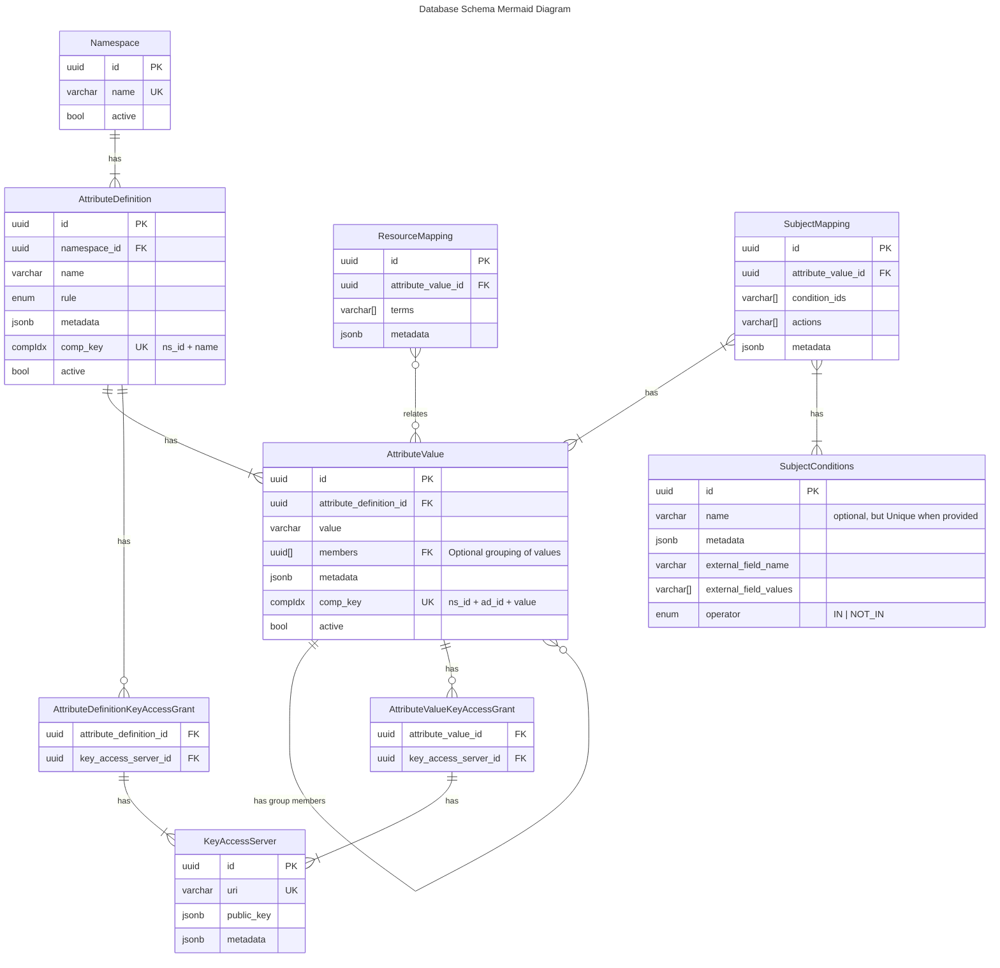

# Diagram for 20240118000000_create_new_tables.sql

```mermaid
---
title: Database Schema Mermaid Diagram
nodes: |
  This schema reflects the addition of SubjectConditions, which map external fields and values, like those
  provided in the context received about a user from an Identity Provider (idP) to an Attribute Value
  by way of a SubjectMapping. An Attribute Value will relate to one or more SubjectMappings with an
  'AND' relationship, and a SubjectMapping will have one or more SubjectConditions with an 'AND' relationship. If an 'OR' boolean relationship is needed, the policy administrator is recommended to utilize
  the 'ANY_OF' Attribute Definition rule and multiple Attribute Values with their own individual
  SubjectMappings.

  Following this schema, a SubjectCondition for a company "division" of "engineering" or "product" could
  be reused across multiple SubjectMappings. On its own, that SubjectCondition would contextualize an
  Attribute Value for "R & D". However, in a SubjectMapping combining it with a second
  SubjectCondition containing the external_field_name "title" and the external_field_values "executive",
  they would contextualize the mapped Attribute Value as essentially "R & D Executives".

  If the intended ABAC behavior was instead "R&D" _OR_ "Executives", the implementation would be an Attribute
  Definition with the rule 'ANY_OF' containing two separate Attribute Values, where each had a distinct
  SubjectMapping to the independent SubjectConditions. 

  Note: a name is optionally provided as a column on SubjectConditions (and constrained to be unique
  when provided) so that SubjectConditions can be more easily reused across varying SubjectMappings
  while allowing a policy administrator to query them by a slug instead of only a uuid.

---

erDiagram

    Namespace ||--|{ AttributeDefinition : has
    AttributeDefinition ||--|{ AttributeValue : has
    AttributeDefinition ||--o{ AttributeDefinitionKeyAccessGrant : has

    AttributeValue ||--o{ AttributeValue: "has group members"
    AttributeValue ||--o{ AttributeValueKeyAccessGrant: has

    AttributeDefinitionKeyAccessGrant ||--|{ KeyAccessServer: has
    AttributeValueKeyAccessGrant ||--|{ KeyAccessServer: has

    ResourceMapping }o--o{ AttributeValue: relates

    SubjectMapping }|--|{ AttributeValue: has
    SubjectMapping }|--|{ SubjectConditions: has

    Namespace {
        uuid        id   PK
        varchar     name UK
        bool        active
    }

    AttributeDefinition {
        uuid         id           PK
        uuid         namespace_id FK
        varchar      name
        enum         rule
        jsonb        metadata
        compIdx      comp_key     UK "ns_id + name"
        bool         active
    }

    AttributeDefinitionKeyAccessGrant {
        uuid  attribute_definition_id FK
        uuid  key_access_server_id    FK
    }

    AttributeValue {
        uuid         id                      PK
        uuid         attribute_definition_id FK
        varchar      value
        uuid[]       members                 FK "Optional grouping of values"
        jsonb        metadata
        compIdx      comp_key                UK "ns_id + ad_id + value"
        bool         active
    }

    AttributeValueKeyAccessGrant {
        uuid  attribute_value_id FK
        uuid  key_access_server_id FK
    }

    ResourceMapping {
        uuid         id                 PK
        uuid         attribute_value_id FK
        varchar[]    terms
        jsonb        metadata
    }

    SubjectMapping {
        uuid           id                          PK
        uuid           attribute_value_id          FK
        varchar[]      condition_ids
        varchar[]      actions
        jsonb          metadata
    }

    SubjectConditions {
        uuid            id                              PK
        varchar         name                    "optional, but Unique when provided"
        jsonb           metadata
        varchar         external_field_name
        varchar[]       external_field_values
        enum            operator                "IN | NOT_IN"
    }

    KeyAccessServer {
        uuid       id                PK
        varchar    uri               UK
        jsonb      public_key
        jsonb      metadata
    }
```
