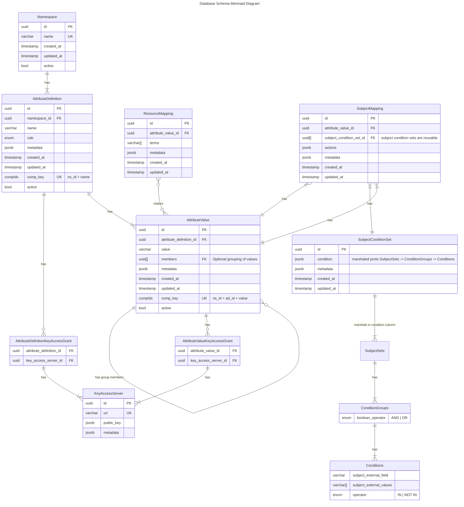

# Diagram for 20240228000000_add_subject_condition_sets.sql

## Background

This schema reflects the addition of `SubjectConditionSets`, which map external fields and values, like those
provided in the context received about a subject/user from an Identity Provider (idP) to an `Attribute Value`
by way of a `SubjectMapping`. An `Attribute Value` will relate to one or more `SubjectMapping`s with an
`AND` relationship, and each `SubjectMapping` will relate to one `SubjectConditionSet` to contextualize the
Attribute so each `Attribute Value -> 1+ SubjectConditionSets` considered `AND`ed together.
If an `OR` boolean relationship is needed, the policy administrator is recommended to utilize
the `ANY_OF` `Attribute Definition` `rule` and multiple `Attribute Values` with their own individual `SubjectMappings`.

It is known that this relation of external idP-derived Subject context to ABAC attributes is a complex
undertaking, and 3rd party FOSS/SaaS tools exist purely for this purpose. Because of this, the platform
currently supports the relation of `SubjectMapping` -> `SubjectSet(s)` -> `ConditionGroup(s)` (`AND/OR`) -> `Condition(s)`
(`IN / NOT IN`) with limited boolean logic. As there is a high likelihood of a need to integrate this relation
with 3rd party tooling in the future, these internal tree structures will be stored in a `SubjectConditionSet`
table as JSONB marshaled from the protos. That will allow reuse of the entire structure across multiple
`Attribute Values` via multiple `SubjectMappings`, but will enable flexibility to grammar and relation changes in the
future, essentially treating this structure as a v1.

As a policy administrator, I will be able to define a `SubjectMapping` on a specific `Attribute Value`
(utilizing our proto Messages/fields for `SubjectSet`s, `ConditionGroup`s, and `Condition`s) to
permit the actions `TRANSMIT` and `DECRYPT` to one or more `SubjectSets`, where each `SubjectSet` comprises
one or more `ConditionGroups`, and each `ConditionGroup` joins with a boolean operator `AND` or `OR` one
or more `Conditions`. Each `Condition` is where Subject context fields and values (i.e. a `username`
of `alice@example.org`) contained in an external source (most likely an idP or LDAP) actually drive a mapping
all the way back up the tree to an internal Platform-ABAC `Attribute Value`.

### Note: PDPs

    A PDP should consider all of the following joined by an AND relationship:
    - more than one SubjectMapping for an Attribute Value
    - more than one SubjectSet in the JSONB of a SubjectConditionSet
    - more than one ConditionGroup on a SubjectSet

    For now, ConditionGroups are the only place a policy platform administrator has control over the boolean
    operator to associate Conditions via AND or OR. If an admin needs to OR together multiple ConditionGroups
    in a SubjectSet, or multiple SubjectSets in a SubjectMapping, that can be accomplished with multiple
    AttributeValues and an AttributeDefinition rule of ANY_OF associating them together.

# ERD

