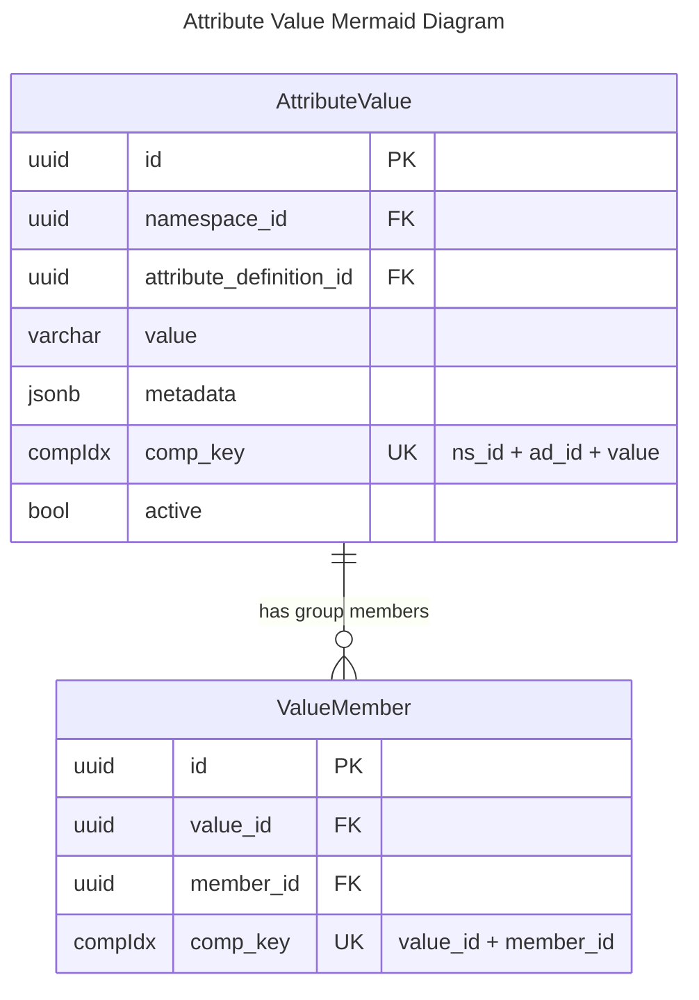

# Diagram for 20240223000000_create_val_members.sql

```mermaid
---
title: Attribute Value Mermaid Diagram
nodes: |
---

erDiagram
    AttributeValue ||--o{ ValueMember: "has group members"

    AttributeValue {
        uuid         id                      PK
        uuid         namespace_id            FK
        uuid         attribute_definition_id FK
        varchar      value
        jsonb        metadata
        compIdx      comp_key                UK "ns_id + ad_id + value"
        bool         active
    }

    ValueMember {
        uuid        id                      PK
        uuid        value_id                FK
        uuid        member_id               FK
          compIdx comp_key UK "value_id + member_id"
    }

```
