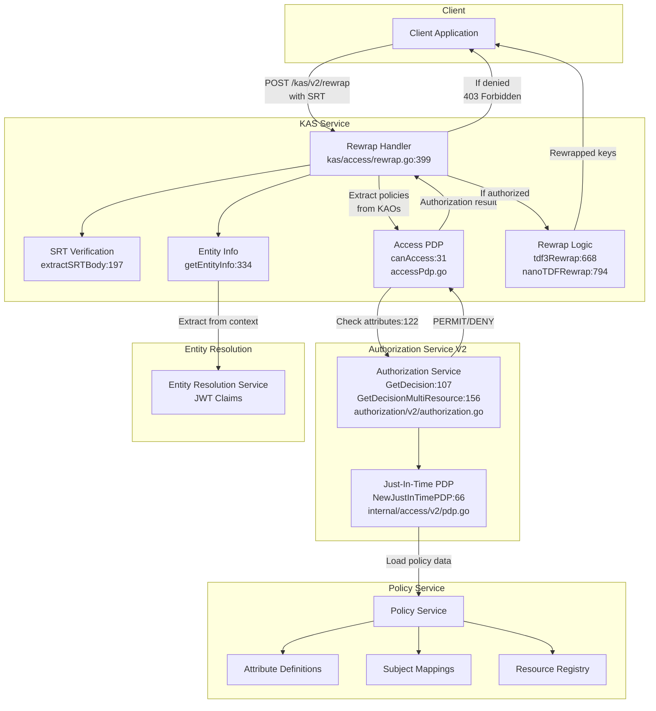
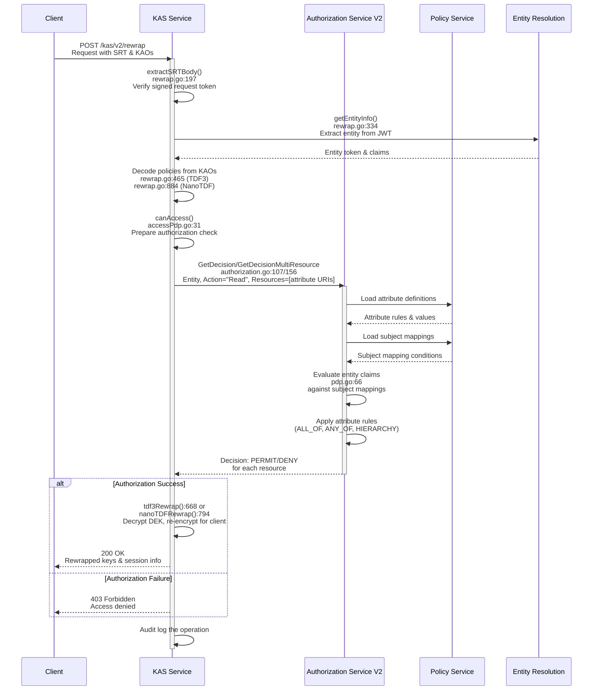
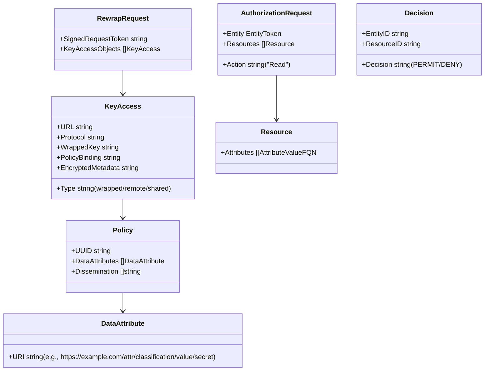
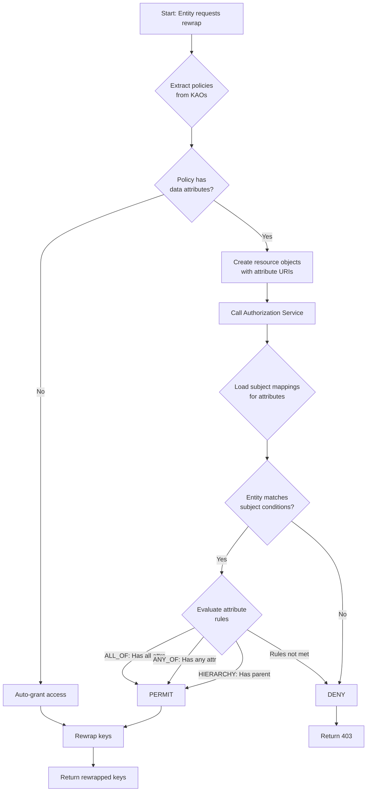

# Rewrap Endpoint Flow Diagram

## Component Overview with Line Numbers

## Detailed Sequence Flow with Line Numbers

## Key Data Structures

## Authorization Decision Logic

## Component Responsibilities with Key File Locations

### KAS Service (Key Access Service)
- **Primary Role**: Handle key rewrap requests
- **Key Files**:
  - Main handler: `service/kas/access/rewrap.go:399`
  - Access control: `service/kas/access/accessPdp.go:31`
  - Service registration: `service/kas/kas.go:37`
- **Responsibilities**:
  - Verify signed request tokens (SRT) - `extractSRTBody():197`
  - Extract and validate policies from Key Access Objects
  - Coordinate with Authorization Service for access decisions - `canAccess():31`
  - Perform actual key rewrapping:
    - RSA/EC for TDF3 - `tdf3Rewrap():668`
    - EC for NanoTDF - `nanoTDFRewrap():794`
  - Audit logging

### Authorization Service V2
- **Primary Role**: Make access control decisions
- **Key Files**:
  - Main service: `service/authorization/v2/authorization.go`
  - PDP implementation: `service/internal/access/v2/pdp.go`
- **Key Functions**:
  - Single resource: `GetDecision():107`
  - Multiple resources: `GetDecisionMultiResource():156`
  - PDP creation: `NewJustInTimePDP():66`
- **Responsibilities**:
  - Evaluate entity claims against subject mappings
  - Apply attribute rules (ALL_OF, ANY_OF, HIERARCHY)
  - Return PERMIT/DENY decisions for resources
  - Support both single and bulk resource decisions

### Policy Service
- **Primary Role**: Store and manage policy configuration
- **Key Files**:
  - Attribute definitions: `service/policy/attributes/`
  - Subject mappings: `service/policy/subjectmapping/`
  - Resource registry: `service/policy/resourcemapping/`
- **Responsibilities**:
  - Maintain attribute definitions and hierarchies
  - Store subject mappings (who can access what)
  - Provide resource registry for registered resources
  - Supply policy data to Authorization Service

### Entity Resolution Service
- **Primary Role**: Manage entity identity
- **Key Integration Points**:
  - Entity info extraction: `service/kas/access/rewrap.go:334`
  - JWT validation through middleware
- **Responsibilities**:
  - Validate JWT tokens
  - Extract entity claims and attributes
  - Provide entity context for authorization

## Key Security Features

1. **Signed Request Tokens (SRT)**: Cryptographically signed tokens prevent replay attacks
2. **DPoP (Demonstrating Proof of Possession)**: Optional additional security layer
3. **Policy Binding**: Cryptographic binding between policy and encrypted data
4. **Attribute-Based Access Control (ABAC)**: Fine-grained access based on data and entity attributes
5. **Audit Logging**: Complete audit trail of all access decisions and operations