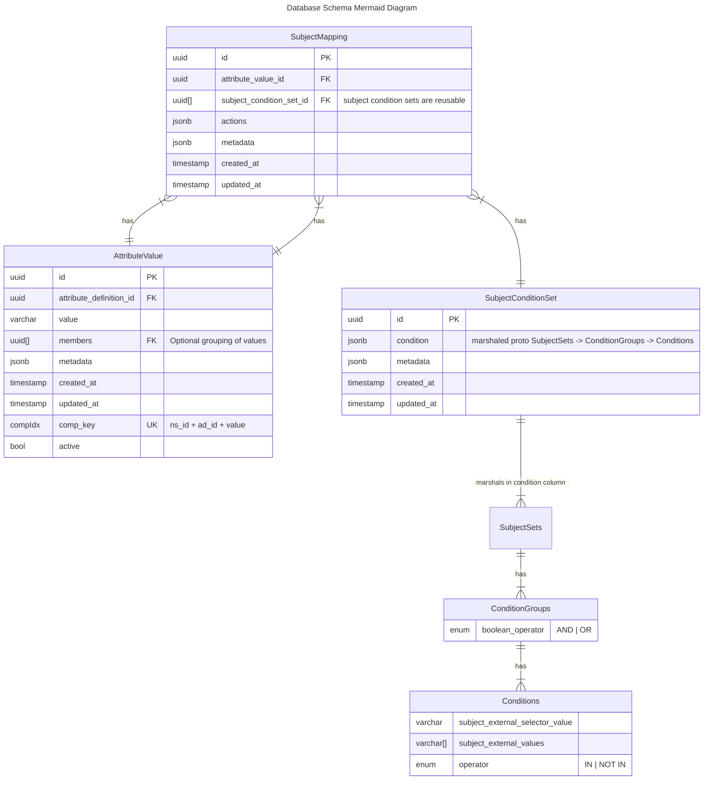

# Diagram for 20240405000000_update_selector_field_name.sql

## Background

This schema reflects an update to `SubjectConditionSets`, which map external fields and values, like those
provided in the context received about a subject/user from an Identity Provider (idP) to an `Attribute Value`
by way of a `SubjectMapping`. Each `Condition` will be driven by the fields and values of an external user
store, and the syntax to select the appropriate field off the user store (or "subject context"), be it an
access token, JSON representation, endpoint/webhook response value, etc, will be housed within the Condition
field `subject_external_selector_value`, which was formerly called `subject_external_field`.

# ERD

