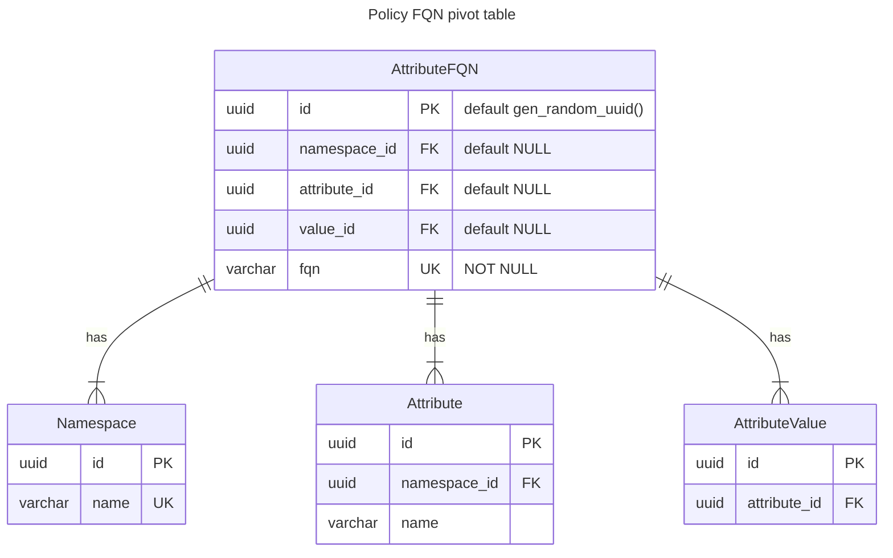

# Diagram for 20240213000000_create_attribute_fqn.sql

```mermaid
---
title: Policy FQN pivot table
notes: |
  FQN (Fully Qualified Name) is a pivot table that will allow us to associate an attribute with a
  fully qualified name. In TDF land attributes are associated with a fully qualified name. The
  structure of the attribute FQN is:

    https://{namespace}/attr/{attribute}/value/{value}

  This pivot table will allow us to associate each part of the FQN with an attribute which will be
  used with systems like KAS to look up the data and make a decision.

  It is alright if this data is eventually consistent as the data can be reindexed as needed. There
  might be a future when we support multiple datastores and utilize an auxiliary database to support
  faster lookups.
---

erDiagram 

    %% We are not going to model the namespace, attribute, and value tables here as they are already
    %% defined in the previous diagram. We will just use the table names and the primary key fields
    %% to show the relationships.

    Namespace {
        uuid        id   PK
        varchar     name UK
    }

    Attribute {
        uuid         id           PK
        uuid         namespace_id FK
        varchar      name
    }

    AttributeValue {
        uuid         id           PK
        uuid         attribute_id FK
    }

    %% The following is the new FQN pivot table. The table supports partial FQN's as well as full
    %% FQN's. Note that the namespace, attribute, and value fields are nullable. This is to support
    %% partial FQN's as the partial resources are already graphed in their respective tables.

    AttributeFQN {
        uuid         id           PK "default gen_random_uuid()"
        uuid         namespace_id FK "default NULL"
        uuid         attribute_id FK "default NULL"
        uuid         value_id     FK "default NULL"
        varchar      fqn          UK "NOT NULL"
    }

    %% Relationships

    AttributeFQN ||--|{ Namespace : has
    AttributeFQN ||--|{ Attribute : has
    AttributeFQN ||--|{ AttributeValue : has

```