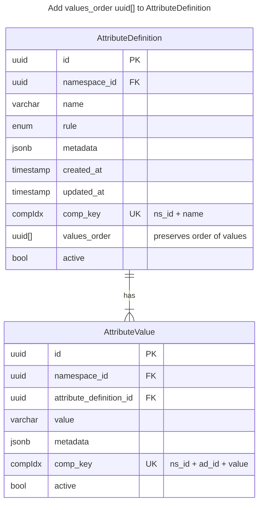

# Diagram for 20240402000000_preserve_values_order.sql

## Background

Attribute definitions and values until this point have not guaranteed order preservation.
This means the attribute rule type `hierarchy` was nonfunctional. The new change will be
to add a `values_order uuid[]` column containing value ids within the attribute definition table.

Expected behaviors:

1. Value CREATE: trigger adds the new value id to the definition `values_order` column.
2. Value DELETE (unsafe behavior): trigger removes the deleted value id from the definition `values_order` column.
3. Value DEACTIVATE/UPDATE: no change to the definition column array.
4. Definition UPDATE with reorder of values (unsafe behavior): full replacement of the column uuid's, with validation that
   1. the new contents are all children values of the attribute, and
   2. that the number of values in the array is unchanged.

