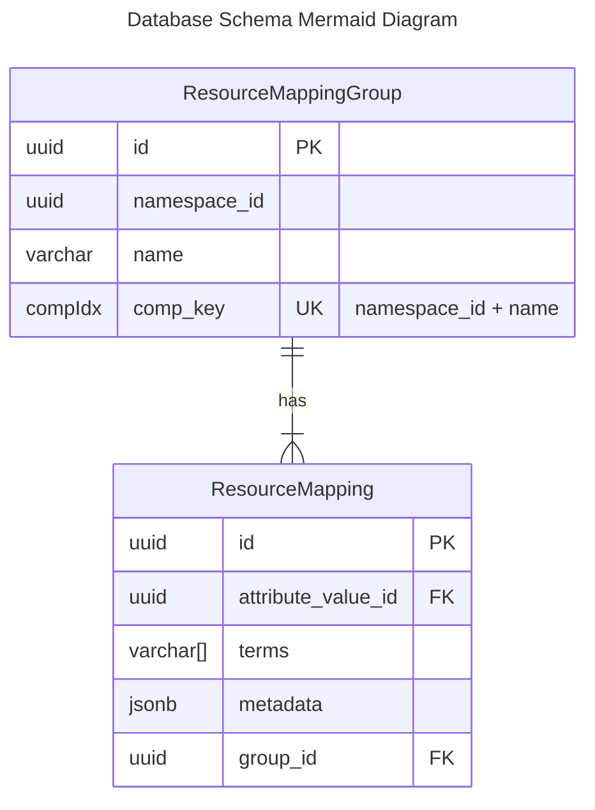

# Diagram for 20240806142109_add_resource_mapping_groups.sql

## Background

This schema reflects the addition of a `resource_mapping_groups` table, allowing existing Resource Mappings to be grouped by namespace and a common name. The migration also updates the `resource_mappings` table to include a `group_id` column, which will be used to optionally associate a Resource Mapping with a group.

# ERD

