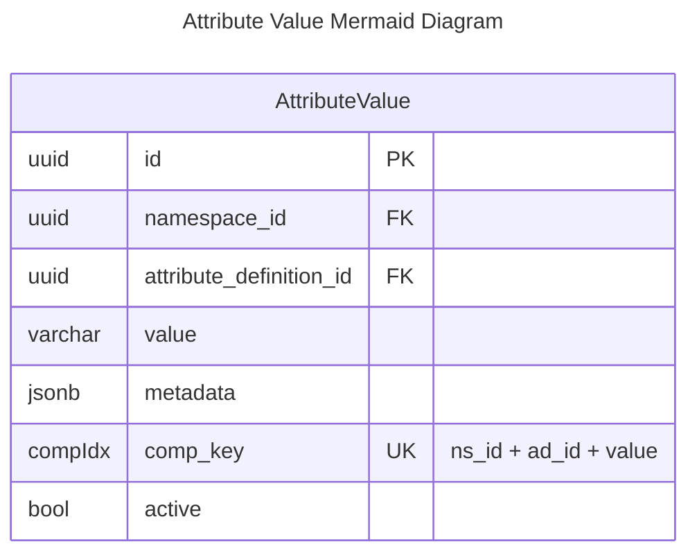

# Diagram for 20240729000000_drop_attribute_value_members.sql

## Removes 'attribute_value_members'

This migration ERD documents changes in the platform architecture to remove 'members'
from policy. ADR can be [viewed here](https://github.com/opentdf/platform/issues/984).

