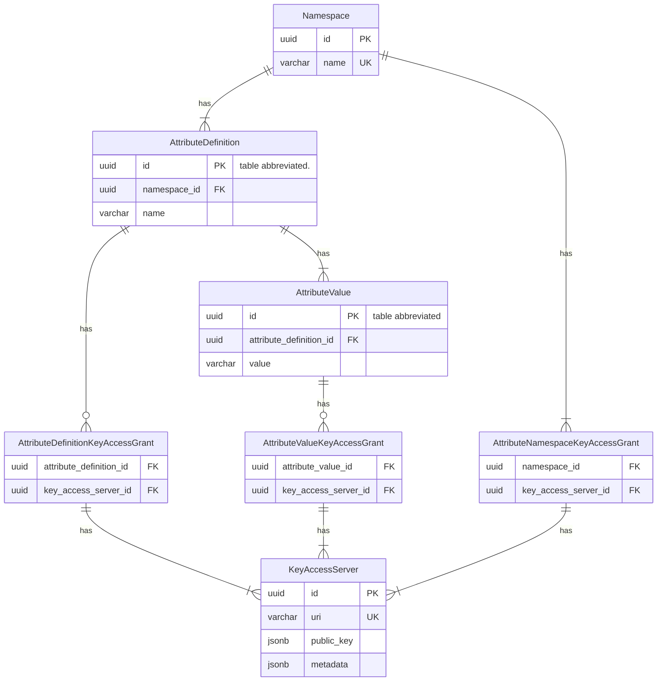

# Diagram for 20240812000000_namespace_kas_grants.sql

```mermaid

erDiagram

    Namespace ||--|{ AttributeNamespaceKeyAccessGrant : has
    Namespace ||--|{ AttributeDefinition : has
    AttributeDefinition ||--|{ AttributeValue : has
    AttributeDefinition ||--o{ AttributeDefinitionKeyAccessGrant : has

    AttributeValue ||--o{ AttributeValueKeyAccessGrant: has

    AttributeDefinitionKeyAccessGrant ||--|{ KeyAccessServer: has
    AttributeValueKeyAccessGrant ||--|{ KeyAccessServer: has
    AttributeNamespaceKeyAccessGrant ||--|{ KeyAccessServer: has

    Namespace {
        uuid        id   PK
        varchar     name UK
    }

    AttributeNamespaceKeyAccessGrant {
        uuid  namespace_id FK
        uuid  key_access_server_id    FK
    }

    AttributeDefinition {
        uuid         id           PK "table abbreviated."
        uuid         namespace_id FK
        varchar      name
    }

    AttributeDefinitionKeyAccessGrant {
        uuid  attribute_definition_id FK
        uuid  key_access_server_id    FK
    }

    AttributeValue {
        uuid         id                      PK "table abbreviated"
        uuid         attribute_definition_id FK
        varchar      value
    }

    AttributeValueKeyAccessGrant {
        uuid  attribute_value_id FK
        uuid  key_access_server_id FK
    }

    KeyAccessServer {
        uuid       id                PK
        varchar    uri               UK
        jsonb      public_key
        jsonb      metadata
    }
```
