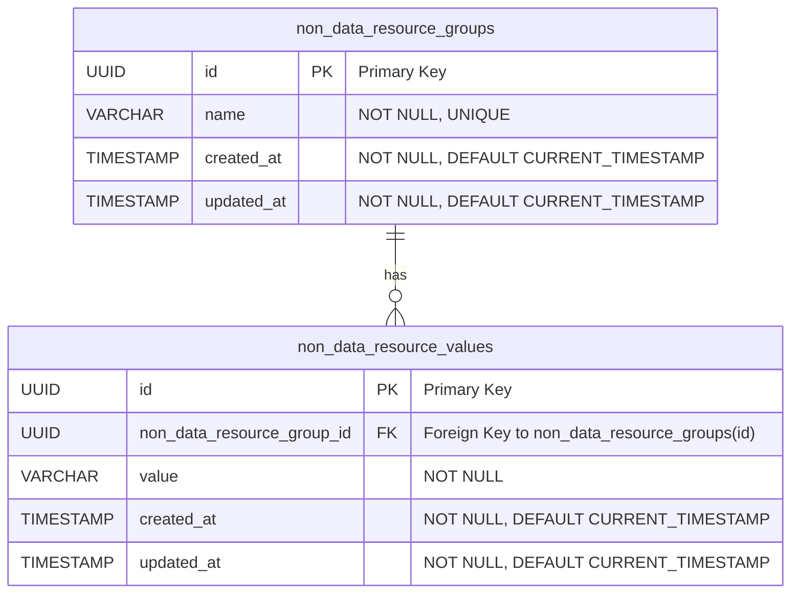

# Add Non Data Resources Table
[ADR for Non Data Resource Support](https://github.com/opentdf/platform/issues/1915)

```mermaid
erDiagram
    non_data_resource_groups ||--o{ non_data_resource_values : "has"
    
    non_data_resource_groups {
        UUID id PK "Primary Key"
        VARCHAR name "NOT NULL, UNIQUE"
        TIMESTAMP created_at "NOT NULL, DEFAULT CURRENT_TIMESTAMP"
        TIMESTAMP updated_at "NOT NULL, DEFAULT CURRENT_TIMESTAMP"
    }
    
    non_data_resource_values {
        UUID id PK "Primary Key"
        UUID non_data_resource_group_id FK "Foreign Key to non_data_resource_groups(id)"
        VARCHAR value "NOT NULL"
        TIMESTAMP created_at "NOT NULL, DEFAULT CURRENT_TIMESTAMP"
        TIMESTAMP updated_at "NOT NULL, DEFAULT CURRENT_TIMESTAMP"
    }
```
