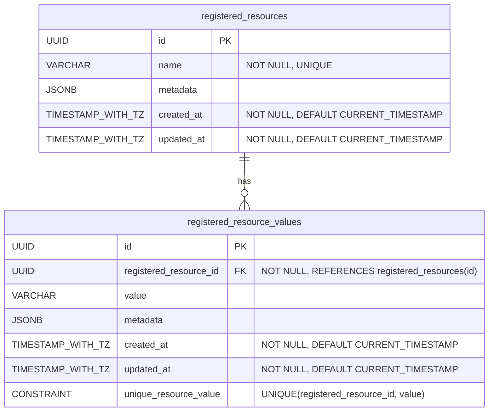

# Add Registered Resources Table
[ADR for Registered Resources (formerly known as Non Data Resources)](https://github.com/opentdf/platform/issues/1915)

```mermaid
erDiagram
    registered_resources ||--o{ registered_resource_values : "has"
    
    registered_resources {
        UUID id PK
        VARCHAR name "NOT NULL, UNIQUE"
        JSONB metadata
        TIMESTAMP_WITH_TZ created_at "NOT NULL, DEFAULT CURRENT_TIMESTAMP"
        TIMESTAMP_WITH_TZ updated_at "NOT NULL, DEFAULT CURRENT_TIMESTAMP"
    }
    
    registered_resource_values {
        UUID id PK
        UUID registered_resource_id FK "NOT NULL, REFERENCES registered_resources(id)"
        VARCHAR value
        JSONB metadata
        TIMESTAMP_WITH_TZ created_at "NOT NULL, DEFAULT CURRENT_TIMESTAMP"
        TIMESTAMP_WITH_TZ updated_at "NOT NULL, DEFAULT CURRENT_TIMESTAMP"
        CONSTRAINT unique_resource_value "UNIQUE(registered_resource_id, value)"
    }
```