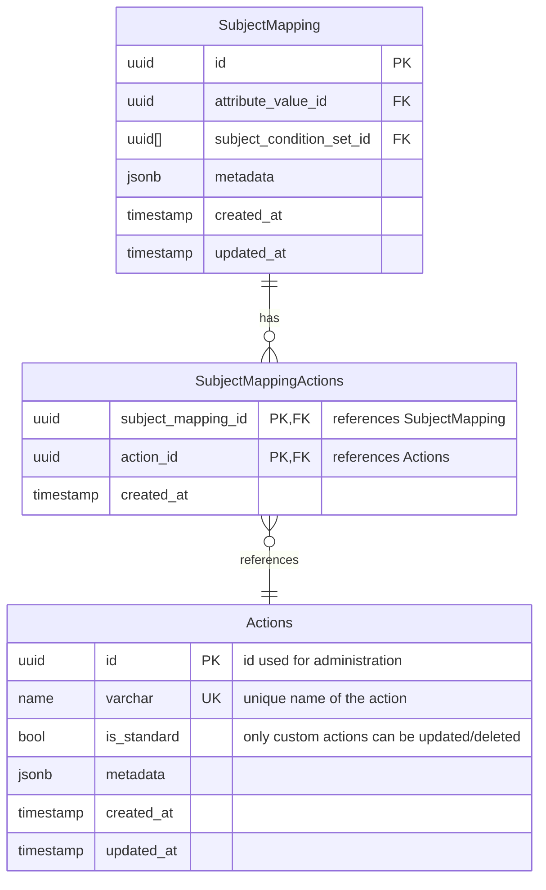

# Add Actions Table

Actions will evolve from a simple enum with limited options (decrypt, transmit) defined solely in protos
to a comprehensive CRUD-inspired policy object with dedicated database storage, explicit relationships to subject
mappings and (incoming) obligations, and improved API support.

This enhancement provides greater flexibility for defining permitted operations on protected
resources while eliminating confusion in action handling across the platform.

