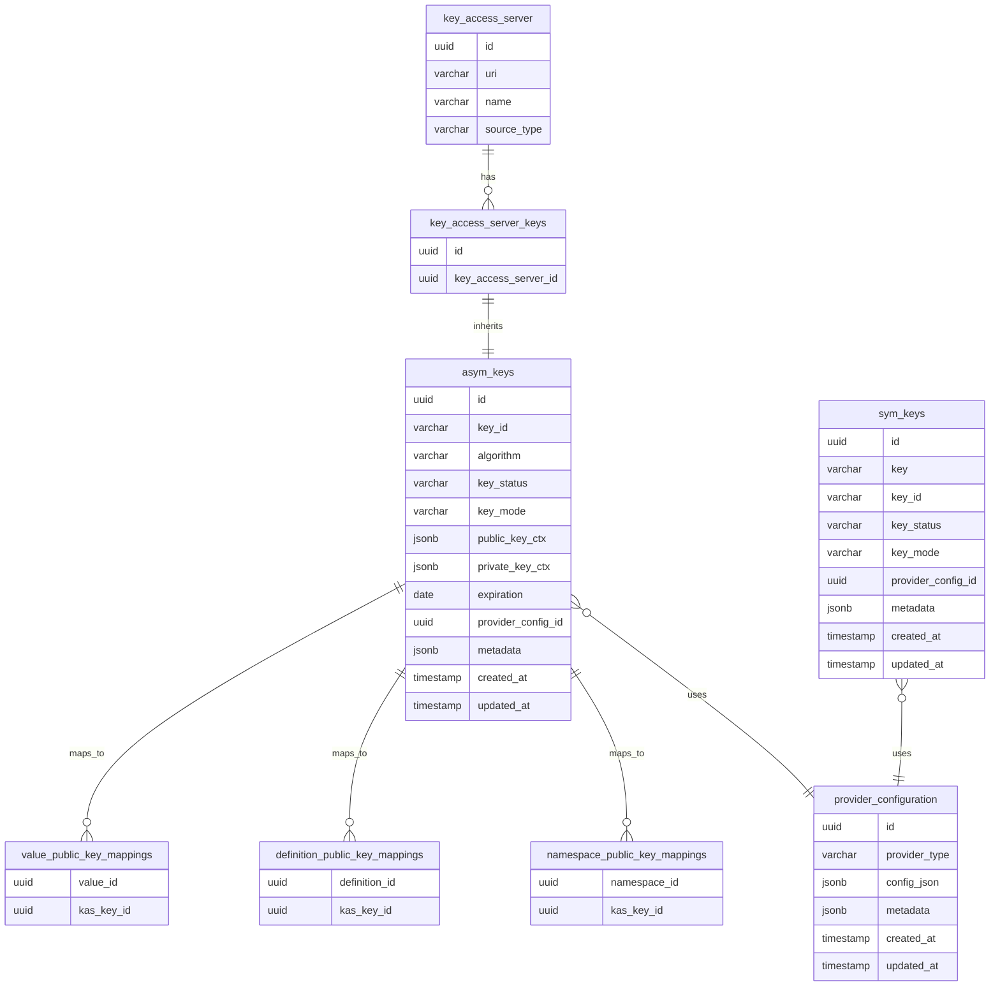

# Refine Key Management Story

```mermaid
erDiagram
key_access_server {
  uuid id
  varchar uri
  varchar name
  varchar source_type
}
key_access_server_keys {
  uuid id
  uuid key_access_server_id
}
asym_keys {
  uuid id
  varchar key_id
  varchar algorithm
  varchar key_status
  varchar key_mode
  jsonb   public_key_ctx
  jsonb   private_key_ctx
  date    expiration
  uuid    provider_config_id
  jsonb   metadata
  timestamp created_at
  timestamp updated_at
}
sym_keys {
  uuid id
  varchar key
  varchar key_id
  varchar key_status
  varchar key_mode
  uuid provider_config_id
  jsonb metadata
  timestamp created_at
  timestamp updated_at
}
provider_configuration {
  uuid id
  varchar provider_type
  jsonb config_json
  jsonb metadata
  timestamp created_at
  timestamp updated_at
}
namespace_public_key_mappings {
  uuid namespace_id
  uuid kas_key_id
}
definition_public_key_mappings {
  uuid definition_id
  uuid kas_key_id
}
value_public_key_mappings {
  uuid value_id
  uuid kas_key_id
}
key_access_server ||--o{ key_access_server_keys : has
key_access_server_keys ||--|| asym_keys : inherits
asym_keys }o--|| provider_configuration : uses
sym_keys }o--|| provider_configuration : uses
asym_keys ||--o{ namespace_public_key_mappings : maps_to
asym_keys ||--o{ definition_public_key_mappings : maps_to
asym_keys ||--o{ value_public_key_mappings : maps_to
```
