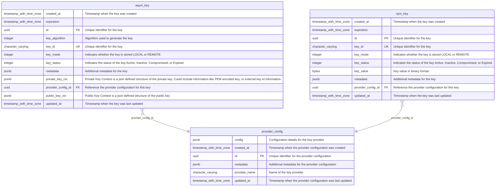

# Refine Key Management Story

```mermaid
erDiagram

    asym_key {
        timestamp_with_time_zone created_at "Timestamp when the key was created"
        timestamp_with_time_zone expiration 
        uuid id PK "Unique identifier for the key"
        integer key_algorithm "Algorithm used to generate the key"
        character_varying key_id UK "Unique identifier for the key"
        integer key_mode "Indicates whether the key is stored LOCAL or REMOTE"
        integer key_status "Indicates the status of the key Active, Inactive, Compromised, or Expired"
        jsonb metadata "Additional metadata for the key"
        jsonb private_key_ctx "Private Key Context is a json defined structure of the private key. Could include information like PEM encoded key, or external key id information"
        uuid provider_config_id FK "Reference the provider configuration for this key"
        jsonb public_key_ctx "Public Key Context is a json defined structure of the public key"
        timestamp_with_time_zone updated_at "Timestamp when the key was last updated"
    }

    provider_config {
        jsonb config "Configuration details for the key provider"
        timestamp_with_time_zone created_at "Timestamp when the provider configuration was created"
        uuid id PK "Unique identifier for the provider configuration"
        jsonb metadata "Additional metadata for the provider configuration"
        character_varying provider_name "Name of the key provider"
        timestamp_with_time_zone updated_at "Timestamp when the provider configuration was last updated"
    }

    sym_key {
        timestamp_with_time_zone created_at "Timestamp when the key was created"
        timestamp_with_time_zone expiration 
        uuid id PK "Unique identifier for the key"
        character_varying key_id UK "Unique identifier for the key"
        integer key_mode "Indicates whether the key is stored LOCAL or REMOTE"
        integer key_status "Indicates the status of the key Active, Inactive, Compromised, or Expired"
        bytea key_value "Key value in binary format"
        jsonb metadata "Additional metadata for the key"
        uuid provider_config_id FK "Reference the provider configuration for this key"
        timestamp_with_time_zone updated_at "Timestamp when the key was last updated"
    }

    asym_key }o--|| provider_config : "provider_config_id"
    sym_key }o--|| provider_config : "provider_config_id"
```
