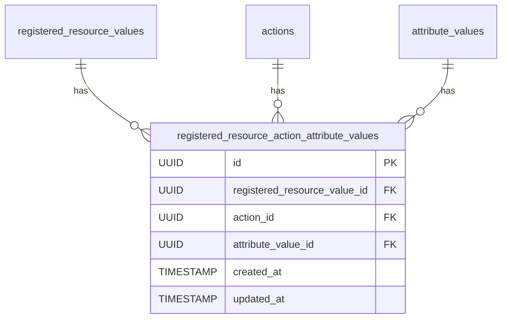

# Registered Resources Action and Attribute Values Migration
This migration creates a new table to store the relationship between registered resources, actions, and attribute values.

```mermaid
erDiagram
    registered_resource_values ||--o{ registered_resource_action_attribute_values : has
    actions ||--o{ registered_resource_action_attribute_values : has
    attribute_values ||--o{ registered_resource_action_attribute_values : has

    registered_resource_action_attribute_values {
        UUID id PK
        UUID registered_resource_value_id FK
        UUID action_id FK
        UUID attribute_value_id FK
        TIMESTAMP created_at
        TIMESTAMP updated_at
    }
```