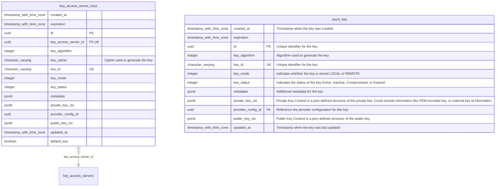

```mermaid
erDiagram

    key_access_server_keys {
        timestamp_with_time_zone created_at 
        timestamp_with_time_zone expiration 
        uuid id PK 
        uuid key_access_server_id FK,UK 
        integer key_algorithm
        character_varying key_cipher "Cipher used to generate the key" 
        character_varying key_id UK 
        integer key_mode 
        integer key_status 
        jsonb metadata 
        jsonb private_key_ctx 
        uuid provider_config_id 
        jsonb public_key_ctx 
        timestamp_with_time_zone updated_at 
        boolean default_key
    }

    asym_key {
        timestamp_with_time_zone created_at "Timestamp when the key was created"
        timestamp_with_time_zone expiration 
        uuid id PK "Unique identifier for the key"
        integer key_algorithm "Algorithm used to generate the key"
        character_varying key_id UK "Unique identifier for the key"
        integer key_mode "Indicates whether the key is stored LOCAL or REMOTE"
        integer key_status "Indicates the status of the key Active, Inactive, Compromised, or Expired"
        jsonb metadata "Additional metadata for the key"
        jsonb private_key_ctx "Private Key Context is a json defined structure of the private key. Could include information like PEM encoded key, or external key id information"
        uuid provider_config_id FK "Reference the provider configuration for this key"
        jsonb public_key_ctx "Public Key Context is a json defined structure of the public key"
        timestamp_with_time_zone updated_at "Timestamp when the key was last updated"
    }


    key_access_server_keys }o--|| key_access_servers : "key_access_server_id"
```

