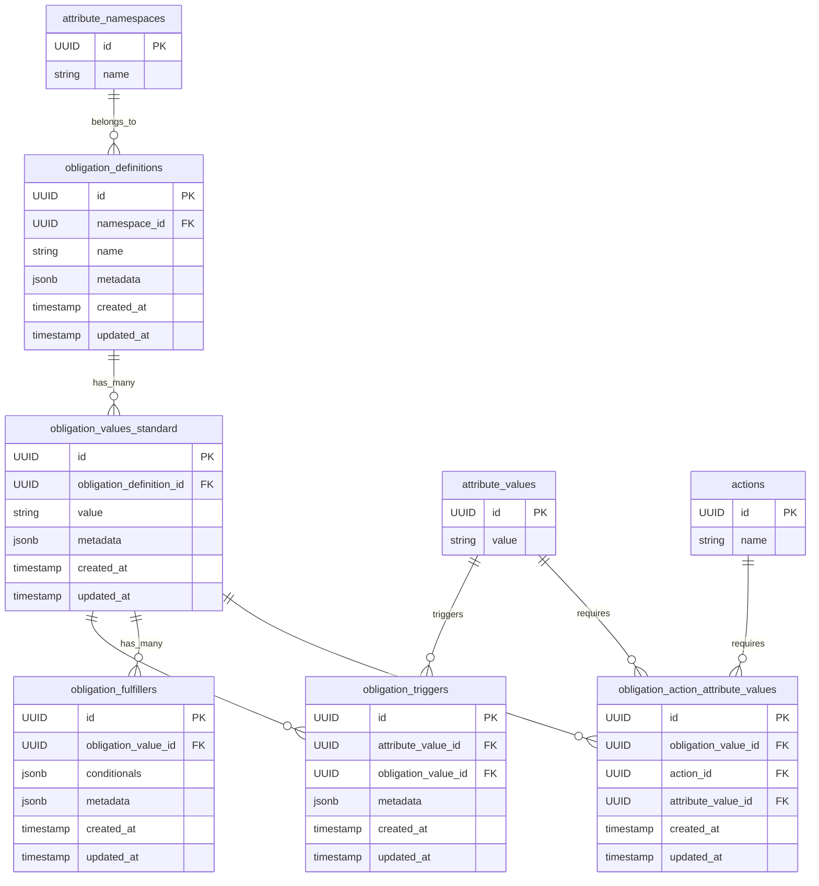

[ADR for Obligations](https://github.com/opentdf/platform/issues/1933)

This migration adds the obligation tables for definitions, values, triggers, fulfillers, and action attribute value relationships.

