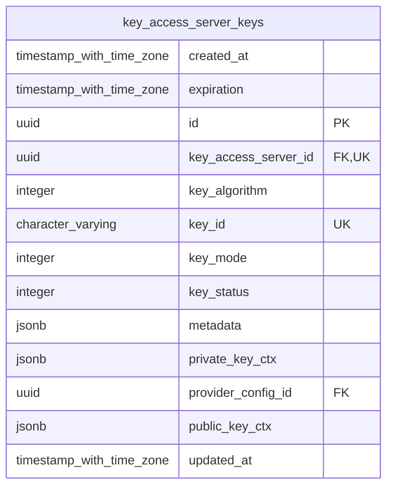
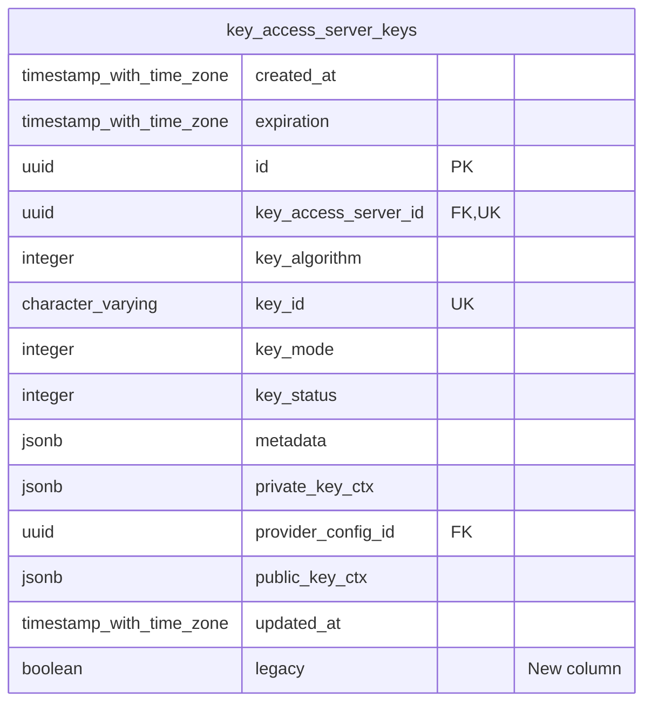

# Migration: Add Legacy Key to KAS Keys

This migration introduces a `legacy` column to the `key_access_server_keys` table.

## Changes

- **`key_access_server_keys` table:**
  - A new boolean column `legacy` is added.
  - This column defaults to `FALSE`.
  - A unique index `key_access_server_keys_legacy_true_idx` is created on `key_access_server_id` where `legacy` is `TRUE`.

## ERD

### Before

### After

The updated `key_access_server_keys` table is as follows, with the new `legacy` column highlighted:

