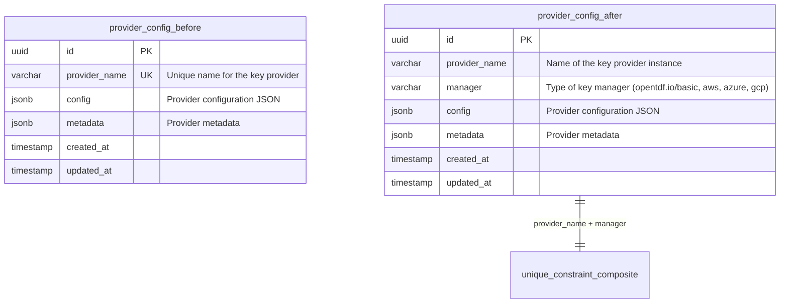
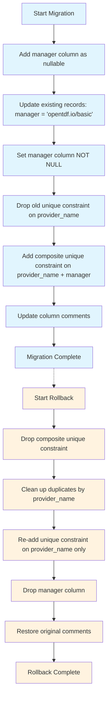

# Add Provider Manager Column Migration

This migration adds a `manager` column to the `provider_config` table to support different key manager types (opentdf.io/basic, aws, azure, gcp, etc.).

## Schema Changes



## Key Changes

### 1. **Column Addition**
- Added `manager VARCHAR(255) NOT NULL` column
- Default value of 'opentdf.io/basic' for backward compatibility

### 2. **Constraint Changes**
- **Removed**: `provider_config_provider_name_key` (unique on provider_name only)
- **Added**: `provider_config_provider_name_manager_key` (composite unique on provider_name + manager)

### 3. **Backward Compatibility**
- Existing records get `manager = 'opentdf.io/basic'` during migration
- API maintains compatibility with default manager assignment

## Migration Flow



## Use Cases Enabled

### 1. **Multi-Manager Support**
```sql
-- Same provider name with different managers
INSERT INTO provider_config (provider_name, manager, config) VALUES 
('my-provider', 'opentdf.io/basic', '{"key": "opentdf.io/basic-config"}'),
('my-provider', 'aws', '{"key": "aws-config"}');
```

### 2. **Manager-Specific Queries**
```sql
-- Find all AWS-managed providers
SELECT * FROM provider_config WHERE manager = 'aws';

-- Find specific provider-manager combination
SELECT * FROM provider_config 
WHERE provider_name = 'my-provider' AND manager = 'opentdf.io/basic';
```

## Rollback Safety

The rollback includes duplicate cleanup logic to prevent constraint violations:

```sql
-- Keep only the oldest record for each provider_name
DELETE FROM provider_config 
WHERE id NOT IN (
    SELECT DISTINCT ON (provider_name) id 
    FROM provider_config 
    ORDER BY provider_name, created_at ASC
);
```

This ensures safe rollback even if multiple provider configs exist with the same name but different managers.