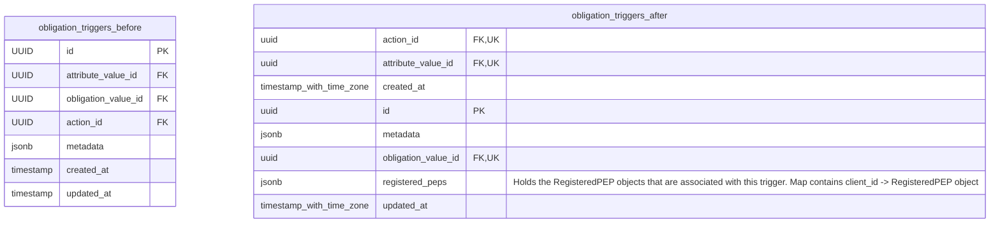

# Add Registered_Peps Column Migration

Adds a column for connecting registered peps with obligations. Doing so bridges the gap between PEPs and Obligations.
"this" obligation.

## Schema Changes

## Key Changes

### 1. **Column Addition**

- Require registered_peps to be apart of a trigger.
