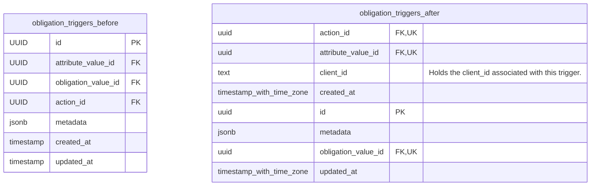

# Add Registered_Peps Column Migration

Adds a column for connecting a client with obligations. Doing so bridges the gap between PEPs and Obligations.

## Schema Changes

## Key Changes

### 1. **Column Addition**

- Add optional `client_id` to be a part of a trigger.
