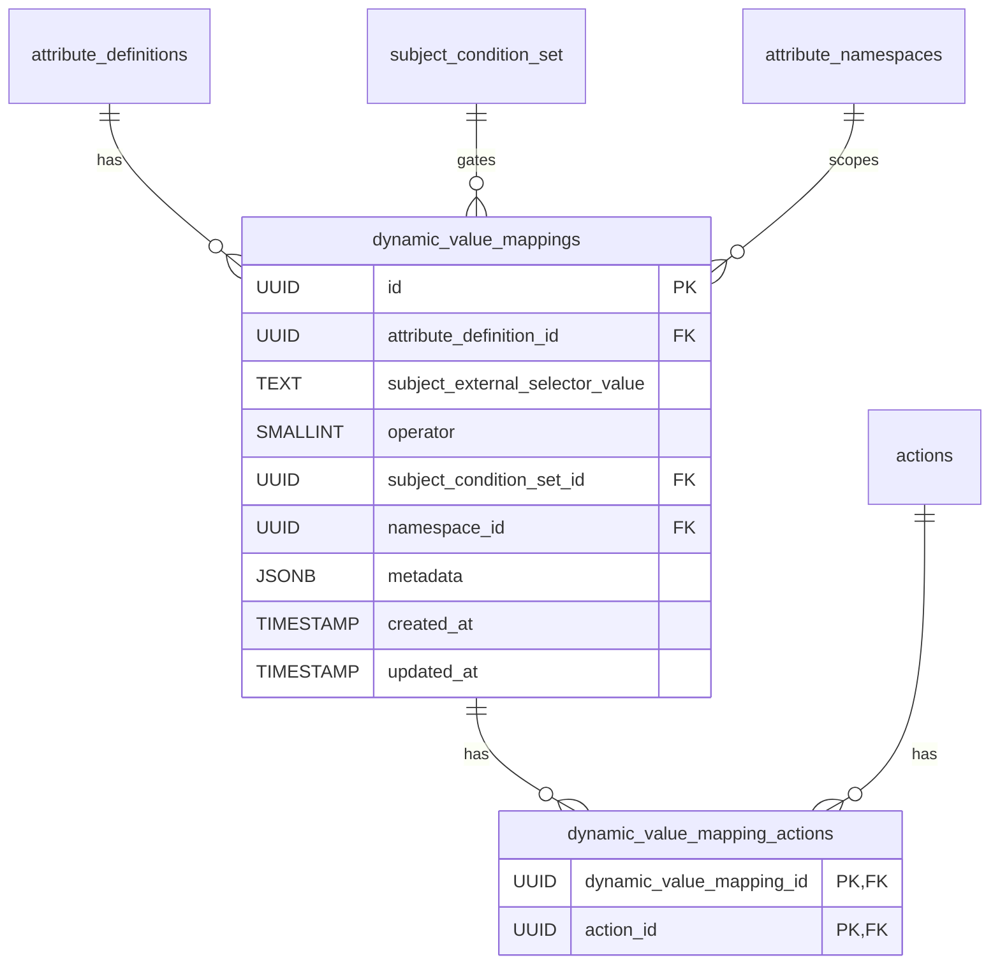

# Add Dynamic Value Mappings

This migration adds the `dynamic_value_mappings` and `dynamic_value_mapping_actions` tables that back
the `DynamicValueMapping` policy primitive.

See ADR 0005,
[Dynamic Attribute Value Entitlement](../../adr/0005-dynamic-attribute-value-entitlements-spike.md),
for the design rationale.

## Why

Entitling highly dynamic, high-cardinality attribute values (medical record numbers, account IDs,
email-like identifiers) previously required duplicating each value as an `AttributeValue` paired with
its own `SubjectMapping` and `SubjectConditionSet`, kept in sync with an external system of record. A
dynamic value mapping raises entitlement authority from a concrete attribute value to the attribute
definition: a single mapping resolves entitlement for dynamically-requested values under the
definition by comparing the requested resource value segment against the entity representation at
decision time.

## Changes

1. `dynamic_value_mappings` — definition-scoped dynamic entitlement mappings:
   - `attribute_definition_id` — foreign key to `attribute_definitions(id)` with `ON DELETE CASCADE`.
   - `subject_external_selector_value` — selector resolved against the entity representation, compared
     to the requested resource value segment.
   - `operator` — `policy.SubjectMappingOperatorEnum` value (`IN` or `IN_CONTAINS`).
   - `subject_condition_set_id` — optional static pre-gate, foreign key to `subject_condition_set(id)`
     with `ON DELETE CASCADE`, evaluated with normal `SubjectConditionSet` semantics.
   - `namespace_id` — foreign key to `attribute_namespaces(id)` with `ON DELETE CASCADE`.
   - `metadata`, `created_at`, `updated_at`, plus an `updated_at` trigger.
   - Indexes on `attribute_definition_id`, `subject_condition_set_id`, and `namespace_id`.

2. `dynamic_value_mapping_actions` — join table linking a dynamic value mapping to its actions:
   - `dynamic_value_mapping_id` — foreign key to `dynamic_value_mappings(id)` with `ON DELETE CASCADE`.
   - `action_id` — foreign key to `actions(id)` with `ON DELETE CASCADE`.
   - Composite `PRIMARY KEY (dynamic_value_mapping_id, action_id)`, which also covers lookups, so no
     separate index is added.

## Resulting Behavior

- A definition can carry a dynamic value mapping that entitles dynamically-requested values without
  pre-provisioning each value plus a subject mapping.
- Dynamic value mappings do not coexist with value-level subject mappings on the same definition, nor
  with values referenced by a registered resource's action attribute values; both directions are
  enforced.
- Deleting a definition, subject condition set, namespace, or action cascades to remove the associated
  dynamic value mappings or action links.
