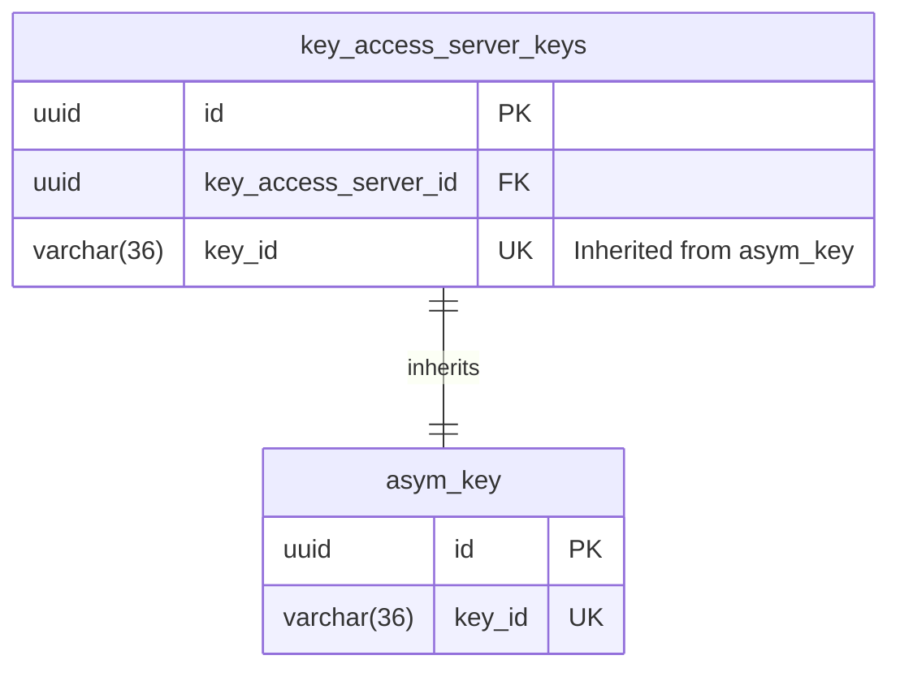
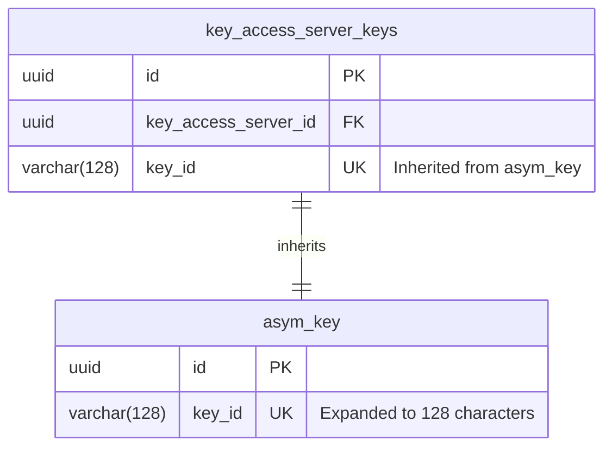

# Migration: Expand KAS Key IDs

This migration supports KAS key IDs longer than the previous 36-character limit,
including the longer IDs used by SaaS DSP.

## Changes

- `asym_key.key_id` changes from `VARCHAR(36)` to `VARCHAR(128)`. The inherited
  column in `key_access_server_keys` changes with it.
- Existing key IDs and uniqueness constraints are preserved.
- The three active public key views are recreated with their existing definitions
  because PostgreSQL requires this when changing the column type.

## ERD

The diagrams show the affected columns and the existing table inheritance.

### Before

### After

## Rollback

Rollback restores the 36-character column limit and fails without truncating data
if longer IDs still exist. Remove or replace those keys before rolling back.
