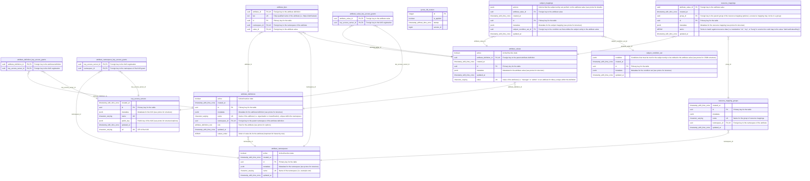

```mermaid
erDiagram
    attribute_definition_key_access_grants {
        uuid attribute_definition_id PK,FK "Foreign key to the attribute definition"
        uuid key_access_server_id PK,FK "Foreign key to the KAS registration"
    }

    attribute_definitions {
        boolean active "Active/Inactive state"
        timestamp_with_time_zone created_at 
        uuid id PK "Primary key for the table"
        jsonb metadata "Metadata for the attribute definition (see protos for structure)"
        character_varying name UK "Name of the attribute (i.e. organization or classification), unique within the namespace"
        uuid namespace_id FK,UK "Foreign key to the parent namespace of the attribute definition"
        attribute_definition_rule rule "<UNSPECIFIED,ALL_OF,ANY_OF,HIERARCHY> Rule for the attribute (see protos for options)"
        timestamp_with_time_zone updated_at 
        ARRAY values_order "Order of value ids for the attribute (important for hierarchy rule)"
    }

    attribute_fqns {
        uuid attribute_id FK,UK "Foreign key to the attribute definition"
        text fqn UK "Fully qualified name of the attribute (i.e. https://<namespace>/attr/<attribute name>/value/<value>)"
        uuid id PK "Primary key for the table"
        uuid namespace_id FK,UK "Foreign key to the namespace of the attribute"
        uuid value_id FK,UK "Foreign key to the attribute value"
    }

    attribute_namespace_key_access_grants {
        uuid key_access_server_id PK,FK "Foreign key to the KAS registration"
        uuid namespace_id PK,FK "Foreign key to the namespace of the KAS grant"
    }

    attribute_namespaces {
        boolean active "Active/Inactive state"
        timestamp_with_time_zone created_at 
        uuid id PK "Primary key for the table"
        jsonb metadata "Metadata for the namespace (see protos for structure)"
        character_varying name UK "Name of the namespace (i.e. example.com)"
        timestamp_with_time_zone updated_at 
    }

    attribute_value_key_access_grants {
        uuid attribute_value_id PK,FK "Foreign key to the attribute value"
        uuid key_access_server_id PK,FK "Foreign key to the KAS registration"
    }

    attribute_values {
        boolean active "Active/Inactive state"
        uuid attribute_definition_id FK,UK "Foreign key to the parent attribute definition"
        timestamp_with_time_zone created_at 
        uuid id PK "Primary key for the table"
        jsonb metadata "Metadata for the attribute value (see protos for structure)"
        timestamp_with_time_zone updated_at 
        character_varying value UK "Value of the attribute (i.e. #quot;manager#quot; or #quot;admin#quot; on an attribute for titles), unique within the definition"
    }

    goose_db_version {
        integer id PK 
        boolean is_applied 
        timestamp_without_time_zone tstamp 
        bigint version_id 
    }

    key_access_servers {
        timestamp_with_time_zone created_at 
        uuid id PK "Primary key for the table"
        jsonb metadata "Metadata for the KAS (see protos for structure)"
        character_varying name UK 
        jsonb public_key "Public key of the KAS (see protos for structure/options)"
        timestamp_with_time_zone updated_at 
        character_varying uri UK "URI of the KAS"
    }

    resource_mapping_groups {
        timestamp_with_time_zone created_at 
        uuid id PK "Primary key for the table"
        jsonb metadata 
        character_varying name UK "Name for the group of resource mappings"
        uuid namespace_id FK,UK "Foreign key to the namespace of the attribute"
        timestamp_with_time_zone updated_at 
    }

    resource_mappings {
        uuid attribute_value_id FK "Foreign key to the attribute value"
        timestamp_with_time_zone created_at 
        uuid group_id FK "Foreign key to the parent group of the resource mapping (optional, a resource mapping may not be in a group)"
        uuid id PK "Primary key for the table"
        jsonb metadata "Metadata for the resource mapping (see protos for structure)"
        ARRAY terms "Terms to match against resource data (i.e. translations #quot;roi#quot;, #quot;rey#quot;, or #quot;kung#quot; in a terms list could map to the value #quot;/attr/card/value/king#quot;)"
        timestamp_with_time_zone updated_at 
    }

    subject_condition_set {
        jsonb condition "Conditions that must be met for the subject entity to be entitled to the attribute value (see protos for JSON structure)"
        timestamp_with_time_zone created_at 
        uuid id PK "Primary key for the table"
        jsonb metadata "Metadata for the condition set (see protos for structure)"
        timestamp_with_time_zone updated_at 
    }

    subject_mappings {
        jsonb actions "Actions that the subject entity can perform on the attribute value (see protos for details)"
        uuid attribute_value_id FK "Foreign key to the attribute value"
        timestamp_with_time_zone created_at 
        uuid id PK "Primary key for the table"
        jsonb metadata "Metadata for the subject mapping (see protos for structure)"
        uuid subject_condition_set_id FK "Foreign key to the condition set that entitles the subject entity to the attribute value"
        timestamp_with_time_zone updated_at 
    }

    attribute_definition_key_access_grants }o--|| attribute_definitions : "attribute_definition_id"
    attribute_definition_key_access_grants }o--|| key_access_servers : "key_access_server_id"
    attribute_definitions }o--|| attribute_namespaces : "namespace_id"
    attribute_fqns }o--|| attribute_definitions : "attribute_id"
    attribute_values }o--|| attribute_definitions : "attribute_definition_id"
    attribute_fqns }o--|| attribute_namespaces : "namespace_id"
    attribute_fqns }o--|| attribute_values : "value_id"
    attribute_namespace_key_access_grants }o--|| attribute_namespaces : "namespace_id"
    attribute_namespace_key_access_grants }o--|| key_access_servers : "key_access_server_id"
    resource_mapping_groups }o--|| attribute_namespaces : "namespace_id"
    attribute_value_key_access_grants }o--|| attribute_values : "attribute_value_id"
    attribute_value_key_access_grants }o--|| key_access_servers : "key_access_server_id"
    resource_mappings }o--|| attribute_values : "attribute_value_id"
    subject_mappings }o--|| attribute_values : "attribute_value_id"
    resource_mappings }o--|| resource_mapping_groups : "group_id"
    subject_mappings }o--|| subject_condition_set : "subject_condition_set_id"
```