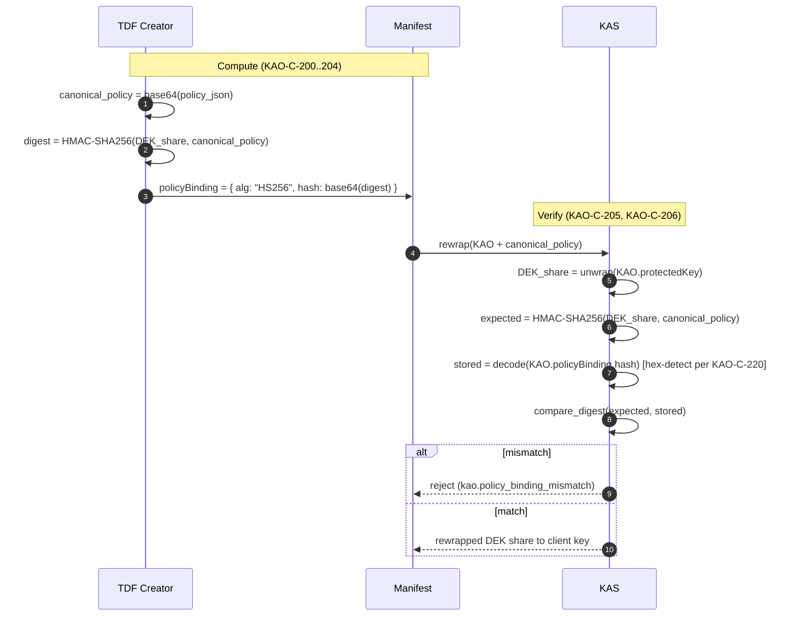
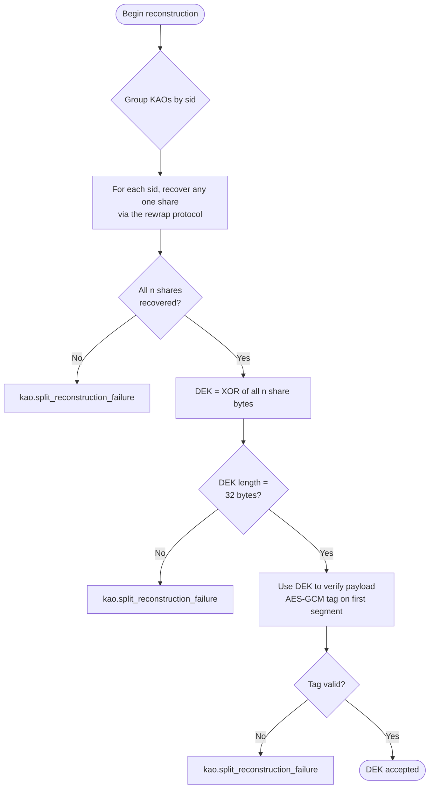
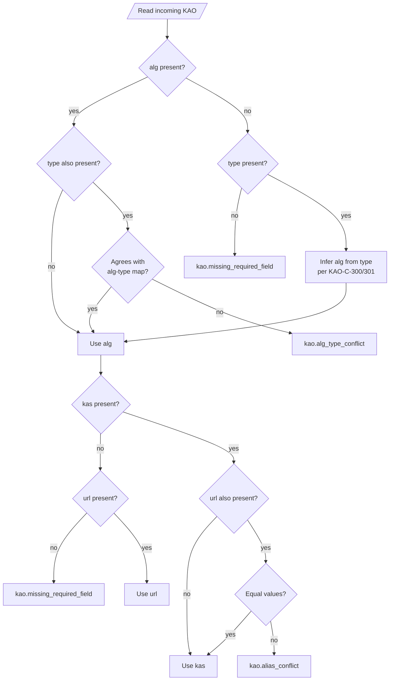

# BaseTDF-KAO-CONF: Key Access Object Conformance

| | |
|---|---|
| **Document** | BaseTDF-KAO-CONF |
| **Title** | Key Access Object Conformance |
| **Version** | 4.4.0 |
| **Status** | Standards Track |
| **Date** | 2026-05 |
| **Suite** | BaseTDF Specification Suite |
| **Depends on** | BaseTDF-KAO, BaseTDF-ALG, BaseTDF-SEC |
| **Referenced by** | BaseTDF-KAS |

## Table of Contents

1. [Introduction](#1-introduction)
2. [Conformance ID Scheme](#2-conformance-id-scheme)
3. [Error Taxonomy](#3-error-taxonomy)
4. [Structural Assertions (KAO-C-001..099)](#4-structural-assertions-kao-c-001099)
5. [Algorithm Assertions (KAO-C-100..199)](#5-algorithm-assertions-kao-c-100199)
6. [Policy-Binding Assertions (KAO-C-200..249)](#6-policy-binding-assertions-kao-c-200249)
7. [Encrypted-Metadata Assertions (KAO-C-250..274)](#7-encrypted-metadata-assertions-kao-c-250274)
8. [Key-Splitting Assertions (KAO-C-275..299)](#8-key-splitting-assertions-kao-c-275299)
9. [Backward-Compatibility Assertions (KAO-C-300..349)](#9-backward-compatibility-assertions-kao-c-300349)
10. [Error-Behavior Assertions (KAO-C-350..399)](#10-error-behavior-assertions-kao-c-350399)
11. [Test Vector Format](#11-test-vector-format)
12. [Diagrams](#12-diagrams)
13. [Normative References](#13-normative-references)

---

## 1. Introduction

### 1.1 Purpose

This document decomposes the prose specification of the Key Access Object
([BaseTDF-KAO][BaseTDF-KAO]) into discrete, stably-identified conformance
assertions and a stable error taxonomy. It is intended for implementers writing
KAO producers, KAO consumers (e.g., Key Access Services), or test harnesses that
verify either.

This document adds **no new normative requirements**. Every assertion derives
from a MUST, SHOULD, or REQUIRED statement already present in BaseTDF-KAO,
BaseTDF-ALG, or BaseTDF-SEC. Where this document and the source spec disagree,
the source spec governs.

### 1.2 Audience

- Implementers of TDF creators and KAS rewrap services who need a checklist of
  observable behaviors to verify.
- Authors of language-specific test harnesses who need stable identifiers to
  cite when reporting pass/fail.
- Reviewers comparing two implementations for conformance.

### 1.3 Relationship to Other BaseTDF Documents

- [BaseTDF-KAO][BaseTDF-KAO] is the prose specification. Each assertion in this
  document cites a section of BaseTDF-KAO as its source.
- [BaseTDF-ALG][BaseTDF-ALG] defines algorithm parameters. Algorithm assertions
  in §5 reference BaseTDF-ALG for parameter detail.
- [BaseTDF-SEC][BaseTDF-SEC] defines security invariants (SI-1..SI-7).
  Assertions related to the policy binding (§6), algorithm validation (§5,
  §10), and key-material hygiene cite the relevant invariant.
- The JSON Schema at [`schema/BaseTDF/kao.schema.json`][KAOSchema] is the
  machine-readable form of the structural assertions in §4.
- The test vectors at [`testvectors/kao/`][TestVectors] are the executable
  form of the assertions in this document.

### 1.4 Conventions

The key words "MUST", "MUST NOT", "REQUIRED", "SHALL", "SHALL NOT", "SHOULD",
"SHOULD NOT", "RECOMMENDED", "NOT RECOMMENDED", "MAY", and "OPTIONAL" in this
document are to be interpreted as described in [BCP 14][RFC2119]
[RFC 8174][RFC8174] when, and only when, they appear in ALL CAPITALS.

Each assertion is stated in the following form:

> **KAO-C-NNN** *(LEVEL)* — Assertion text, including the relevant MUST/SHOULD
> keyword. *Source:* spec section reference. *Vectors:* test-vector ids.
> *Error:* error code from §3 returned when violated, when applicable.

`LEVEL` is one of `MUST`, `MUST NOT`, `SHOULD`, `SHOULD NOT`, `MAY`, matching
the source statement's strength.

---

## 2. Conformance ID Scheme

Conformance assertions are identified by `KAO-C-NNN`, where `NNN` is a
zero-padded three-digit number. Identifiers are allocated in topical ranges:

| Range | Topic |
|---|---|
| 001–099 | Structural — presence, types, aliases, schema |
| 100–199 | Algorithm-specific behavior |
| 200–249 | Policy binding |
| 250–274 | Encrypted metadata |
| 275–299 | Key splitting |
| 300–349 | Backward compatibility (v4.3.0 and earlier) |
| 350–399 | Error behavior — which error code MUST be returned for which input pathology |
| 400+ | Reserved |

**Allocation rules:**

1. Identifiers are **append-only and immutable**. Once an assertion has an ID,
   the ID is never reassigned to a different assertion, even if the original
   is deprecated.
2. Deprecated assertions remain in this document with `*(DEPRECATED)*` in place
   of their level keyword. Test harnesses MAY skip deprecated assertions.
3. New assertions are appended into the next available slot in the relevant
   topical range. Implementations MUST NOT renumber existing assertions to
   keep ranges contiguous.
4. If a topical range is exhausted, additional assertions for that topic are
   allocated from the 400+ reserved space and cross-referenced from the
   relevant section.

---

## 3. Error Taxonomy

The error codes in this section are the canonical values used by KAS
implementations and validators when rejecting a KAO. They are surfaced by the
reference Python validator at `spec/tools/python/` and the Astro explorer at
`spec/tools/explorer/`. CI maintains lockstep parity between this table, the
Python `StrEnum`, and the TypeScript const.

| Code | Returned when |
|---|---|
| `kao.schema_violation` | JSON Schema validation fails and no more specific code applies. |
| `kao.missing_required_field` | A REQUIRED field (or its alias) is absent. |
| `kao.unknown_alg` | The `alg` value is not in the BaseTDF-ALG key-protection enum. |
| `kao.alg_type_conflict` | Both `alg` and `type` are present and do not agree per the v4.3→v4.4 mapping in BaseTDF-KAO §7.1. |
| `kao.alias_conflict` | A v4.4 canonical field and its v4.3 alias are both present with different values (`kas`/`url`, `protectedKey`/`wrappedKey`, `ephemeralKey`/`ephemeralPublicKey`). |
| `kao.ephemeral_key_required` | The algorithm requires `ephemeralKey` (key agreement / KEM / hybrid) and the field is absent. |
| `kao.ephemeral_key_unexpected` | The algorithm forbids `ephemeralKey` (RSA wrapping) and the field is present. **Warning-level by default; KAS implementations MAY treat as fatal.** |
| `kao.policy_binding_missing` | `policyBinding` is absent. |
| `kao.policy_binding_format_invalid` | `policyBinding` is neither a valid object nor a valid bare string. |
| `kao.policy_binding_alg_unsupported` | `policyBinding.alg` is present and is not `"HS256"`. |
| `kao.policy_binding_mismatch` | After format normalization (including legacy hex-then-base64 detection), HMAC verification fails. |
| `kao.legacy_decoding_failure` | The hex-then-base64 detection rule (BaseTDF-KAO §5.5) produced an unexpected length after decoding. |
| `kao.aead_tag_failure` | AES-GCM authentication tag verification failed when unwrapping `protectedKey`. |
| `kao.kem_decapsulation_failure` | ML-KEM decapsulation rejected the supplied ciphertext. |
| `kao.metadata_decrypt_failure` | AES-GCM tag verification failed on `encryptedMetadata`. |
| `kao.metadata_format_invalid` | Decrypted `encryptedMetadata` is not valid JSON or lacks the documented shape. |
| `kao.split_reconstruction_failure` | XOR of recovered shares does not match the expected DEK length, or the reconstructed DEK does not produce a valid AES-GCM tag on the payload. |

---

## 4. Structural Assertions (KAO-C-001..099)

### 4.1 Required-field presence

> **KAO-C-001** *(MUST)* — When creating a v4.4.0 KAO, implementations MUST
> include the `alg` field. *Source:* BaseTDF-KAO §2.2 "alg".
> *Vectors:* `pos-rsa-oaep-256-001`, `pos-mlkem-768-001`.
> *Error on absence (without legacy `type`):* `kao.missing_required_field`.

> **KAO-C-002** *(MUST)* — Implementations MUST reject a KAO with neither `alg`
> nor `type`. *Source:* BaseTDF-KAO §2.2; `kao.schema.json` `allOf[0]`.
> *Vectors:* `neg-missing-alg-and-type-001`. *Error:* `kao.missing_required_field`.

> **KAO-C-003** *(MUST)* — Implementations MUST reject a KAO with neither `kas`
> nor `url`. *Source:* BaseTDF-KAO §2.2 "kas"; `kao.schema.json` `allOf[1]`.
> *Vectors:* `neg-missing-kas-and-url-001`. *Error:* `kao.missing_required_field`.

> **KAO-C-004** *(MUST)* — Implementations MUST reject a KAO with neither
> `protectedKey` nor `wrappedKey`. *Source:* BaseTDF-KAO §2.2 "protectedKey";
> `kao.schema.json` `allOf[2]`. *Vectors:* `neg-missing-protected-and-wrapped-001`.
> *Error:* `kao.missing_required_field`.

> **KAO-C-005** *(MUST)* — Implementations MUST reject a KAO without
> `policyBinding`. *Source:* BaseTDF-KAO §2.2 "policyBinding"; `kao.schema.json`
> `allOf[3]`. *Vectors:* `neg-missing-policy-binding-001`.
> *Error:* `kao.policy_binding_missing`.

> **KAO-C-006** *(MUST)* — When creating new KAOs, implementations MUST include
> the `kid` field. *Source:* BaseTDF-KAO §2.2 "kid".
> *Vectors:* `pos-rsa-oaep-256-001`, `pos-ecdh-hkdf-aesgcm-001`.

> **KAO-C-007** *(MUST)* — When key splitting is used, each KAO MUST include
> a `sid` value identifying the share it protects. *Source:* BaseTDF-KAO §2.2
> "sid", §3.4. *Vectors:* `pos-multi-split-2of2-001`.

### 4.2 Type and value constraints

> **KAO-C-010** *(MUST)* — When `alg` is present, its value MUST be one of the
> identifiers in the BaseTDF-ALG key-protection registry: `RSA-OAEP`,
> `RSA-OAEP-256`, `ECDH-HKDF`, `ML-KEM-768`, `ML-KEM-1024`, `X-ECDH-ML-KEM-768`.
> *Source:* BaseTDF-KAO §2.2 "alg"; `kao.schema.json` `properties.alg.enum`.
> *Vectors:* `neg-unknown-alg-001`. *Error:* `kao.unknown_alg`.

> **KAO-C-011** *(MUST)* — When `type` is present, its value MUST be one of
> `wrapped`, `ec-wrapped`, `remote`. *Source:* BaseTDF-KAO §2.2 "type";
> `kao.schema.json` `properties.type.enum`.
> *Vectors:* `neg-unknown-type-001`. *Error:* `kao.schema_violation`.

> **KAO-C-012** *(MUST)* — When `kas` is present, its value MUST be a valid
> URI. *Source:* BaseTDF-KAO §2.2 "kas"; `kao.schema.json`
> `properties.kas.format`. *Vectors:* `neg-kas-not-uri-001`.
> *Error:* `kao.schema_violation`.

> **KAO-C-013** *(MUST)* — Implementations MUST reject a KAO containing
> properties not defined in `kao.schema.json`. *Source:*
> `kao.schema.json` `additionalProperties: false`.
> *Vectors:* `neg-additional-properties-001`. *Error:* `kao.schema_violation`.

> **KAO-C-014** *(MUST)* — `policyBinding`, when present as an object, MUST
> contain exactly the properties `alg` and `hash`; additional properties are
> forbidden. *Source:* `kao.schema.json` `policyBinding.oneOf[0].additionalProperties`.
> *Vectors:* `neg-policy-binding-extra-prop-001`.
> *Error:* `kao.policy_binding_format_invalid`.

### 4.3 Alias precedence

> **KAO-C-020** *(MUST)* — When both `alg` and `type` are present and the
> implied algorithm differs (e.g., `alg: "ML-KEM-768"`, `type: "wrapped"`),
> implementations MUST resolve to `alg` and SHOULD warn. *Source:*
> BaseTDF-KAO §2.2 "type", §7.1. *Vectors:* `pos-alias-precedence-alg-over-type-001`,
> `neg-alg-type-conflict-001`. *Error on fatal-mode rejection:* `kao.alg_type_conflict`.

> **KAO-C-021** *(MUST)* — When both `kas` and `url` are present, implementations
> MUST resolve to `kas`. If their values differ, implementations MUST treat the
> KAO as malformed and return `kao.alias_conflict`. *Source:* BaseTDF-KAO §2.2
> "url". *Vectors:* `neg-alias-conflict-kas-url-001`. *Error:* `kao.alias_conflict`.

> **KAO-C-022** *(MUST)* — When both `protectedKey` and `wrappedKey` are present,
> implementations MUST resolve to `protectedKey`. If their values differ,
> implementations MUST return `kao.alias_conflict`. *Source:* BaseTDF-KAO §2.2
> "wrappedKey". *Vectors:* `neg-alias-conflict-protected-wrapped-001`.
> *Error:* `kao.alias_conflict`.

> **KAO-C-023** *(MUST)* — When both `ephemeralKey` and `ephemeralPublicKey` are
> present, implementations MUST resolve to `ephemeralKey`. If their values
> differ, implementations MUST return `kao.alias_conflict`. *Source:* BaseTDF-KAO
> §2.2 "ephemeralKey". *Vectors:* `neg-alias-conflict-ephemeral-001`.
> *Error:* `kao.alias_conflict`.

### 4.4 Conditional fields

> **KAO-C-030** *(MUST)* — When the resolved algorithm is a key-agreement, KEM,
> or hybrid algorithm (`ECDH-HKDF`, `ML-KEM-768`, `ML-KEM-1024`,
> `X-ECDH-ML-KEM-768`), the KAO MUST include `ephemeralKey` (or its legacy
> alias `ephemeralPublicKey`). *Source:* BaseTDF-KAO §2.2 "ephemeralKey", §4.2,
> §4.3, §4.4. *Vectors:* `neg-ephemeral-key-required-mlkem-001`,
> `neg-ephemeral-key-required-ecdh-001`, `neg-ephemeral-key-required-hybrid-001`.
> *Error:* `kao.ephemeral_key_required`.

> **KAO-C-031** *(SHOULD)* — When the resolved algorithm is a key-wrapping
> algorithm (`RSA-OAEP`, `RSA-OAEP-256`), the KAO SHOULD NOT include
> `ephemeralKey`. Implementations MAY warn or reject. *Source:* BaseTDF-KAO §2.2
> "ephemeralKey", §4.1. *Vectors:* `pos-rsa-with-extraneous-ephemeral-warn-001`.
> *Error (fatal mode):* `kao.ephemeral_key_unexpected`.

> **KAO-C-032** *(MAY)* — `encryptedMetadata` MAY be present on any KAO,
> regardless of algorithm. When absent, no metadata is associated with the KAO.
> *Source:* BaseTDF-KAO §2.2 "encryptedMetadata", §6.1.
> *Vectors:* `pos-encrypted-metadata-001`, `pos-rsa-oaep-256-001`.

---

## 5. Algorithm Assertions (KAO-C-100..199)

This section defines per-algorithm conformance for the cryptographic
operations in BaseTDF-KAO §4. Each assertion references the corresponding
known-answer test (KAT) vector.

### 5.1 RSA-OAEP and RSA-OAEP-256 (KAO-C-100..119)

> **KAO-C-100** *(MUST)* — For `alg: "RSA-OAEP"`, `protectedKey` MUST be the
> Base64 encoding of an RSA-OAEP ciphertext computed with the SHA-1 mask
> generation function. *Source:* BaseTDF-KAO §4.1; BaseTDF-ALG §5.1.
> *Vectors:* `pos-rsa-oaep-sha1-001`.

> **KAO-C-101** *(MUST)* — For `alg: "RSA-OAEP-256"`, `protectedKey` MUST be the
> Base64 encoding of an RSA-OAEP ciphertext computed with the SHA-256 mask
> generation function. *Source:* BaseTDF-KAO §4.1; BaseTDF-ALG §5.1.
> *Vectors:* `pos-rsa-oaep-256-001`.

> **KAO-C-102** *(MUST)* — A KAS implementation MUST recover the DEK share by
> RSA-OAEP decryption with the private key identified by `kid`. *Source:*
> BaseTDF-KAO §4.1. *Vectors:* `pos-rsa-oaep-256-001`, `pos-rsa-oaep-sha1-001`.

### 5.2 ECDH-HKDF (KAO-C-120..139)

> **KAO-C-120** *(MUST)* — For `alg: "ECDH-HKDF"`, `ephemeralKey` MUST be a
> PEM-encoded EC public key on the curve documented in the KAS metadata
> (typically P-256). *Source:* BaseTDF-KAO §4.2.
> *Vectors:* `pos-ecdh-hkdf-aesgcm-001`.

> **KAO-C-121** *(MUST)* — Implementations MUST derive the wrapping key with
> HKDF-SHA256 using `salt = SHA256("TDF")` (the 32-byte hash of the three ASCII
> bytes `0x54 0x44 0x46`), an empty `info`, and length 32. *Source:*
> BaseTDF-KAO §4.2; embedded hex value in BaseTDF-KAO §4.2.
> *Vectors:* `kat-ecdh-hkdf-salt-001`.

> **KAO-C-122** *(MUST)* — When writing v4.4 KAOs with `alg: "ECDH-HKDF"`,
> `protectedKey` MUST be the Base64 encoding of an AES-256-GCM ciphertext
> (ciphertext concatenated with the 16-byte authentication tag) of the DEK
> share under the HKDF-derived key. *Source:* BaseTDF-KAO §4.2.
> *Vectors:* `pos-ecdh-hkdf-aesgcm-001`.

> **KAO-C-123** *(MUST)* — When reading legacy v4.3 KAOs, implementations MUST
> support the XOR-based wrapping form (`protectedKey = derived_key XOR DEK_share`).
> *Source:* BaseTDF-KAO §4.2 "Legacy compatibility", §7.1.
> *Vectors:* `legacy-type-ec-wrapped-xor-001`.

### 5.3 ML-KEM-768 and ML-KEM-1024 (KAO-C-140..159)

> **KAO-C-140** *(MUST)* — For ML-KEM algorithms, `ephemeralKey` MUST be the
> Base64 encoding of the KEM ciphertext: 1088 bytes for `ML-KEM-768`, 1568
> bytes for `ML-KEM-1024`. *Source:* BaseTDF-KAO §4.3; FIPS 203.
> *Vectors:* `pos-mlkem-768-001`, `pos-mlkem-1024-001`.

> **KAO-C-141** *(MUST)* — Implementations MUST derive the wrapping key with
> HKDF-SHA256 using empty salt, `info = "BaseTDF-KEM"`, and length 32.
> *Source:* BaseTDF-KAO §4.3. *Vectors:* `kat-mlkem-hkdf-info-001`.

> **KAO-C-142** *(MUST)* — `protectedKey` MUST be the Base64 encoding of an
> AES-256-GCM ciphertext (ciphertext concatenated with the 16-byte
> authentication tag) of the DEK share under the HKDF-derived key.
> *Source:* BaseTDF-KAO §4.3. *Vectors:* `pos-mlkem-768-001`,
> `pos-mlkem-1024-001`.

> **KAO-C-143** *(MUST)* — ML-KEM operations MUST conform to NIST FIPS 203.
> *Source:* BaseTDF-KAO §4.3, BaseTDF-ALG §5.4.
> *Vectors:* `pos-mlkem-768-001`, `pos-mlkem-1024-001`,
> `neg-mlkem-decap-failure-001`. *Error on decap rejection:*
> `kao.kem_decapsulation_failure`.

### 5.4 X-ECDH-ML-KEM-768 hybrid (KAO-C-160..179)

> **KAO-C-160** *(MUST)* — For `alg: "X-ECDH-ML-KEM-768"`, `ephemeralKey` MUST
> be the Base64 encoding of the concatenation `ephemeral_ec_pk_uncompressed (65
> bytes) || ml_kem_768_ciphertext (1088 bytes)`, totalling 1153 bytes.
> *Source:* BaseTDF-KAO §4.4; BaseTDF-ALG §4.4.
> *Vectors:* `pos-hybrid-x-ecdh-mlkem-768-001`.

> **KAO-C-161** *(MUST)* — The classical component MUST use the P-256 curve.
> *Source:* BaseTDF-KAO §4.4 "Requirements".
> *Vectors:* `pos-hybrid-x-ecdh-mlkem-768-001`.

> **KAO-C-162** *(MUST)* — Implementations MUST derive the wrapping key with
> HKDF-SHA256 using `salt = SHA256("BaseTDF-Hybrid")`, `info =
> "BaseTDF-Hybrid-Key"`, and length 32. The IKM MUST be `ss_classical || ss_pqc`
> in that order. *Source:* BaseTDF-KAO §4.4. *Vectors:* `kat-hybrid-hkdf-001`.

> **KAO-C-163** *(MUST)* — `protectedKey` MUST be the Base64 encoding of an
> AES-256-GCM ciphertext of the DEK share under the combined derived key.
> *Source:* BaseTDF-KAO §4.4. *Vectors:* `pos-hybrid-x-ecdh-mlkem-768-001`.

---

## 6. Policy-Binding Assertions (KAO-C-200..249)

> **KAO-C-200** *(MUST)* — Implementations MUST compute the policy-binding HMAC
> over the canonical policy form: the Base64-encoded policy string from
> `encryptionInformation.policy`, taken byte-for-byte without re-decoding,
> re-encoding, or re-serialization. *Source:* BaseTDF-KAO §5.2.
> *Vectors:* `kat-policy-binding-001`.

> **KAO-C-201** *(MUST)* — The HMAC key MUST be the DEK share carried by this
> KAO (not the reconstructed full DEK). *Source:* BaseTDF-KAO §5.2.
> *Vectors:* `kat-policy-binding-001`.

> **KAO-C-202** *(MUST)* — `policyBinding.alg` MUST be `"HS256"` (HMAC-SHA256).
> *Source:* BaseTDF-KAO §5.4. *Vectors:* `pos-rsa-oaep-256-001`,
> `neg-policy-binding-alg-unsupported-001`. *Error:*
> `kao.policy_binding_alg_unsupported`.

> **KAO-C-203** *(MUST)* — When writing v4.4 KAOs, the binding hash MUST be
> direct Base64 encoding of the 32-byte HMAC digest (NOT hex-then-base64).
> *Source:* BaseTDF-KAO §5.5. *Vectors:* `kat-policy-binding-001`.

> **KAO-C-204** *(MUST)* — When writing v4.4 KAOs, `policyBinding` MUST be the
> object form (`{ alg, hash }`), not a bare string. *Source:* BaseTDF-KAO §5.5,
> §7.2. *Vectors:* `pos-rsa-oaep-256-001`.

> **KAO-C-205** *(MUST)* — Implementations MUST verify the policy binding using
> a constant-time comparison primitive. Reference primitives:
> `hmac.compare_digest` (Python), `subtle.ConstantTimeCompare` (Go),
> `crypto.timingSafeEqual` (Node.js). *Source:* BaseTDF-KAO §5.3.
> *Vectors:* indirect; verified by `neg-policy-binding-tampered-001`.

> **KAO-C-206** *(MUST)* — A KAS implementation MUST reject a rewrap request
> when policy-binding verification fails and MUST NOT return any key material
> derived from the affected DEK share. *Source:* BaseTDF-KAO §5.3, §8.1; SI-1
> in BaseTDF-SEC. *Vectors:* `neg-policy-binding-tampered-001`. *Error:*
> `kao.policy_binding_mismatch`.

> **KAO-C-220** *(MUST)* — When reading a `policyBinding` whose decoded `hash`
> length is 64 bytes and consists entirely of ASCII hex characters
> (`0-9`, `a-f`, `A-F`), implementations MUST decode it as hex to recover the
> 32-byte HMAC digest before comparison. *Source:* BaseTDF-KAO §5.5.
> *Vectors:* `legacy-binding-hex-001`, `legacy-binding-hex-002`.

> **KAO-C-221** *(MUST)* — When reading a `policyBinding` whose value is a bare
> string, implementations MUST treat the algorithm as `HS256` and the string as
> the binding hash, applying the hex detection rule of KAO-C-220.
> *Source:* BaseTDF-KAO §5.4 "MUST default", §5.5.
> *Vectors:* `legacy-binding-bare-string-001`.

---

## 7. Encrypted-Metadata Assertions (KAO-C-250..274)

> **KAO-C-250** *(MUST)* — When present, `encryptedMetadata` MUST decode (after
> outer Base64) to a JSON object containing `ciphertext` (Base64) and `iv`
> (Base64). *Source:* BaseTDF-KAO §6.2. *Vectors:* `pos-encrypted-metadata-001`,
> `neg-metadata-format-invalid-001`. *Error:* `kao.metadata_format_invalid`.

> **KAO-C-251** *(MUST)* — The IV MUST be 12 bytes (96 bits). *Source:*
> BaseTDF-KAO §6.3. *Vectors:* `pos-encrypted-metadata-001`.

> **KAO-C-252** *(MUST)* — `ciphertext` MUST be an AES-256-GCM ciphertext
> (ciphertext concatenated with the 16-byte authentication tag) under the DEK
> share. *Source:* BaseTDF-KAO §6.3. *Vectors:* `pos-encrypted-metadata-001`,
> `neg-metadata-decrypt-failure-001`. *Error on tag failure:*
> `kao.metadata_decrypt_failure`.

> **KAO-C-253** *(MUST)* — A KAS MUST NOT decrypt or process `encryptedMetadata`
> before successful policy-binding verification and authorization. *Source:*
> BaseTDF-KAO §6.4; SI-1, SI-2 in BaseTDF-SEC.
> *Vectors:* indirect; verified by `neg-policy-binding-tampered-001`
> ensuring metadata is not exposed on policy-binding failure.

> **KAO-C-254** *(MUST NOT)* — Implementations MUST NOT use decrypted metadata
> for access-control decisions. *Source:* BaseTDF-KAO §6.4. *Vectors:* none
> (architectural assertion).

---

## 8. Key-Splitting Assertions (KAO-C-275..299)

> **KAO-C-275** *(MUST)* — Within a single TDF manifest, distinct splits MUST
> have distinct `sid` values. *Source:* BaseTDF-KAO §3.4.
> *Vectors:* `pos-multi-split-2of2-001`, `neg-duplicate-sid-001`.

> **KAO-C-276** *(MUST)* — Reconstruction of an n-share split MUST be performed
> by XORing the recovered share bytes; partial reconstruction with fewer than n
> shares MUST NOT be attempted. *Source:* BaseTDF-KAO §3.2.
> *Vectors:* `pos-multi-split-2of2-001`, `neg-split-reconstruction-failure-001`.
> *Error:* `kao.split_reconstruction_failure`.

> **KAO-C-277** *(MUST)* — Each share other than the final one MUST be generated
> from a CSPRNG with full entropy. *Source:* BaseTDF-KAO §3.2, §8.4; SI-7 in
> BaseTDF-SEC. *Vectors:* not directly testable from a vector; assertion is
> a producer-side requirement enforced by code review and entropy testing.

> **KAO-C-278** *(SHOULD)* — Implementations SHOULD warn when all splits in a
> key-splitting configuration resolve to the same KAS URL. *Source:*
> BaseTDF-KAO §3.5. *Vectors:* `pos-same-kas-split-warn-001`.

---

## 9. Backward-Compatibility Assertions (KAO-C-300..349)

> **KAO-C-300** *(MUST)* — When reading a KAO with `type: "wrapped"` and no
> `alg`, implementations MUST infer `alg: "RSA-OAEP"`. *Source:* BaseTDF-KAO
> §7.1 table. *Vectors:* `legacy-type-wrapped-001`.

> **KAO-C-301** *(MUST)* — When reading a KAO with `type: "ec-wrapped"` and no
> `alg`, implementations MUST infer `alg: "ECDH-HKDF"`. *Source:* BaseTDF-KAO
> §7.1 table. *Vectors:* `legacy-type-ec-wrapped-xor-001`.

> **KAO-C-302** *(MUST)* — When reading legacy KAOs, implementations MUST treat
> `wrappedKey` as `protectedKey`, `url` as `kas`, and `ephemeralPublicKey` as
> `ephemeralKey`. *Source:* BaseTDF-KAO §7.1.
> *Vectors:* `legacy-aliases-all-001`.

> **KAO-C-303** *(SHOULD)* — When writing new KAOs, implementations SHOULD
> include the `type` field for backward compatibility with older readers,
> consistent with the `alg`-to-`type` mapping (`RSA-OAEP*` → `wrapped`,
> `ECDH-HKDF` → `ec-wrapped`; other algorithms have no `type` equivalent).
> *Source:* BaseTDF-KAO §7.2 item 2. *Vectors:* `pos-rsa-oaep-256-001`,
> `pos-ecdh-hkdf-aesgcm-001`.

> **KAO-C-304** *(MAY)* — A v4.4 KAO MAY include `wrappedKey` and/or `url` as
> aliases of `protectedKey` and `kas` for backward compatibility, provided the
> values are byte-identical (otherwise see KAO-C-021 / KAO-C-022).
> *Source:* BaseTDF-KAO §7.2 items 3-4.
> *Vectors:* `pos-dual-aliases-equal-001`.

---

## 10. Error-Behavior Assertions (KAO-C-350..399)

This section maps input pathologies to the error code an implementation MUST
return. Each assertion below has a corresponding negative test vector.

> **KAO-C-350** *(MUST)* — On policy-binding mismatch (after format
> normalization), implementations MUST return `kao.policy_binding_mismatch`.
> *Source:* BaseTDF-KAO §5.3. *Vectors:* `neg-policy-binding-tampered-001`.

> **KAO-C-351** *(MUST)* — On `policyBinding.alg` not in `{ "HS256" }`,
> implementations MUST return `kao.policy_binding_alg_unsupported`.
> *Source:* BaseTDF-KAO §5.4. *Vectors:* `neg-policy-binding-alg-unsupported-001`.

> **KAO-C-352** *(MUST)* — On unknown `alg`, implementations MUST return
> `kao.unknown_alg`. *Source:* BaseTDF-KAO §2.2 "alg".
> *Vectors:* `neg-unknown-alg-001`.

> **KAO-C-353** *(MUST)* — On `alg`/`type` disagreement under fatal-mode
> resolution, implementations MUST return `kao.alg_type_conflict`.
> *Source:* BaseTDF-KAO §7.1. *Vectors:* `neg-alg-type-conflict-001`.

> **KAO-C-354** *(MUST)* — On AES-GCM tag failure when unwrapping
> `protectedKey`, implementations MUST return `kao.aead_tag_failure`.
> *Source:* BaseTDF-KAO §4.2, §4.3, §4.4 (decrypt steps).
> *Vectors:* `neg-aead-tag-failure-001`.

> **KAO-C-355** *(MUST)* — On ML-KEM decapsulation failure, implementations
> MUST return `kao.kem_decapsulation_failure`. *Source:* BaseTDF-KAO §4.3.
> *Vectors:* `neg-mlkem-decap-failure-001`.

> **KAO-C-356** *(MUST)* — On split reconstruction failure (missing share or
> reconstructed-DEK validation failure), implementations MUST return
> `kao.split_reconstruction_failure`. *Source:* BaseTDF-KAO §3.2.
> *Vectors:* `neg-split-reconstruction-failure-001`.

---

## 11. Test Vector Format

Machine-readable test vectors live at
[`spec/testvectors/kao/`][TestVectors]. Each vector is a JSON file conforming
to [`vector.schema.json`][VectorSchema]. The index file
[`index.json`][VectorIndex] enumerates all vectors with summary metadata.

Every vector has:

- `id` — globally unique kebab-case identifier (e.g., `pos-rsa-oaep-256-001`).
- `description` — one-paragraph explanation.
- `conformance` — array of `KAO-C-NNN` identifiers this vector exercises.
- `category` — `positive`, `negative`, `legacy`, or `kat`.
- `algorithm` — one of the BaseTDF-ALG identifiers, or `n/a`.
- `inputs` — KAO JSON, canonical policy string, manifest schema version, key
  references, and (for KAT vectors) a fixed DEK share in hex.
- `expected` — `outcome` (`accept`/`reject`), `errorCode` (when `reject`),
  `recoveredDek` (hex; for `accept` crypto vectors), `policyBindingValid`
  (boolean), and `normalizedKao` (post-alias-resolution form).

Test harnesses in any language MAY load these vectors and assert the expected
outcomes. The reference Python validator at `spec/tools/python/` and the
in-browser TypeScript validator at `spec/tools/explorer/` exercise the same
vectors and serve as conformance baselines.

---

## 12. Diagrams

### 12.1 KAO field anatomy

```mermaid
graph LR
  subgraph KAO[Key Access Object]
    direction TB
    ALG["alg<br/>(REQUIRED, v4.4)"]
    KAS["kas<br/>(REQUIRED)"]
    KID["kid<br/>(REQUIRED)"]
    SID["sid<br/>(REQUIRED if split)"]
    PK["protectedKey<br/>(REQUIRED)"]
    EK["ephemeralKey<br/>(CONDITIONAL)"]
    PB["policyBinding<br/>(REQUIRED)"]
    EM["encryptedMetadata<br/>(OPTIONAL)"]
    TYPE["type<br/>(DEPRECATED)"]
    URL["url<br/>(DEPRECATED)"]
    WK["wrappedKey<br/>(DEPRECATED)"]
    EPK["ephemeralPublicKey<br/>(DEPRECATED)"]
  end
  classDef required fill:#dff5dd,stroke:#1a7f37,color:#1a4225
  classDef conditional fill:#fff5dd,stroke:#9a6700,color:#4d3500
  classDef optional fill:#e8eef9,stroke:#0969da,color:#0a3069
  classDef deprecated fill:#f6f8fa,stroke:#6e7781,color:#57606a,stroke-dasharray:4 2
  class ALG,KAS,KID,SID,PK,PB required
  class EK,SID conditional
  class EM optional
  class TYPE,URL,WK,EPK deprecated
```

### 12.2 Policy-binding compute and verify

### 12.3 Key-splitting reconstruction

### 12.4 Alias resolution

---

## 13. Normative References

| Reference | Title |
|---|---|
| [BaseTDF-KAO][BaseTDF-KAO] | Key Access Object, v4.4.0 |
| [BaseTDF-ALG][BaseTDF-ALG] | Algorithm Registry, v4.4.0 |
| [BaseTDF-SEC][BaseTDF-SEC] | Security Model and Zero Trust Architecture, v4.4.0 |
| [NIST FIPS 203][FIPS203] | Module-Lattice-Based Key-Encapsulation Mechanism Standard (ML-KEM) |
| [NIST FIPS 198-1][FIPS198] | The Keyed-Hash Message Authentication Code (HMAC) |
| [RFC 2104][RFC2104] | HMAC: Keyed-Hashing for Message Authentication |
| [RFC 2119][RFC2119] | Key words for use in RFCs to Indicate Requirement Levels |
| [RFC 4231][RFC4231] | Identifiers and Test Vectors for HMAC-SHA Identifiers |
| [RFC 4648][RFC4648] | The Base16, Base32, and Base64 Data Encodings |
| [RFC 5869][RFC5869] | HMAC-based Extract-and-Expand Key Derivation Function (HKDF) |
| [RFC 8174][RFC8174] | Ambiguity of Uppercase vs Lowercase in RFC 2119 Key Words |

[BaseTDF-KAO]: basetdf-kao.md
[BaseTDF-ALG]: basetdf-alg.md
[BaseTDF-SEC]: basetdf-sec.md
[KAOSchema]: ../schema/BaseTDF/kao.schema.json
[TestVectors]: ../testvectors/kao/
[VectorSchema]: ../testvectors/kao/vector.schema.json
[VectorIndex]: ../testvectors/kao/index.json
[FIPS203]: https://doi.org/10.6028/NIST.FIPS.203
[FIPS198]: https://doi.org/10.6028/NIST.FIPS.198-1
[RFC2104]: https://www.rfc-editor.org/rfc/rfc2104
[RFC2119]: https://www.rfc-editor.org/rfc/rfc2119
[RFC4231]: https://www.rfc-editor.org/rfc/rfc4231
[RFC4648]: https://www.rfc-editor.org/rfc/rfc4648
[RFC5869]: https://www.rfc-editor.org/rfc/rfc5869
[RFC8174]: https://www.rfc-editor.org/rfc/rfc8174
