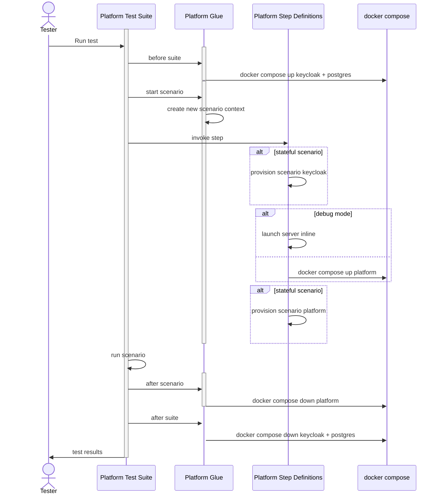

# Cucumber Platform Testing

BDD via [cucumber framework](https://cucumber.io/docs/cucumber/api/) for platform and related individual components.

The primary goal of this test framework is to allow no-code BDD test creation by QA, Product, SMEs and developers
(via a library of easy to use [Gherkin](https://cucumber.io/docs/gherkin/reference) based Step Definitions)

## Other Goals
- Support testing in different modes:
  - local - development.  Tests platform services locally and in a way that supports local debugging for developers.
    - stands up required support containers (DB, etc.)
    - platform services started inline to step definitions
  - local - container.  Much like the local development mode, but platform (and associated services) are deployed from 
    specific image versions.
- Provide tooling support for Test Feature Development.  Allows test authors to use and understand the available library of step definitions.
  - [JetBrains Cucumber Extension](https://plugins.jetbrains.com/plugin/24323-cucumber-go)
  - [VSCode Cucumber Extension](https://marketplace.visualstudio.com/items?itemName=CucumberOpen.cucumber-official)
- Supports customer specific test features.  This testing framework can be used to test customer specific configurations using the same step definitions.

## Implementation Details
Cucumber Step Definitions and related glue code are written in golang using [godog](https://github.com/cucumber/godog)

[Go Test Containers](https://golang.testcontainers.org/) are used to support containerized deployment of dependent and/or
service components depending on the desired testing mode.

Step Definitions are encapsulated in separate definition files; e.g. [steps_namespaces.go](cukes/steps_namespaces.go)
and are registered for use by interested test suites.

Step definitions and glue code are implemented in the cukes module.  This 
module could be imported by other repos for extensible testing (customer specific)

Tests are located in `test-bdd` directory and utilize build tag `cukes` to 
exclude from project level go testing

Project layout:
- `cukes`: reusable cucumber step definitions and glue.  Used locally or by downstream projects
- `features`: folder containing Gherkin feature files
- `tests-bdd`: contains cucumber test suites.

### Platform Test Suite
This test suite exercises platform level cukes tests.  The [Platform Test](./platform_test.go) initializes the test suite
and registers Step Definitions.

The Platform Test Suite stands up infrastructure services one time via test container docker compose (postgres, keycloak, etc.).



Test isolation is maintained by creating a new keycloak realm , platform and platform provision per scenario.

This approach allows for test isolation with the original bootstrap time of postgres and keycloak amortized over all 
scenarios within the test suite.

Further improvements in test speed can be had by utilizing `@stateless` cukes tags.  This will only provision a keycloak
and platform instance per feature.  Care should be taken with this approach as the test author needs to be mindful 
that their tests are not sharing state.

### Step Definitions

[Local Platform Step Definitions](cukes/steps_localplatform.go) handle the provisioning of keycloak, bootstrapping
of the platform and provisioning of the platform.  This is handled in the following modes:
- default local platform: TBD
- empty local platform: stands up platform without provisioning any platform policy and uses a [keycloak profile with no users](cukes/resources/keycloak_base.template)
  - add users and their attributes as part of step defs
  - add policy as part of step defs
- local platform with a parameterized path to platform policy (optional) and keycloak template. See [example keycloak template](cukes/resources/keycloak_base.template) 

## Test Feature Authoring

Platform level testing should leverage the platform test suite and registered Step Definitions. Additional 
component or feature testing should use new test suites and new step definitions (as needed).

Leverage tooling to help generate and author tests.

### Scenario Generation
AI can be useful to generate scenarios from service descriptions.  

An example using your favorite LLM:

upload the *attribute.proto* service description as *attribute.proto.txt* and prompt:
```
Generate gherkin cucumber tests scenarios and golang godog step definitions for the attribute service as defined in the protobuf definition located in attributes.proto.txt
```

## Running Tests
Cukes test suites are excluded from normal tests and build artifacts
using go build flag: (`//go:build cukes`)

Tests are located in the `tests-bdd` directory.  

Cucumber tests are executed using standard go test commands with 
the inclusion of the "cukes" tag: `go test --tags=cukes`

### Parallel Test Execution
TBD

### Tag Coverage in CI
TBD

### Running Tests with Specific Tags
You can use the `--godog.tags` option to run subsets of scenarios based on their tags. For example:

```shell
go test ./tests-bdd/platform_test.go -v --tags=cukes --godog.tags="@fast or @unit"
```

This will run only scenarios that have either the `@fast` or `@unit` tag. You can use complex expressions with `and`, `or`, and `not` operators:

```shell
go test ./tests-bdd/platform_test.go -v --tags=cukes --godog.tags="@fast and not @slow"
```

The tags option works with any of the test files, allowing you to run specific subsets of scenarios across different test groups.

### Pre-req for Colima Docker Engine
Note, for running with colima Docker engine; [See Docs](https://golang.testcontainers.org/system_requirements/using_colima/):
```shell
export DOCKER_HOST=unix://${HOME}/.colima/default/docker.sock
export TESTCONTAINERS_DOCKER_SOCKET_OVERRIDE=/var/run/docker.sock
```

Run one or more test suites using the following steps:

### 1. Build or pull local image
If using a container image (and not running in DEBUG mode) then the reference image needs to be present on the host machine. This is to remove the requirement to pass credentials to test containers framework.
If running against a local image build, build the image:
```shell
docker build -t platform-cukes .
```
Otherwise:
```shell
docker pull <image>
```

#### Additional Docker Build Pre-requisites
If you are encountering issues running the previously mentioned docker build command, you can try the following:
- Make sure that `docker-buildx` is installed:
```shell
brew install docker-buildx
```
- Start up colima with enough CPU/Memory:
```shell
colima start -c 8 -m 16
```

### 2. Run Tests
Runs one or more cucumber tests.  Commands below executed from the project root directory

The `PLATFORM_IMAGE` environment variables is used to configure the platform (and mode) used for testing.
- DEBUG: If set to DEBUG a local in process platform is launched for purposes of debugging a scenario.  This should not be used for testing more than one scenario as the inline platform version does not support multiple platform installs.
- other:  any other image tag for the platform image version to be launched and tested against. see example above (`platform-cukes`, 
  which is the default expected image)

Default options create the following log files:
- compose.log :  any container logs
- cukes.log: any fixture/step definition logs

To change to console logging set the following env vars:
- CUKES_LOG_HANDLER=console
- COMPOSE_LOG_HANDLER=console

#### Run only specific test suite 
```shell
go test ./tests-bdd/platform_test.go --tags=cukes -v --godog.random ./features
```

#### Run only specific test suite for against explicit features
```shell
go test ./tests-bdd/platform_test.go -v --tags=cukes --godog.random ./your-custom-features
```

#### Run all tests

```shell
go test ./tests-bdd -v --tags=cukes --godog.random --godog.format=pretty
```

With logging to console for both cukes and containers:
```
CUKES_LOG_HANDLER=console COMPOSE_LOG_HANDLER=console go test ./tests-bdd -v --tags=cukes --godog.random --godog.format=pretty
```

### Run scenarios filtered by tags
```shell
go test ./tests-bdd -v --tags=cukes --godog.random --godog.tags=example ./features
```

### Debug a Scenario 
Create an IDE run configuration and locally debug a Scenario.

Set Environment variables:
```
PLATFORM_IMAGE=DEBUG
DOCKER_HOST=unix:///Users/<username>/.colima/default/docker.sock
TESTCONTAINERS_DOCKER_SOCKET_OVERRIDE=/var/run/docker.sock
```

Example GoLang configuration to run only the `empty-platform` tagged scenarios:
- Package path: github.com/opentdf/platform/tests-bdd
- Working directory: the repo base directory (platform)
- Program Arguments: --godog.tags empty-platform --godog.format=pretty --godog.random features


### Run explicit features in path
```shell
go test ./tests-bdd -v --tags=cukes --godog.random <feature path>
```

## IDE Integration: Cucumber Autocompletion in VSCode

To enable step autocompletion and "Go to Definition" for Cucumber/Gherkin steps in VSCode, install the official [Cucumber](https://marketplace.visualstudio.com/items?itemName=CucumberOpen.cucumber-official) extension.

The extension uses the configuration in `.vscode/settings.json` to locate your feature and glue files. Your settings should look like:

```jsonc
{
  "cucumber.features": [
    "features/**/*.feature"
  ],
  "cucumber.glue": [
    "cukes/**/*.go"
  ]
}
```

- After installing the extension, you may need to reload VSCode or the extension for autocompletion to work.
- If autocompletion is not working for specific steps, make sure that the steps are defined properly. Run the tests locally and ensure that no undefined steps are found.

## TODO
- Improve execution time for platform testing
  - Remove keycloak with wiremock/mock or mock
- Build out step definitions for platform services
- Continue to explore AI Agent for scenario generation
- Build cross version/platform/sdk fixtures
